# C4 Model — Level 3: Component Diagram (API Backend)

| | |
|---|---|
| **Document ID** | RAH-DOC-013-C4-COMPONENT |
| **Phase** | Phase 0 — Analysis (refined in Phase 1) |
| **Version** | 1.0 |
| **Related** | [C4 Container](./c4-container.md) · [Domain Model](./domain-model.md) |

## Purpose
Zooms into the **API Backend** container from the [Container diagram](./c4-container.md), showing its internal modular structure. Each component corresponds 1:1 to a bounded context from the [Domain Model](./domain-model.md), following the modular-monolith approach of [ADR-0003](../adr/0003-backend-architecture-style.md).

## Diagram

```mermaid
C4Component
  title API Backend — Component Diagram

  Container_Boundary(api, "API Backend") {
    Component(apiLayer, "API / Interface Layer", "REST controllers, DTOs, validation", "Exposes versioned REST endpoints — Clean Architecture outer ring")
    Component(authMw, "Auth Middleware", "JWT/session verification, RBAC guard", "Delegates to Auth Service")

    Component(identityCtx, "Identity & Access", "Application + Domain module", "Users, roles, verified-diabetic status — §2.6")
    Component(stationCtx, "Station Network", "Application + Domain module", "Stations, cabins, availability — §2.1, §2.2, §8")
    Component(thirdPartyCtx, "Third-Party Places", "Application + Domain module", "Community/declarative places — §2.1, §2.2")
    Component(slatokiCtx, "Slatoki", "Application + Domain module", "Prayer/ablution spaces, Qibla, tents — §2.3")
    Component(accessPaymentCtx, "Access & Payment", "Application + Domain module", "QR sessions, unlock orchestration, transactions — §2.5")
    Component(emergencyCtx, "Emergency Mode", "Application + Domain module", "Emergency targeting, discount eligibility — §2.4")
    Component(notificationCtx, "Notifications", "Application + Domain module", "Availability/operator/payment notifications — §6")
    Component(sponsorshipCtx, "Sponsorship", "Application + Domain module", "Sponsors, campaigns, aggregated reporting — §5")
    Component(operationsCtx, "Operations", "Application + Domain module", "Maintenance scheduling, alert triage — §4")
    Component(analyticsCtx, "Analytics & BI", "Application + Domain module", "Frequentation history, exports — §4, §5")

    Component(repoPort, "Repository Ports", "Interfaces", "Domain-owned persistence contracts (Dependency Inversion)")
  }

  ContainerDb(postgres, "Base Relationnelle (Postgres)")
  ContainerDb(timeseries, "Base Séries Temporelles")
  Container(authService, "Service Auth & RBAC")
  Container(iotIngestion, "Service d'Ingestion IoT")
  Container(notifService, "Service de Notification (delivery)")
  System_Ext(paymentProvider, "Prestataire de Paiement")

  Rel(apiLayer, authMw, "Passe par")
  Rel(authMw, authService, "Vérifie")
  Rel(apiLayer, identityCtx, "Route vers")
  Rel(apiLayer, stationCtx, "Route vers")
  Rel(apiLayer, thirdPartyCtx, "Route vers")
  Rel(apiLayer, slatokiCtx, "Route vers")
  Rel(apiLayer, accessPaymentCtx, "Route vers")
  Rel(apiLayer, emergencyCtx, "Route vers")
  Rel(apiLayer, sponsorshipCtx, "Route vers")
  Rel(apiLayer, operationsCtx, "Route vers")
  Rel(apiLayer, analyticsCtx, "Route vers")

  Rel(emergencyCtx, identityCtx, "Vérifie statut vérifié")
  Rel(emergencyCtx, stationCtx, "Cherche lieu accessible le plus proche")
  Rel(accessPaymentCtx, stationCtx, "Vérifie disponibilité cabine")
  Rel(accessPaymentCtx, paymentProvider, "Déclenche paiement")
  Rel(accessPaymentCtx, iotIngestion, "Envoie ordre de déverrouillage")
  Rel(accessPaymentCtx, notificationCtx, "Déclenche confirmation")
  Rel(operationsCtx, stationCtx, "Consulte état / planifie intervention")
  Rel(sponsorshipCtx, analyticsCtx, "Consomme données agrégées")
  Rel(analyticsCtx, stationCtx, "Consomme historique occupation")
  Rel(notificationCtx, notifService, "Délègue l'envoi")

  Rel(identityCtx, repoPort, "Utilise")
  Rel(stationCtx, repoPort, "Utilise")
  Rel(thirdPartyCtx, repoPort, "Utilise")
  Rel(slatokiCtx, repoPort, "Utilise")
  Rel(accessPaymentCtx, repoPort, "Utilise")
  Rel(sponsorshipCtx, repoPort, "Utilise")
  Rel(operationsCtx, repoPort, "Utilise")
  Rel(analyticsCtx, repoPort, "Utilise")

  Rel(repoPort, postgres, "Implémenté par adaptateur Postgres")
  Rel(repoPort, timeseries, "Implémenté par adaptateur TSDB")

  UpdateLayoutConfig($c4ShapeInRow="3", $c4BoundaryInRow="1")
```

## Components

| Component | Bounded Context | Depends on |
|---|---|---|
| API / Interface Layer | *(cross-cutting)* | Auth Middleware, all context modules |
| Auth Middleware | *(cross-cutting)* | Auth Service |
| Identity & Access | Identity & Access | Repository Ports |
| Station Network | Station Network | Repository Ports |
| Third-Party Places | Third-Party Places | Repository Ports |
| Slatoki | Slatoki | Repository Ports |
| Access & Payment | Access & Payment | Station Network, Payment Provider, IoT Ingestion, Notifications, Repository Ports |
| Emergency Mode | Emergency Mode | Identity & Access, Station Network |
| Notifications | Notifications | Notification Service (delivery) |
| Sponsorship | Sponsorship | Analytics & BI, Repository Ports |
| Operations | Operations | Station Network, Repository Ports |
| Analytics & BI | Analytics & BI | Station Network, Repository Ports |
| Repository Ports | *(cross-cutting)* | — (implemented by infrastructure adapters) |

## Design Notes
- **Dependency Inversion**: every bounded-context module depends on `Repository Ports` (interfaces owned by the Domain layer); Postgres/TSDB adapters implement those ports from the Infrastructure layer — this is the Clean Architecture dependency rule made concrete (see [Architecture Overview §2](./architecture-overview.md#2-system-layers-clean-architecture)).
- **Emergency Mode** intentionally depends on **Identity & Access** and **Station Network** rather than duplicating their logic, keeping RAH-DOC-005 §2.4's "ignore active filters, nearest accessible facility" rule as a thin orchestration on top of Station Network's existing availability query.
- **Access & Payment** is the only component with an external-system dependency (Payment Provider) and a cross-container dependency (IoT Ingestion), reflecting its role as the orchestrator of RAH-DOC-005 §2.5's six-step unlock journey.

## Completion Status
✅ Complete for Phase 0 depth. Further component decomposition (internal use-case classes, DTOs) is a Phase 1 deliverable.
