# C4 Model — Level 2: Container Diagram

| | |
|---|---|
| **Document ID** | RAH-DOC-012-C4-CONTAINER |
| **Phase** | Phase 0 — Analysis |
| **Version** | 1.0 |
| **Related** | [C4 Context](./c4-context.md) · [C4 Component](./c4-component.md) · [Architecture Overview](./architecture-overview.md) |

## Purpose
Decomposes the RAHATI Digital Platform system boundary from the [Context diagram](./c4-context.md) into its deployable containers, per RAH-DOC-005 §1 (five components) and §7 (technical stack).

## Diagram

```mermaid
C4Container
  title RAHATI Digital Platform — Container Diagram

  Person(usager, "Usager / Usagère Slatoki")
  Person(operateur, "Opérateur terrain")
  Person(sponsor, "Sponsor")
  Person(visiteur, "Visiteur Web")

  System_Boundary(rahati, "RAHATI Digital Platform") {
    Container(mobileApp, "Application Mobile", "Flutter, Material Design 3", "Carte temps réel, Slatoki, Mode Urgence, Paiement/QR, Profil — §2")
    Container(website, "Plateforme Web", "Static/SSR site, bilingue FR/AR", "Vitrine publique — §3")
    Container(operatorDash, "Tableau de Bord Opérateur", "Web app, Material Design 3", "Supervision réseau, alertes, maintenance — §4")
    Container(sponsorDash, "Tableau de Bord Sponsor", "Web app, Material Design 3", "Statistiques agrégées, rapports — §5")
    Container(apiGateway, "API Backend", "REST, API-First", "Point d'entrée unique pour tous les clients — §6, §7")
    Container(iotIngestion, "Service d'Ingestion IoT", "MQTT subscriber", "Reçoit la télémétrie des stations — §6, §9")
    Container(notifService, "Service de Notification", "Backend service", "Disponibilité, alertes, confirmations — §6")
    ContainerDb(postgres, "Base Relationnelle", "PostgreSQL (Supabase)", "Utilisateurs, paiements, réservations implicites — §7, §8")
    ContainerDb(timeseries, "Base Séries Temporelles", "TSDB (TBD — ADR-0004)", "Flux IoT: occupation, capteurs — §7")
    Container(authService, "Service Auth & RBAC", "Supabase Auth + custom RBAC", "Authentification, rôles multi-sites — §4, §9")
    Container(storage, "Stockage Objet", "Supabase Storage", "Photos de lieux, justificatifs, assets")
  }

  System_Ext(stationNetwork, "Réseau de Stations RAHETI", "Passerelle IoT par station")
  System_Ext(paymentProvider, "Prestataire de Paiement")
  System_Ext(navApp, "Application de Navigation")
  System_Ext(pushProvider, "FCM / APNs")

  Rel(usager, mobileApp, "Utilise")
  Rel(visiteur, website, "Consulte")
  Rel(operateur, operatorDash, "Utilise")
  Rel(sponsor, sponsorDash, "Consulte")

  Rel(mobileApp, apiGateway, "Appelle", "HTTPS/REST")
  Rel(website, apiGateway, "Appelle", "HTTPS/REST")
  Rel(operatorDash, apiGateway, "Appelle", "HTTPS/REST")
  Rel(sponsorDash, apiGateway, "Appelle", "HTTPS/REST (lecture seule, agrégée)")

  Rel(apiGateway, authService, "Vérifie identité / rôles")
  Rel(apiGateway, postgres, "Lit/écrit")
  Rel(apiGateway, timeseries, "Lit l'historique de fréquentation")
  Rel(apiGateway, storage, "Lit/écrit fichiers")
  Rel(apiGateway, notifService, "Déclenche notifications")
  Rel(apiGateway, paymentProvider, "Déclenche paiement/remboursement")

  Rel(stationNetwork, iotIngestion, "Publie télémétrie", "MQTT")
  Rel(iotIngestion, timeseries, "Écrit séries temporelles")
  Rel(iotIngestion, postgres, "Met à jour statut station/cabine")
  Rel(apiGateway, iotIngestion, "Envoie ordres (déverrouillage, alerte)", "interne")
  Rel(iotIngestion, stationNetwork, "Relaie ordres", "MQTT")

  Rel(notifService, pushProvider, "Envoie notifications push")
  Rel(mobileApp, navApp, "Ouvre itinéraire")

  Rel(mobileApp, postgres, "Realtime subscribe (statut disponibilité)", "Supabase Realtime")
  Rel(operatorDash, postgres, "Realtime subscribe (alertes, occupation)", "Supabase Realtime")

  UpdateLayoutConfig($c4ShapeInRow="4", $c4BoundaryInRow="1")
```

## Containers

| Container | Technology | Responsibility | RAH-DOC-005 Source |
|---|---|---|---|
| Application Mobile | Flutter, Material Design 3 | End-user features per §2 | §2, [ADR-0002](../adr/0002-mobile-framework-selection.md), [ADR-0011](../adr/0011-material-design-3-as-design-system.md) |
| Plateforme Web | Bilingual SSR/static site | Public showcase | §3 |
| Tableau de Bord Opérateur | Web app, M3 | Fleet supervision | §4 |
| Tableau de Bord Sponsor | Web app, M3 | Read-only aggregated reporting | §5 |
| API Backend | REST, API-First | Single entry point for all clients | §6, §7, [ADR-0007](../adr/0007-api-style-rest.md) |
| Service d'Ingestion IoT | MQTT subscriber | Station telemetry intake and command relay | §6, §9, [ADR-0006](../adr/0006-iot-protocol-mqtt.md) |
| Service de Notification | Backend service | Push/notification orchestration | §6 |
| Base Relationnelle | PostgreSQL (Supabase) | Transactional data | §7, §8, [ADR-0004](../adr/0004-database-strategy.md), [ADR-0005](../adr/0005-baas-platform-supabase.md) |
| Base Séries Temporelles | TSDB (TBD) | IoT telemetry history | §7, [ADR-0004](../adr/0004-database-strategy.md) |
| Service Auth & RBAC | Supabase Auth + custom RBAC | Identity and role management | §4, §9, [ADR-0009](../adr/0009-authentication-and-rbac.md) |
| Stockage Objet | Supabase Storage | File/asset storage | Implied by §2.6 (justificatifs), §2.2 (photos) |

## Assumptions
- The API Backend is modeled as a single logical container implementing a modular-monolith internal structure (per [ADR-0003](../adr/0003-backend-architecture-style.md)), not as N independently deployed microservices — this is a Phase 1 refinement of RAH-DOC-005 §7's indicative "microservices" language, not a contradiction of it.
- Object storage is inferred as necessary infrastructure to support §2.2 (place photos) and §2.6 (diabetic-status supporting documents), which are functionally required but do not name a storage container explicitly.

## Completion Status
✅ Complete — pending Phase 1 confirmation of backend language/framework (OQ5) and time-series store selection (OQ6).
