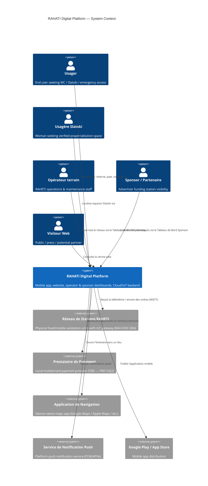

# C4 Model — Level 1: System Context Diagram

| | |
|---|---|
| **Document ID** | RAH-DOC-011-C4-CONTEXT |
| **Phase** | Phase 0 — Analysis |
| **Version** | 1.0 |
| **Related** | [Architecture Overview](./architecture-overview.md) · [C4 Container](./c4-container.md) · [C4 Component](./c4-component.md) |

## Purpose
Shows the RAHATI digital platform as a single system, its human actors, and the external systems it depends on. Scope and actors are drawn directly from RAH-DOC-005 §1 and §7.

## Diagram

## Actors and External Systems

| Element | Type | Description | Source |
|---|---|---|---|
| Usager | Person | General end user | PRD §5 |
| Usagère Slatoki | Person | Woman using the Slatoki feature | PRD §5, RAH-DOC-005 §2.3 |
| Opérateur terrain | Person | Field/technical operations staff | RAH-DOC-005 §4 |
| Sponsor / Partenaire | Person | Advertiser/partner | RAH-DOC-005 §5 |
| Visiteur Web | Person | Public/press/potential partner | RAH-DOC-005 §3 |
| Réseau de Stations RAHETI | External System | Physical IoT-connected stations | RAH-DOC-005 §6, RAH-DOC-004 §8 |
| Prestataire de Paiement | External System | Payment processing (provider TBD) | RAH-DOC-005 §7, §11 |
| Application de Navigation | External System | Device-native navigation | RAH-DOC-005 §2.2 |
| Service de Notification Push | External System | Push notification delivery | RAH-DOC-005 §6 |
| Google Play / App Store | External System | App distribution | RAH-DOC-005 §3 |

## Completion Status
✅ Complete — all actors and external dependencies trace to RAH-DOC-005; no invented integrations beyond standard push-notification and app-store delivery, which are implied but not named in the source (flagged as such).
