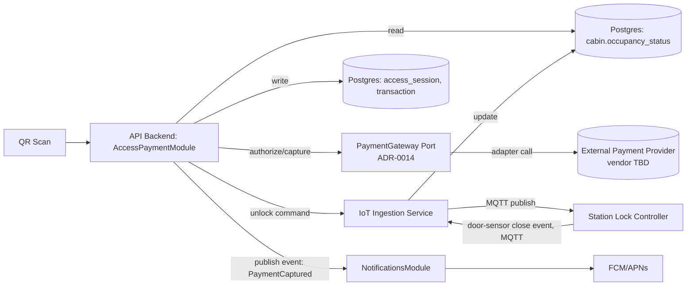
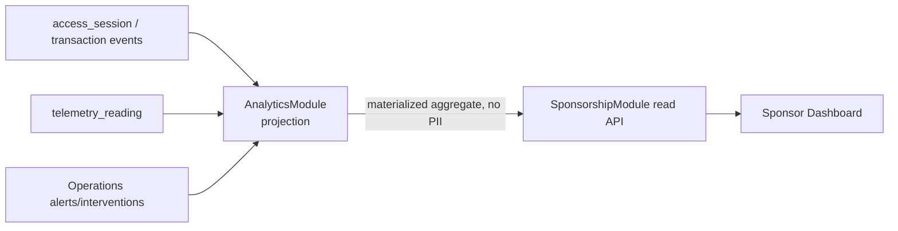
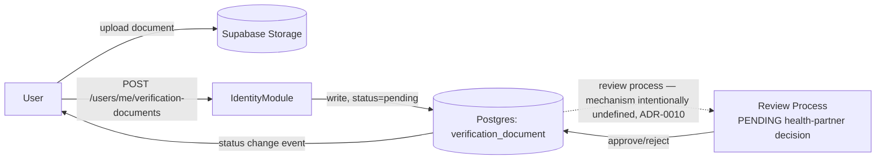
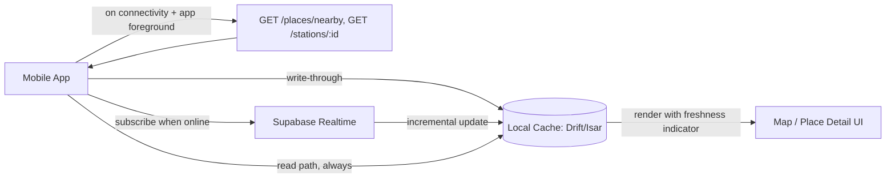

# Data Flow Diagrams

| | |
|---|---|
| **Document ID** | RAH-DOC-024-DATA-FLOW |
| **Phase** | Phase 1 — System Architecture |
| **Version** | 1.0 |
| **Related** | [System Architecture Document](./system-architecture.md) · [Sequence Diagrams](./sequence-diagrams.md) · [C4 Container](./c4-container.md) |

> These show **data movement** between systems/stores. For **actor-driven, time-ordered interactions**, see [Sequence Diagrams](./sequence-diagrams.md).

## 1. IoT Telemetry → Real-Time Client Update

```mermaid
flowchart LR
    STATION[Station IoT Gateway] -->|MQTT publish: battery, water, door-sensor, occupancy| BROKER[MQTT Broker]
    BROKER --> INGEST[IoT Ingestion Service]
    INGEST -->|write| TS[(Postgres: telemetry_reading\npartitioned, ADR-0013)]
    INGEST -->|upsert| PG[(Postgres: station / cabin)]
    PG -->|logical replication| RT[Supabase Realtime]
    RT -->|WebSocket: station:{id}:cabins| MOBILE[Mobile App]
    RT -->|WebSocket: ops:alerts, station updates| OPSDASH[Operator Dashboard]
```
Implements FR-CLD-01, FR-PLC-02, FR-PAY-05, FR-OPS-01. Single aggregation point per RAH-DOC-005 §6.

## 2. Access & Payment Data Flow


Implements FR-PAY-01…06. `PaymentGateway` isolates the provider-TBD dependency (ADR-0014) — no other component in this flow touches provider-specific data.

## 3. Sponsor Analytics Aggregation


Implements FR-SPN-01, FR-SPN-02. `AnalyticsModule` never exposes `user_id` or any Identity & Access field to `SponsorshipModule` — enforced at the projection query itself (Domain Model §9 invariant), not only at the API layer, so a future SponsorshipModule bug cannot leak PII by construction.

## 4. Diabetic Verification Submission (Data Shape Only)


Implements FR-USR-03. The dashed edge marks the explicitly undecided step (RAH-DOC-005 §11) — architecture stops at "a `review_status` transitions," not at "how."

## 5. Offline Read-Cache Refresh (Mobile)


Implements FR-MAP-07. Full state-machine detail in [Offline & Sync Architecture](./offline-sync-architecture.md).

## Completion Status
✅ Complete for Phase 1 depth — all five flows trace to SRS requirements; no flow assumes a vendor for payment or verification.

**Phase 1 deliverable 5 of 10 — Data Flow Diagrams: COMPLETE.**
