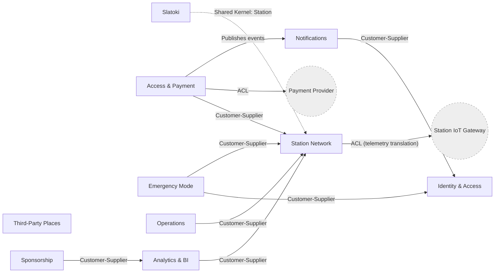

# Domain Model — Bounded Contexts, Aggregates, Entities, Value Objects

| | |
|---|---|
| **Document ID** | RAH-DOC-015-DOMAIN-MODEL |
| **Phase** | Phase 0 — Analysis (refined in Phase 1) |
| **Version** | 1.0 |
| **Status** | Draft for Review |
| **Date** | 2026-07-31 |
| **Related** | [Architecture Overview](./architecture-overview.md) · [ERD](../erd/erd.md) · [C4 Component](./c4-component.md) · [SRS](../srs/SRS.md) |

## 1. Context Map

**Reading**: An arrow from A to B means A is the upstream/customer of B's published contract (events or queries). `ACL` = Anti-Corruption Layer, isolating the domain from an external system's model. `Slatoki` shares the `Station` aggregate identity with `Station Network` (Slatoki tent data is an attribute of a Station, not a competing aggregate) rather than duplicating station state — see §4.

## 2. Bounded Context: Identity & Access

**Purpose**: Owns user identity, authentication delegation, roles, and the diabetic-verification workflow. Source: RAH-DOC-005 §2.6, §4 (multi-site RBAC), §9 (strong authentication).

| Element | Detail |
|---|---|
| **Aggregate Root** | `User` |
| **Entities** | `User`, `UserRole`, `VerificationDocument` |
| **Value Objects** | `Email`, `PhoneNumber`, `LanguagePreference` (fr\|ar), `DiabeticVerificationStatus` (none\|pending\|verified\|rejected) |
| **Domain Events** | `UserRegistered`, `LanguagePreferenceChanged`, `DiabeticVerificationRequested`, `DiabeticVerificationApproved`, `DiabeticVerificationRejected`, `RoleGranted` |
| **Invariants** | A `User` must have at least one contact method (email or phone) once persisted (guest usage requires no `User` row at all, per FR-USR-01). A `VerificationDocument` can only transition `pending → approved/rejected`, never backward. `DiabeticVerificationStatus` on `User` is a projection, updated only by `DiabeticVerificationApproved`/`Rejected` events. |
| **Repository Port** | `UserRepository` |

## 3. Bounded Context: Station Network

**Purpose**: Owns the physical RAHETI station fleet — configuration, cabins, real-time availability. Source: RAH-DOC-005 §2.1, §2.2, §6, §8.

| Element | Detail |
|---|---|
| **Aggregate Root** | `Station` (aggregate boundary includes its `Cabin` entities and, where present, its `SlatokiTent`) |
| **Entities** | `Station`, `Cabin`, `SlatokiTent` |
| **Value Objects** | `GeoPosition` (lat/lng), `StationConfiguration` (fixe\|mobile\|event), `CabinType` (H\|F\|Slatoki\|PMR), `OccupancyStatus` (free\|occupied\|out_of_service), `Price` (amount + currency) |
| **Domain Events** | `StationRegistered`, `CabinOccupancyChanged`, `StationStatusChanged`, `SlatokiTentDeployed`, `SlatokiTentFolded` |
| **Invariants** | A `Cabin` always belongs to exactly one `Station`. `CabinOccupancyChanged` may only be raised by the telemetry Anti-Corruption Layer (door sensor / lock controller) or by the `Access & Payment` context completing a session — never directly by a client request, preserving RAH-DOC-005 §2.5 step 6 (sensor-detected close). A `SlatokiTent` belongs to at most one `Station`. |
| **Repository Port** | `StationRepository` |
| **Note** | `Station Network` also exposes a **read-only query service** consumed by `Third-Party Places` to produce the unified map/search result described in [ERD §3.4](../erd/erd.md#34-third-party-place-src-ext) — this is a query-side concern, not a shared aggregate. |

## 4. Bounded Context: Slatoki

**Purpose**: Owns the women's prayer/ablution discovery experience — the Qibla utility and the domain rules distinguishing verified vs. generic spaces. Source: RAH-DOC-005 §2.3.

| Element | Detail |
|---|---|
| **Aggregate Root** | *(none owned — see below)* |
| **Domain Service** | `QiblaDirectionCalculator` (stateless: computes bearing to Mecca from a `GeoPosition`) |
| **Value Objects** | `PrayerFacilityFilter` (prayer_only\|wudu_only\|prayer_and_wudu), `WomenVerificationLevel` (verified_confirmed\|generic) |
| **Domain Events** | *(none — Slatoki is a read/orchestration context over `Station.SlatokiTent` and `ThirdPartyPlace` tags, not an event source)* |
| **Rationale** | RAH-DOC-005 §2.3 describes Slatoki as a **presentation-and-filtering concern** over two existing data sources (RAHETI Slatoki tents on `Station`, and tagged mosques in `ThirdPartyPlace`), not a new physical entity with its own lifecycle. Modeling it as an aggregate would duplicate state already owned by `Station Network` and `Third-Party Places`. This context therefore owns only the **Qibla domain service** and the **filtering/verification-level logic**, and reads (never writes) the other two contexts' data. |

## 5. Bounded Context: Third-Party Places

**Purpose**: Owns community/declarative places (mosques, businesses) referenced in-app. Source: RAH-DOC-005 §2.1, §2.2.

| Element | Detail |
|---|---|
| **Aggregate Root** | `ThirdPartyPlace` |
| **Entities** | `ThirdPartyPlace` |
| **Value Objects** | `GeoPosition`, `PlaceType` (mosque\|business\|gas_station\|other), `DeclaredStatus` (open\|closed\|unknown), `Tag` (women_confirmed\|wudu\|pmr\|prayer\|open_now) |
| **Domain Events** | `ThirdPartyPlaceSubmitted`, `ThirdPartyPlaceTagged`, `ThirdPartyPlaceStatusDeclared` |
| **Invariants** | Status changes are declarative (community/owner-asserted) and never IoT-verified — must be visually distinguished in the UI from `Station` IoT-verified status (§2.2 requirement kept intact). |
| **Repository Port** | `ThirdPartyPlaceRepository` |

## 6. Bounded Context: Access & Payment

**Purpose**: Owns the QR-scan-to-unlock journey and the transactional record of payment. Source: RAH-DOC-005 §2.5.

| Element | Detail |
|---|---|
| **Aggregate Root** | `AccessSession` (owns its optional `Transaction`) |
| **Entities** | `AccessSession`, `Transaction` |
| **Value Objects** | `QrCode`, `Money`, `DiscountRate`, `AccessSessionStatus` (initiated\|payment_pending\|unlocked\|in_use\|completed\|cancelled) |
| **Domain Events** | `AccessSessionInitiated`, `PaymentAuthorized`, `PaymentCaptured`, `PaymentFailed`, `UnlockOrderIssued`, `CabinAccessCompleted` |
| **Invariants** | `UnlockOrderIssued` may only follow either a free-cabin `AccessSessionInitiated` or a `PaymentCaptured` — never precede payment for a paid cabin (enforces §2.5 step 3→4 ordering). Exactly one `Transaction` per `AccessSession` when payment applies. |
| **Repository Port** | `AccessSessionRepository`, `TransactionRepository` |
| **External Dependency** | Payment Provider, isolated behind an `PaymentGateway` port (Anti-Corruption Layer) — see [ADR-0007](../adr/0007-api-style-rest.md) note on provider abstraction. |

## 7. Bounded Context: Emergency Mode

**Purpose**: Owns the one-tap emergency targeting rule and discount eligibility check. Source: RAH-DOC-005 §2.4.

| Element | Detail |
|---|---|
| **Aggregate Root** | *(none owned — pure orchestration/domain service)* |
| **Domain Service** | `EmergencyFacilityFinder` (queries `Station Network` for nearest accessible, filter-independent facility), `EmergencyDiscountPolicy` (reads `Identity & Access`'s `DiabeticVerificationStatus`, yields a `DiscountRate` consumed by `Access & Payment`) |
| **Domain Events** | `EmergencyModeActivated` |
| **Invariants** | `EmergencyDiscountPolicy` yields a non-zero discount **only** when `User.diabeticVerificationStatus = verified` (enforces §2.4's "usagers diabétiques vérifiés" wording exactly). Extension to other emergency profiles is explicitly not modeled (out of V1 scope, PRD §13). |

## 8. Bounded Context: Notifications

**Purpose**: Owns dispatch of availability, operator, and payment notifications. Source: RAH-DOC-005 §6.

| Element | Detail |
|---|---|
| **Aggregate Root** | `Notification` |
| **Value Objects** | `NotificationChannel` (push\|in_app), `NotificationType` (availability\|operator_alert\|payment_confirmation) |
| **Domain Events** | `NotificationQueued`, `NotificationDelivered`, `NotificationFailed` |
| **Invariants** | Every `Notification` records its triggering event reference (`Alert` or `Transaction`) for the audit trail required by §6 ("journalisation complète"). |
| **Repository Port** | `NotificationRepository` |
| **Subscribes to** | `CabinOccupancyChanged` (Station Network), `AlertRaised` (Operations), `PaymentCaptured` (Access & Payment) |

## 9. Bounded Context: Sponsorship

**Purpose**: Owns sponsors, campaigns, and their read-only aggregated reporting. Source: RAH-DOC-005 §5.

| Element | Detail |
|---|---|
| **Aggregate Root** | `Sponsor` (owns `SponsorshipCampaign` entities) |
| **Entities** | `Sponsor`, `SponsorshipCampaign` |
| **Value Objects** | `SponsorshipTier`, `CampaignPeriod` (date range) |
| **Domain Events** | `CampaignCreated`, `CampaignActivated`, `CampaignCompleted`, `StationLinkedToCampaign` |
| **Invariants** | A `SponsorshipCampaign`'s station set is immutable once `active` unless explicitly re-authorized (prevents mid-campaign reporting drift). Sponsor-facing reads **never** join to `User`-identifying data — enforced at the query/API layer per §5's "aucune donnée personnelle d'usager n'est exposée" requirement. |
| **Repository Port** | `SponsorRepository` |
| **Reads from** | `Analytics & BI` (aggregated frequentation/exposure figures) |

## 10. Bounded Context: Operations

**Purpose**: Owns alert triage and maintenance scheduling for field teams. Source: RAH-DOC-005 §4.

| Element | Detail |
|---|---|
| **Aggregate Root** | `Alert`; `MaintenanceIntervention` (separate aggregate, optionally referencing an `Alert`) |
| **Value Objects** | `AlertSeverity` (critical\|high\|medium\|low), `AlertType` (fire\|sos\|technical_anomaly\|preventive_maintenance), `InterventionType` (refill\|emptying\|repair\|preventive) |
| **Domain Events** | `AlertRaised`, `AlertAcknowledged`, `AlertResolved`, `InterventionScheduled`, `InterventionCompleted` |
| **Invariants** | Alert priority ordering (fire/SOS → technical anomaly → preventive) is enforced at the query layer per FR-OPS-02, not by mutating `severity` — severity is set once at `AlertRaised` and is immutable. |
| **Repository Port** | `AlertRepository`, `MaintenanceInterventionRepository` |

## 11. Bounded Context: Analytics & BI

**Purpose**: Owns frequentation history and exportable reporting, consumed by both Operations (redeployment decisions) and Sponsorship (campaign reports). Source: RAH-DOC-005 §4, §5; Master Roadmap Phase 11.

| Element | Detail |
|---|---|
| **Aggregate Root** | *(none owned — read-model/projection context)* |
| **Domain Service** | `FrequentationAggregator`, `ExposureReportBuilder` |
| **Invariants** | All projections are derived, eventually-consistent read models built from other contexts' domain events (`CabinOccupancyChanged`, `AccessSessionInitiated`, etc.) — this context never emits commands back to any other context, preserving one-way dependency flow. |

## 12. Ubiquitous Language (excerpt)

| Term | Definition | Context |
|---|---|---|
| Station | A physical RAHETI unit (fixed, mobile, or event configuration) | Station Network |
| Cabine / Cabin | An individual stall within a Station | Station Network |
| Lieu tiers / Third-Party Place | A non-RAHETI place referenced declaratively | Third-Party Places |
| Slatoki | Women's prayer/ablution feature; also the tent equipment on a mobile Station | Slatoki, Station Network |
| Mode Urgence / Emergency Mode | One-tap fast path to the nearest accessible facility | Emergency Mode |
| Usager vérifié / Verified user | A `User` whose `DiabeticVerificationStatus = verified` | Identity & Access |
| Session d'accès / Access Session | The lifecycle of one QR-scan-to-exit cycle | Access & Payment |

## 13. Assumptions
- Slatoki is modeled as a cross-cutting domain service rather than an aggregate (§4) to avoid duplicating `Station` and `ThirdPartyPlace` state — this is a Phase 0 architectural judgment call within RAH-DOC-005's explicit invitation (§7) to validate indicative choices; it changes no user-facing requirement.
- `Emergency Mode` and `Analytics & BI` are modeled without owned aggregates because RAH-DOC-005 describes them as orchestration/reporting concerns over other contexts' data, not new business entities with independent lifecycles.

## 14. Open Questions
- OQ8: Should `Sponsorship`'s read access to `Analytics & BI` be synchronous (query) or via materialized projections refreshed on a schedule? Affects NFR-PERF for the Sponsor Dashboard; to be resolved in Phase 1.
- See also PRD OQ1–OQ4 and ERD OQ7.

## 15. Completion Status

| Item | Status |
|---|---|
| All 10 bounded contexts defined with aggregates/entities/VOs | ✅ Complete |
| Domain events enumerated per context | ✅ Complete |
| Context map with strategic DDD patterns (ACL, Customer-Supplier, Shared Kernel) | ✅ Complete |
| Ubiquitous language glossary (excerpt) | ✅ Complete — full glossary to be expanded in Phase 1 |

**Phase 0 document 6 of 10 — Domain Model: COMPLETE.**
