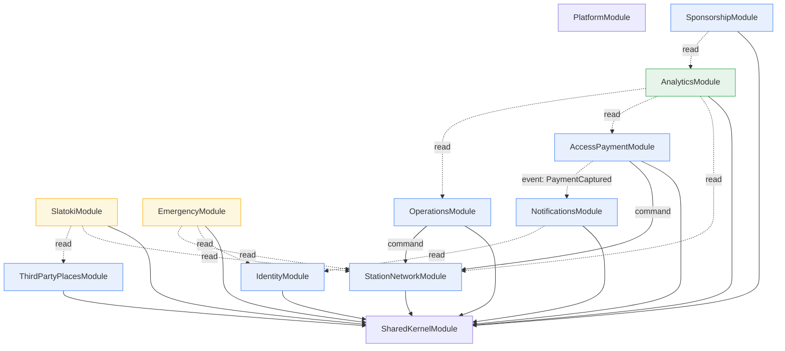

# Module Dependency Diagram

| | |
|---|---|
| **Document ID** | RAH-DOC-021-MODULE-DEPS |
| **Phase** | Phase 1 — System Architecture |
| **Version** | 1.0 |
| **Related** | [System Architecture Document](./system-architecture.md) · [Domain Model](./domain-model.md) · [C4 Component](./c4-component.md) |

## 1. Purpose
Fixes the **allowed** dependency directions between backend modules, so that the Clean Architecture dependency rule and the [ADR-0003](../adr/0003-backend-architecture-style.md) module-boundary intent are enforceable in code review and CI (ESLint boundary rule, see [Repository Structure](./repository-structure.md)), not just in diagrams.

## 2. Module List

| Module (NestJS) | Bounded Context | Layer contents |
|---|---|---|
| `IdentityModule` | Identity & Access | domain/application/infrastructure/interface |
| `StationNetworkModule` | Station Network | domain/application/infrastructure/interface |
| `ThirdPartyPlacesModule` | Third-Party Places | domain/application/infrastructure/interface |
| `SlatokiModule` | Slatoki | application/interface only (no owned domain aggregate, per [Domain Model §4](./domain-model.md#4-bounded-context-slatoki)) |
| `AccessPaymentModule` | Access & Payment | domain/application/infrastructure/interface |
| `EmergencyModule` | Emergency Mode | application/interface only (orchestration, per [Domain Model §7](./domain-model.md#7-bounded-context-emergency-mode)) |
| `NotificationsModule` | Notifications | domain/application/infrastructure/interface |
| `SponsorshipModule` | Sponsorship | domain/application/infrastructure/interface |
| `OperationsModule` | Operations | domain/application/infrastructure/interface |
| `AnalyticsModule` | Analytics & BI | application/infrastructure/interface only (read-model/projection, per [Domain Model §11](./domain-model.md#11-bounded-context-analytics--bi)) |
| `SharedKernelModule` | *(cross-cutting)* | Common Value Objects (`Money`, `GeoPosition`, `LanguagePreference`), base repository interfaces, domain-event bus contract |
| `PlatformModule` | *(cross-cutting)* | Config, structured logging, health checks, request-context (correlation IDs) |

## 3. Allowed Dependency Matrix

Rows may depend on columns marked `✔`. All other cells are **forbidden** and enforced by CI lint.

| ↓ depends on → | Identity | StationNet | 3rdParty | Slatoki | AccessPay | Emergency | Notif | Sponsor | Ops | Analytics | SharedKernel |
|---|---|---|---|---|---|---|---|---|---|---|---|
| **Identity** | — | | | | | | | | | | ✔ |
| **StationNet** | | — | | | | | | | | | ✔ |
| **3rdParty** | | | — | | | | | | | | ✔ |
| **Slatoki** | | ✔(read) | ✔(read) | — | | | | | | | ✔ |
| **AccessPay** | | ✔ | | | — | | ✔(publish) | | | | ✔ |
| **Emergency** | ✔(read) | ✔(read) | | | | — | | | | | ✔ |
| **Notif** | ✔(read) | | | | | | — | | | | ✔ |
| **Sponsor** | | | | | | | | — | | ✔(read) | ✔ |
| **Ops** | | ✔ | | | | | | | — | | ✔ |
| **Analytics** | | ✔(read) | | | ✔(read) | | | | ✔(read) | — | ✔ |
| **SharedKernel** | | | | | | | | | | | — |

**Reading**: `AccessPay → StationNet` (plain ✔) means Access & Payment calls Station Network's **application service interface** (e.g. `checkCabinAvailability()`), never its repository or database table directly. `✔(read)` denotes a read-only query-service dependency (CQRS-style query, no commands). `✔(publish)` denotes eventing only — `AccessPaymentModule` publishes `PaymentCaptured`; it does not call `NotificationsModule` synchronously, `NotificationsModule` subscribes instead (see [Domain Model §8](./domain-model.md#8-bounded-context-notifications)).

## 4. Diagram

## 5. Rules Enforced (CI + Review)

1. **No cross-module repository access.** A module may only call another module's exported `*ApplicationService`/`*QueryService` — never import another module's Prisma repository or Domain entity constructor directly.
2. **No cyclic dependencies.** The matrix in §3 is acyclic by construction; any PR introducing a cycle (e.g. `StationNetworkModule` depending back on `AccessPaymentModule`) fails the architecture-boundary lint.
3. **Orchestration modules own no persisted state.** `SlatokiModule` and `EmergencyModule` have no `infrastructure/persistence` folder — enforced by the [Repository Structure](./repository-structure.md#per-module-internal-structure) convention (a module with no Domain aggregate gets no repository folder to accidentally fill).
4. **Cross-module communication for side effects is event-based, not synchronous**, except where the source (§3) explicitly denotes a command dependency (`AccessPay → StationNet`, `Ops → StationNet`) — those two are intentional synchronous commands because their consistency requirements are immediate (cabin availability must be checked synchronously before payment; station status must update synchronously when maintenance starts).

## 6. Completion Status
✅ Complete. Enforcement tooling (ESLint boundary rule configuration) is a Phase 1→Phase 4 handoff item, not authored here since it is implementation, not architecture.

**Phase 1 deliverable 2 of 10 — Module Dependency Diagram: COMPLETE.**
