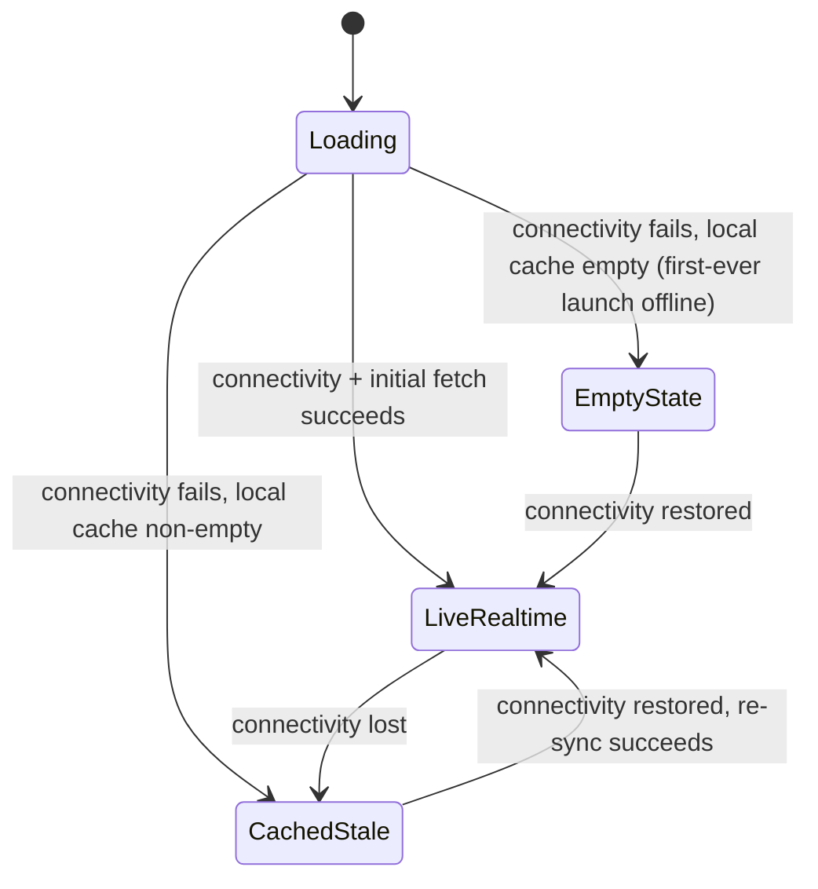

# Offline & Sync Architecture

| | |
|---|---|
| **Document ID** | RAH-DOC-027-OFFLINE-SYNC | 
| **Phase** | Phase 1 — System Architecture |
| **Version** | 1.0 |
| **Related** | [ADR-0008](../adr/0008-offline-first-mobile-sync.md) · [Sequence Diagram §6](./sequence-diagrams.md#6-offline-map-load--reconnect-sync) · [SRS FR-MAP-07, NFR-AVAIL-02](../srs/SRS.md) |

## 1. Scope
Implementation-level detail on top of [ADR-0008](../adr/0008-offline-first-mobile-sync.md)'s strategy decision (read-cache-first, no offline writes for payment/unlock).

## 2. Local Data Model (Mobile)

A local SQLite-backed store (Drift or Isar — final library choice is a Phase 5 implementation detail, not fixed here) mirrors a **read-only subset** of the backend schema, scoped to what the map/place-detail/Slatoki/profile screens need offline:

| Local table | Mirrors | Sync direction |
|---|---|---|
| `local_place_summary` | `PlaceSummary` API projection (station + third-party place) | Server → Client only |
| `local_cabin_status` | `Cabin` | Server → Client only |
| `local_favorite` | `Favorite` | Client → Server (online-only write, cached locally post-write for instant UI) |
| `local_user_profile` | `User` (own profile only) | Server → Client, refreshed on login/foreground |
| `sync_metadata` | `{ table, lastSyncedAt, cursor }` per local table | Local only — drives freshness indicator (§4) |

**No local table mirrors `access_session` or `transaction`** — by design (ADR-0008): these flows require connectivity by nature and are never given a local read-then-later-sync path, since Access & Payment correctness depends on server-authoritative real-time state.

## 3. Sync Algorithm

1. **Cold start / app foreground with connectivity**: pull `GET /places/nearby` for the user's last-known or current position, write-through to `local_place_summary`/`local_cabin_status`, update `sync_metadata.lastSyncedAt`.
2. **While foregrounded with connectivity**: subscribe to Supabase Realtime channels (`station:{id}:cabins` for stations currently on-screen) — incremental updates write directly to local tables, bypassing a full re-pull.
3. **Loss of connectivity**: Realtime subscription drops; UI continues reading from local tables; `sync_metadata.lastSyncedAt` stops advancing, which is exactly what drives the freshness indicator (§4) — no special "offline mode" flag is needed beyond "how old is my data."
4. **Reconnection**: on connectivity-restored callback, re-pull `GET /places/nearby` for the current viewport (full reconciliation, not a delta — simplest correct approach at V1 traffic/data volume) and re-subscribe to Realtime.

## 4. Freshness Indicator (FR-MAP-07)

- Every screen reading from local cache computes `age = now - sync_metadata.lastSyncedAt` for the relevant table and renders a Material 3 `AssistChip`/`Badge` ("Updated just now" / "Updated 4 min ago" / "Updated 20+ min ago — may be outdated") per [ADR-0011](../adr/0011-material-design-3-as-design-system.md)'s component-composition rule.
- Thresholds (indicative, Phase 5 UX-tunable): `<1min` = no badge (fresh), `1–10min` = neutral badge, `>10min` = warning-toned M3 badge.

## 5. Conflict Handling

Because writes to the mirrored tables are **server-only** (§2), there is no client-side write/write conflict to resolve. The only client "write" that touches the local cache is `Favorite`, which is: (a) sent to the server immediately if online — local cache updates only after server `201` confirms, never optimistically for the persisted flag; (b) **disabled entirely** (button shows a disabled/offline state) if there is no connectivity, rather than queued — consistent with ADR-0008's "no offline writes" scope, applied uniformly rather than carving out a special case for favorites.

## 6. Cache Eviction

- `local_place_summary`/`local_cabin_status` rows outside a configurable radius of the user's last N known positions are evicted on a rolling basis (LRU by `last_seen_at`, cap e.g. 500 places — exact figure a Phase 5 tuning item) to bound local storage growth for users who travel across many cities.
- `local_favorite` and `local_user_profile` are never evicted by the LRU policy (always small, always relevant).

## 7. State Diagram — Map Screen Data Source

## 8. Assumptions
- Local cache library (Drift vs. Isar) is not fixed here — both satisfy the read-only-mirror requirement equally; final choice is a Phase 5 team-preference decision, not an architectural one.
- Eviction cap (500 places) is illustrative; final figure depends on Phase 5 device-storage budget testing.

## 9. Open Questions
- Should `local_favorite`'s "add" action be silently disabled offline, or queued with a visible "will sync when online" affordance? RAH-DOC-005 does not specify offline favorite behavior; current decision (disabled, not queued) favors architectural simplicity and consistency with ADR-0008's no-offline-writes scope — revisit in Phase 5 UX review if user testing shows friction.

## 10. Completion Status

| Item | Status |
|---|---|
| Local data model scoped to read-only mirror | ✅ Complete |
| Sync algorithm (pull + realtime + reconnect) specified | ✅ Complete |
| Freshness indicator logic specified | ✅ Complete |
| Conflict handling policy specified (none needed by design) | ✅ Complete |
| Cache eviction policy specified | ✅ Complete (exact thresholds deferred to Phase 5 tuning) |

**Phase 1 deliverable 8 of 10 — Offline & Sync Architecture: COMPLETE.**
