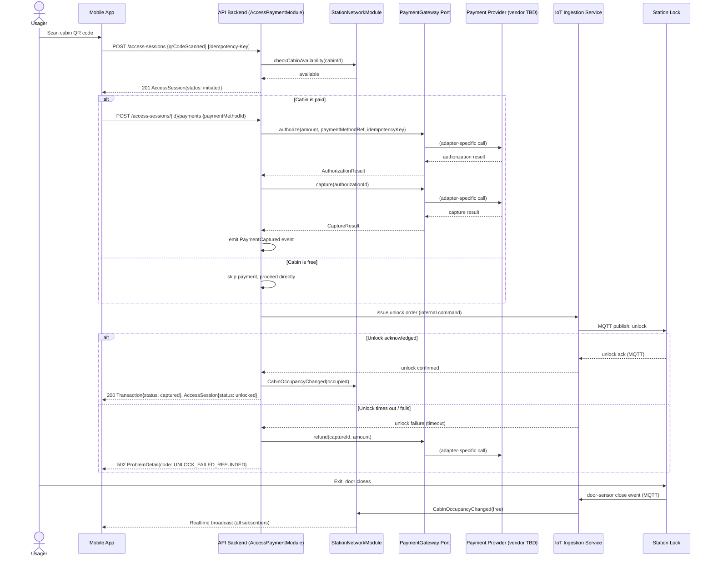
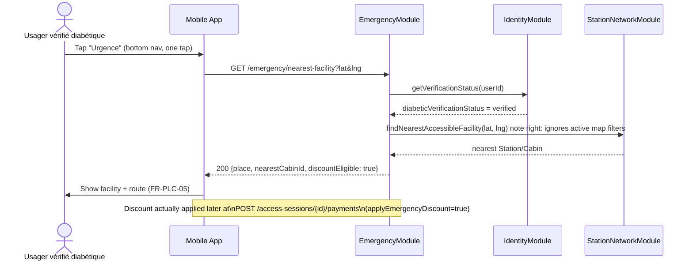
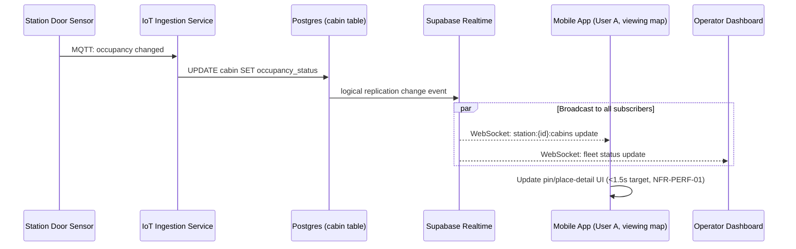
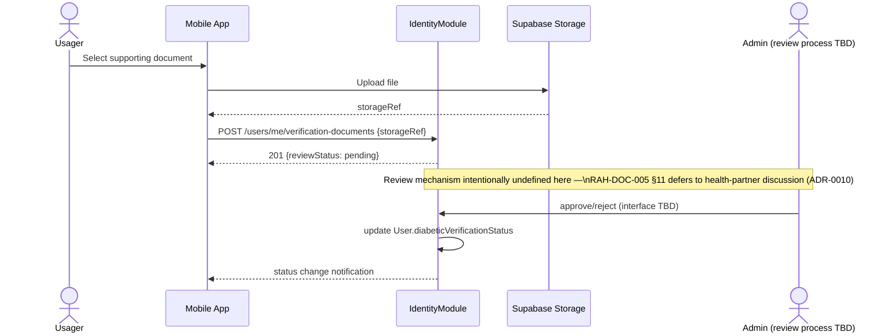
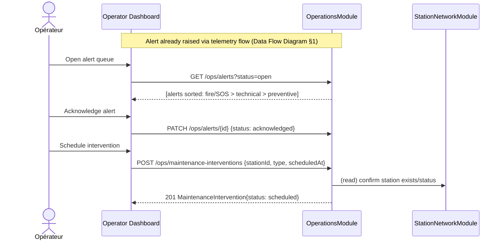
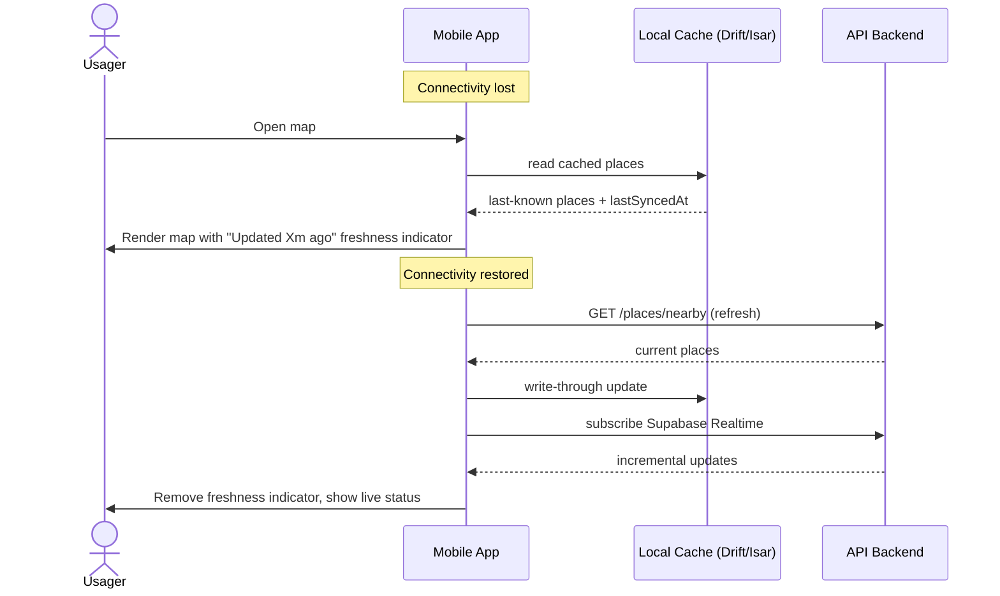

# Sequence Diagrams — Critical User Flows

| | |
|---|---|
| **Document ID** | RAH-DOC-025-SEQUENCE-DIAGRAMS |
| **Phase** | Phase 1 — System Architecture |
| **Version** | 1.0 |
| **Related** | [Data Flow Diagrams](./data-flow-diagrams.md) · [Domain Model](./domain-model.md) · [API Architecture](../api/api-architecture.md) |

## 1. QR Scan → Payment → Unlock (incl. failure/refund path)
Implements FR-PAY-01…06, ADR-0014's `PaymentGateway` abstraction, Risk R-11/R-12 mitigation.

## 2. Mode Urgence Activation
Implements FR-EMG-01…03.

## 3. Real-Time Cabin Status Broadcast
Implements FR-PLC-02, FR-PAY-05, FR-OPS-01.

## 4. Diabetic Verification Submission & Review
Implements FR-USR-03; process step intentionally provider/process-agnostic (ADR-0010).

## 5. Operator Alert Triage & Maintenance Scheduling
Implements FR-OPS-02, FR-OPS-03.

## 6. Offline Map Load & Reconnect Sync
Implements FR-MAP-07, [Offline & Sync Architecture](./offline-sync-architecture.md).

## Completion Status
✅ Complete — six critical flows covering payment/unlock (incl. failure), emergency, real-time broadcast, verification, operations, and offline/sync, each traced to SRS requirements.

**Phase 1 deliverable 6 of 10 — Sequence Diagrams: COMPLETE.**
