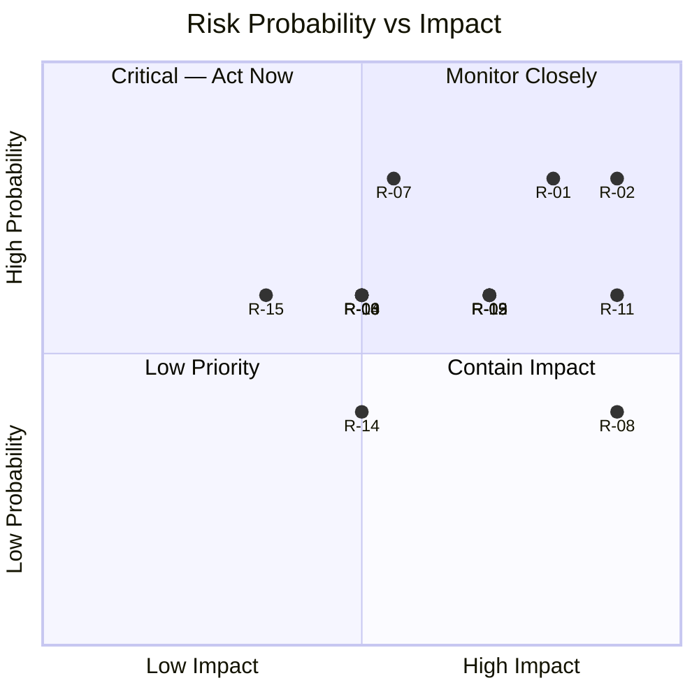

# Risk Register

| | |
|---|---|
| **Document ID** | RAH-DOC-018-RISK-REGISTER |
| **Phase** | Phase 0 — Analysis |
| **Version** | 1.0 |
| **Status** | Living document — reviewed at the start of each phase |
| **Date** | 2026-07-31 |
| **Related** | [PRD Open Questions](../prd/PRD.md#15-open-questions) · [ADRs](../adr/README.md) |

**Scoring**: Probability (1–5) × Impact (1–5) = Score. `Score ≥ 15` = 🔴 High, `8–14` = 🟠 Medium, `< 8` = 🟢 Low.

| ID | Risk | Category | Prob | Impact | Score | Mitigation | Owner | Related |
|---|---|---|---|---|---|---|---|---|
| R-01 | Diabetic-verification mechanism is undefined pending health-partner discussions; Mode Urgence discount (§2.4) cannot ship without it. | Business/Compliance | 4 | 4 | 16 🔴 | Data shape fixed now ([ADR-0010](../adr/0010-diabetic-verification-mechanism.md)); escalate health-partner workshop scheduling before Phase 4. | Product | PRD OQ1 |
| R-02 | Local payment provider not yet selected; Access & Payment epic (EPIC-04) cannot be implemented against a real integration. | Technical/Schedule | 4 | 5 | 20 🔴 | Prioritize provider selection workshop before Phase 4/10; design `PaymentGateway` port now so provider choice doesn't block domain work ([Domain Model §6](../architecture/domain-model.md#6-bounded-context-access--payment)). | Engineering | PRD OQ2 |
| R-03 | Backend implementation language/framework undecided (RAH-DOC-005 §7 names no language). | Technical/Schedule | 3 | 3 | 9 🟠 | Resolve in Phase 1 System Architecture kickoff workshop. | Engineering | Architecture Overview OQ5 |
| R-04 | Time-series store engine undecided; IoT telemetry volume at scale is unknown until station count is confirmed. | Technical | 3 | 3 | 9 🟠 | Resolve in Phase 1, informed by projected station count from the business/rollout plan. | Engineering | ADR-0004, OQ6 |
| R-05 | Native RTL implementation (not mirrored LTR) across mobile, web, and both dashboards is a genuinely hard UI engineering problem, easy to under-deliver as a visual mirror. | Technical | 3 | 4 | 12 🟠 | Dedicated RTL QA pass per surface; RTL golden-path test suite; avoid framework auto-mirroring as a substitute. | Engineering/QA | SRS NFR-I18N-01, US-06.2 |
| R-06 | Achieving genuine Material Design 3 parity (not just visual imitation) on the Operator/Sponsor web dashboards requires a web component library decision not yet made. | Technical | 3 | 3 | 9 🟠 | Select M3-compliant web library in Phase 1/2; flagged in [ADR-0011](../adr/0011-material-design-3-as-design-system.md) consequences. | Engineering | ADR-0011 |
| R-07 | Community-declarative status for third-party places (mosques, businesses) may be stale or inaccurate, undermining user trust versus IoT-verified RAHETI units. | Product | 4 | 3 | 12 🟠 | Enforce clear visual distinction between IoT-verified and declarative status (already required, §2.2); consider staleness thresholds/community flagging in Phase 1. | Product | SRS FR-PLC-02 |
| R-08 | Sponsor Dashboard aggregation logic could leak user-identifying data if analytics queries aren't strictly aggregate-only at the data-access layer. | Compliance/Security | 2 | 5 | 10 🟠 | Enforce aggregation at the query/API layer, not just the UI layer, per [Domain Model §9 invariant](../architecture/domain-model.md#9-bounded-context-sponsorship); add an automated test asserting no PII field is reachable from Sponsor-scoped endpoints. | Engineering/Security | SRS FR-SPN-04 |
| R-09 | Cloud availability target (99.5%) and 1.5s response-time target depend on regional hosting proximity to Algeria, which is not yet confirmed for the chosen Supabase project region. | Technical | 3 | 4 | 12 🟠 | Validate Supabase region latency from representative Algerian network conditions before Phase 3 commitment; have a CDN/edge-cache fallback plan. | Engineering | SRS NFR-PERF-01, NFR-AVAIL-01 |
| R-10 | Modular-monolith boundaries ([ADR-0003](../adr/0003-backend-architecture-style.md)) are not compiler-enforced; without review discipline, bounded contexts can silently couple, undermining future microservices extraction. | Technical | 3 | 3 | 9 🟠 | Add architecture-boundary lint/static-analysis checks in CI (Phase 3); code review checklist item. | Engineering | ADR-0003 |
| R-11 | MQTT broker and IoT ingestion service must handle unlock/alert commands reliably under field connectivity conditions (mobile stations, intermittent networks); a dropped unlock order after payment capture is a direct user-facing failure. | Technical | 3 | 5 | 15 🔴 | Design idempotent, retried command delivery with explicit timeout/refund path in Access & Payment; define SLA with RAH-DOC-004 hardware team. | Engineering | SRS FR-PAY-04, ADR-0006 |
| R-12 | Payment/refund handling when an unlock order fails after capture (edge case not explicitly specified in RAH-DOC-005 §2.5) could leave a user charged with no access. | Business/Compliance | 3 | 4 | 12 🟠 | Define an explicit auto-refund or retry policy in Phase 1 API design; not specified in source document — flag for product decision. | Product/Engineering | ERD Access & Payment, R-11 |
| R-13 | Local personal-data-protection regulation compliance (§9) requirements are referenced generically; specific legal obligations (data residency, consent flows, retention periods) are not detailed in RAH-DOC-005. | Compliance | 3 | 4 | 12 🟠 | Engage legal/compliance review before Phase 4 (backend) and Phase 13 (production) sign-off. | Product/Legal | SRS NFR-SEC-04 |
| R-14 | Vendor lock-in to Supabase for Auth/Realtime/Storage could complicate a future migration if scale or cost requirements change. | Technical/Business | 2 | 3 | 6 🟢 | Keep persistence access behind repository ports ([ADR-0003](../adr/0003-backend-architecture-style.md)) to bound the migration surface if ever needed. | Engineering | ADR-0005 |
| R-15 | Native-language content authoring requirement (§2.7 — no machine translation in production) could bottleneck content velocity if bilingual content authors are understaffed. | Business/Schedule | 3 | 2 | 6 🟢 | Confirm content-team staffing plan alongside Phase 2 design-system work. | Product | SRS FR-I18N-03 |

## Risk Heatmap (indicative)

## Phase 1 Update Log

| Risk | Change | Reference |
|---|---|---|
| R-03 (backend language/framework undecided) | **Resolved** — TypeScript/NestJS selected | [ADR-0012](../adr/0012-backend-framework-selection.md) |
| R-04 (time-series store undecided) | **Resolved** — native PostgreSQL partitioning, no new infra | [ADR-0013](../adr/0013-time-series-storage-strategy.md) |
| R-11 (MQTT unlock-command reliability) | **Partially mitigated** — idempotent commands, refund-on-failure path architected | [Sequence Diagram §1](../architecture/sequence-diagrams.md#1-qr-scan--payment--unlock-incl-failurerefund-path), [ADR-0014](../adr/0014-payment-provider-abstraction.md) |
| R-12 (payment captured, unlock fails) | **Mitigated** — explicit refund path now architected, no longer an unspecified edge case | [ADR-0014](../adr/0014-payment-provider-abstraction.md) |
| R-02 (payment provider undecided) | **Still open by design** — provider-agnostic architecture unblocks development regardless | [ADR-0014](../adr/0014-payment-provider-abstraction.md) |
| R-01 (diabetic verification undecided) | **Still open by design** — data shape fixed, process intentionally deferred | [ADR-0010](../adr/0010-diabetic-verification-mechanism.md) |
| R-09 (regional hosting latency) | **Still open** — indicative shortlist only, final selection pending | [ADR-0016](../adr/0016-hosting-provider-selection.md) |
| *(new)* R-16 | RLS policies are a Phase 4 implementation task; if skipped or misconfigured, the "defense in depth" AuthZ model degrades to app-layer-only enforcement. | [Security Architecture §2](../architecture/security-architecture.md#2-authorization-authz) — Prob 2, Impact 4, Score 8 🟠 — Mitigation: make RLS presence a Phase 4 PR-review checklist item for every new table. |

## Assumptions
- Probability/Impact scores are Phase-0 qualitative estimates by the documentation author, not a formal stakeholder risk workshop output — to be re-scored with product/engineering leadership before Phase 1 sign-off.

## Completion Status

| Item | Status |
|---|---|
| Risks derived from every open question across PRD/SRS/Architecture/ERD/Domain Model | ✅ Complete |
| Additional delivery/technical risks identified beyond source-document gaps | ✅ Complete |
| Scoring and mitigation owner assigned per risk | ✅ Complete |
| Formal stakeholder risk workshop validation | ⚠️ Pending — recommended before Phase 1 kickoff |
| Phase 1 review pass (resolved/mitigated risks logged) | ✅ Complete |

**Living document — last reviewed at Phase 1 completion (2026-07-31).**
