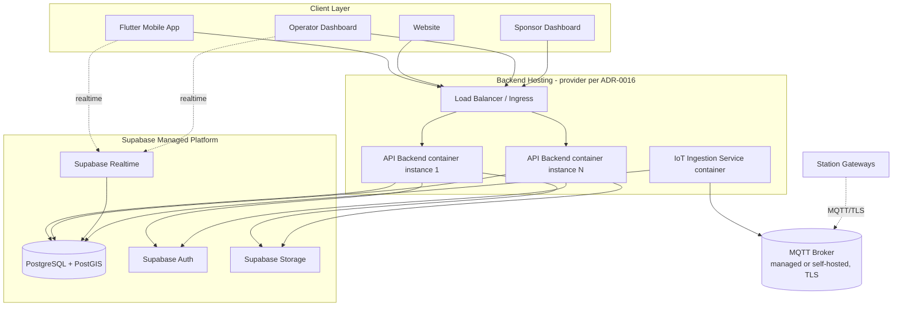

# Deployment Architecture

| | |
|---|---|
| **Document ID** | RAH-DOC-029-DEPLOYMENT-ARCHITECTURE |
| **Phase** | Phase 1 — System Architecture (executed in Phase 3 — Cloud, and Phase 13 — Production) |
| **Version** | 1.0 |
| **Related** | [System Architecture Document](../architecture/system-architecture.md) · [ADR-0005](../adr/0005-baas-platform-supabase.md) · [ADR-0016](../adr/0016-hosting-provider-selection.md) |

> This fixes the **target topology and operability contract** the Phase 3/13 execution work builds against. It does not provision any infrastructure — no code/config was written, per the Phase 1 instruction not to begin implementation.

## 1. Environments

| Environment | Purpose | Supabase project | Backend hosting |
|---|---|---|---|
| `dev` | Local/shared development | Dedicated Supabase dev project | Local Docker Compose (NestJS + local Postgres mirror optional) |
| `staging` | Pre-production validation, QA, UAT | Dedicated Supabase staging project | Hosting candidate per [ADR-0016](../adr/0016-hosting-provider-selection.md), staging tier |
| `production` | Live | Production Supabase project, region chosen for Algeria proximity (§7's requirement) | Hosting candidate per ADR-0016, production tier |

Each environment is a fully isolated Supabase project (no shared database across environments), per standard BaaS environment-isolation practice.

## 2. Deployment Topology

- **API Backend** is deployed as a **stateless, horizontally scalable container** (Docker image built from [ADR-0012](../adr/0012-backend-framework-selection.md)'s NestJS app) behind a load balancer — statelessness is guaranteed by the modular-monolith design ([ADR-0003](../adr/0003-backend-architecture-style.md)) having no in-process session state (JWT auth, no server-side sessions).
- **IoT Ingestion Service** can be deployed as a separate container (or a NestJS microservice-mode module within the same monolith image, sharing the codebase but scaled independently) — final packaging choice is a Phase 3 decision; the architectural requirement is only that it can scale independently of the HTTP API tier, since telemetry volume and HTTP request volume grow independently.

## 3. CI/CD Pipeline (stages, to be implemented Phase 3)

1. **Lint & type-check** (ESLint incl. the module-boundary rule from [Module Dependency Diagram §5](../architecture/module-dependency-diagram.md#5-rules-enforced-ci--review); `tsc --noEmit`).
2. **Unit tests** (Domain + Application layers — no I/O, fast).
3. **Contract check**: generated OpenAPI (from `@nestjs/swagger` decorators) diffed against the authored [`openapi.yaml`](../api/openapi.yaml) — fails the build on undocumented drift ([API Architecture §1](../api/api-architecture.md#1-principle-api-first-contract-before-code)).
4. **Integration tests** (Infrastructure layer against a disposable Postgres/PostGIS container).
5. **Security scan**: dependency vulnerability scan (`npm audit`/Snyk-class tool), secret scan (§ [Security Architecture §4](../architecture/security-architecture.md#4-secrets-management)).
6. **Build & push** container image, tagged by commit SHA.
7. **Deploy to staging** (automatic on merge to main), **deploy to production** (manual approval gate).

## 4. Scalability

- **API Backend**: horizontal scaling of stateless containers behind the load balancer, triggered on CPU/request-latency thresholds (exact autoscaling policy is a Phase 3 tuning item).
- **Database**: Supabase connection pooling (Supavisor/PgBouncer, Supabase-managed) sits in front of Postgres to absorb connection growth as API instances scale out, avoiding Postgres's native connection-limit ceiling.
- **Time-series telemetry** ([ADR-0013](../adr/0013-time-series-storage-strategy.md)): partition-pruned queries keep read performance roughly constant as historical data grows; a documented future checkpoint (not a V1 action) is evaluating a dedicated store or read-replica if station-fleet growth outpaces native-partitioning performance.
- **Realtime**: Supabase Realtime's channel-based fan-out scales with subscriber count per Supabase's managed service limits — a Phase 3 capacity-planning input once expected concurrent-user counts are estimated.

## 5. Observability

- **Structured logging**: JSON logs from every container (`PlatformModule`), each entry carrying a `correlationId` propagated from the originating HTTP request (or MQTT message) through every downstream module call and external adapter call — enabling full request-flow reconstruction across the sequence diagrams in [Sequence Diagrams](../architecture/sequence-diagrams.md).
- **Tracing**: OpenTelemetry instrumentation (NestJS interceptor) across API Backend, IoT Ingestion, and outbound calls to Supabase/Payment Provider/MQTT — exported to a tracing backend (candidate: Grafana Tempo, or hosting-provider-native equivalent, TBD with [ADR-0016](../adr/0016-hosting-provider-selection.md)).
- **Metrics**: request rate/latency/error-rate (RED metrics) per endpoint; domain-specific metrics (unlock success rate, payment authorization latency, MQTT message lag) surfaced via Prometheus-compatible `/metrics` endpoint — directly supporting NFR-PERF-01/NFR-AVAIL-01 measurement.

## 6. Monitoring & Alerting

| Signal | Alert condition (indicative) | Severity |
|---|---|---|
| API error rate | >2% 5xx over 5 min | High |
| Unlock command failure rate | >1% over 15 min | Critical (feeds Risk R-11) |
| MQTT broker connection count | Sudden drop >20% | High |
| Database CPU/connection saturation | >80% sustained 10 min | High |
| Backup job failure | Any failure | Critical |

Exact alert routing (on-call, escalation) is a Phase 13 operational readiness item.

## 7. Backup & Retention

- **Database**: Supabase automated daily backups + Point-In-Time Recovery (PITR), satisfying RAH-DOC-005 §7's "plan de reprise d'activité formalisé." RPO/RTO targets to be formalized against Supabase's plan-tier PITR window in Phase 3.
- **Object storage**: Supabase Storage versioning/backup per Supabase platform defaults; verification documents retained per the compliance-pending policy in [Security Architecture §6](../architecture/security-architecture.md#6-privacy--compliance-nfr-sec-04).
- **Telemetry partitions** ([ADR-0013](../adr/0013-time-series-storage-strategy.md)): rolling retention (indicative: 24 months of raw readings, older data aggregated/summarized then archived to Supabase Storage as cold export) — exact window a Phase 3 business decision.
- **Disaster Recovery**: cross-region backup replication target and documented recovery runbook are a Phase 3/13 deliverable once the hosting provider ([ADR-0016](../adr/0016-hosting-provider-selection.md)) and Supabase region are finalized.

## 8. Assumptions
- Container orchestration platform (Kubernetes vs. simpler container PaaS) is intentionally not fixed — the topology above is portable to either, consistent with [ADR-0016](../adr/0016-hosting-provider-selection.md) being deliberately left open.

## 9. Open Questions
- Final hosting provider and region (ADR-0016).
- RPO/RTO targets and DR runbook — Phase 3.
- Autoscaling thresholds — Phase 3 tuning.

## 10. Completion Status

| Item | Status |
|---|---|
| Environment topology specified | ✅ Complete |
| Deployment diagram and CI/CD pipeline stages specified | ✅ Complete |
| Scalability, observability, monitoring, backup strategy specified | ✅ Complete |
| Provider-specific execution detail | ⚠️ Deferred to Phase 3 pending ADR-0016 |

**Phase 1 deliverable 9 of 10 — Deployment Architecture: COMPLETE.**
