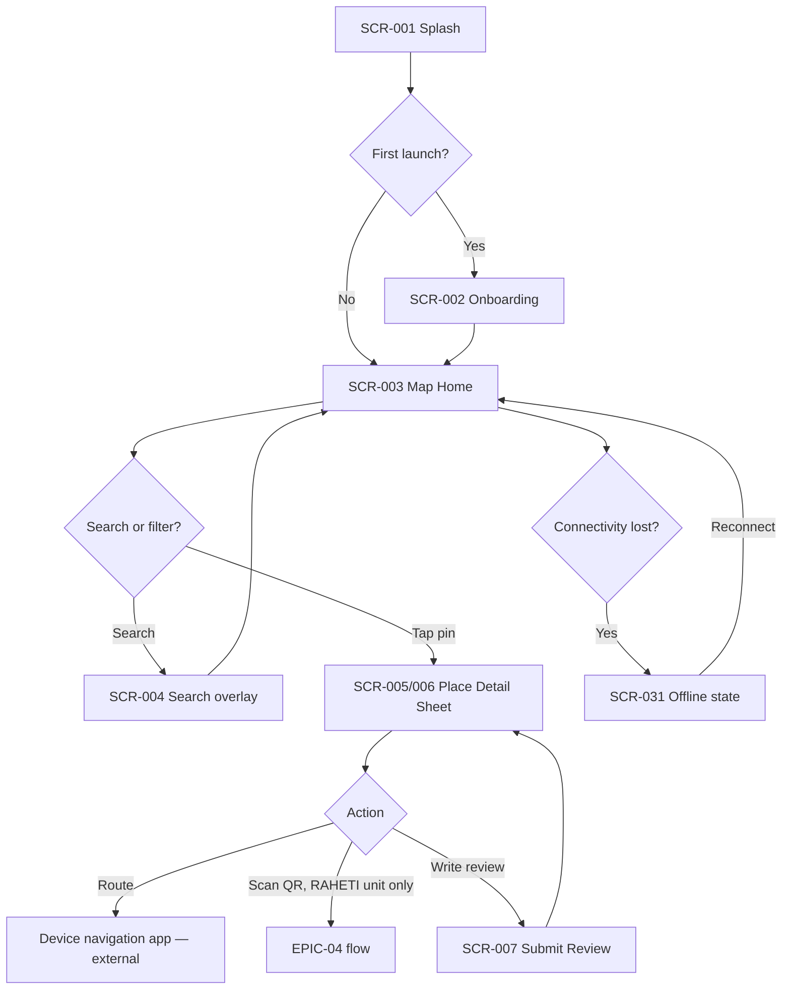
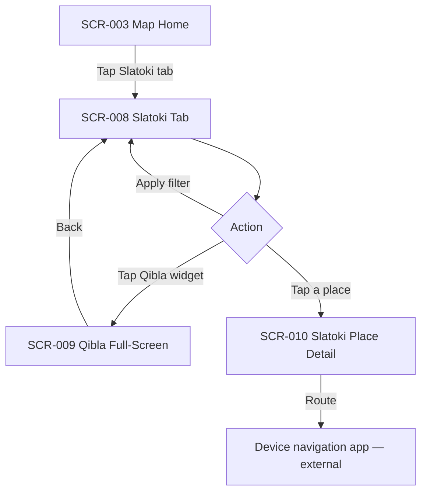
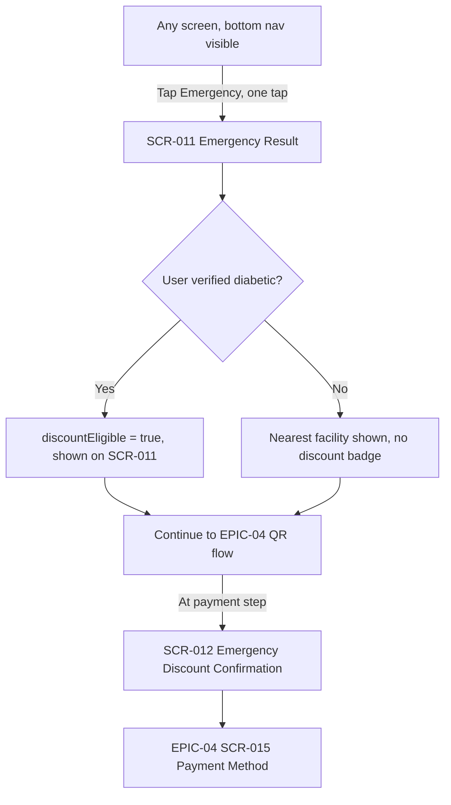
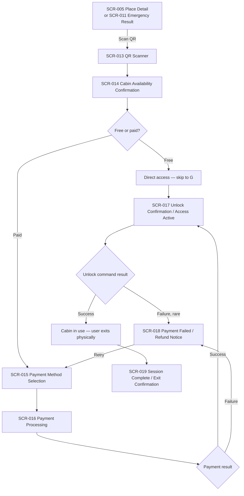
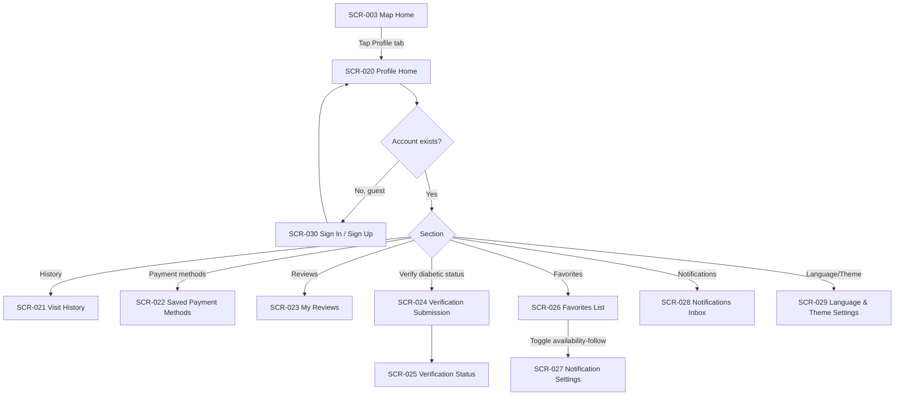
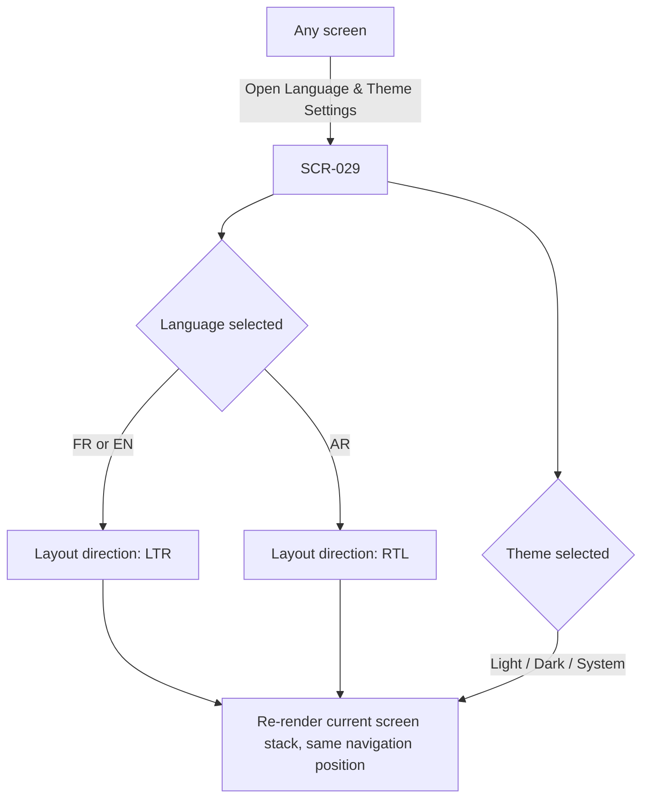
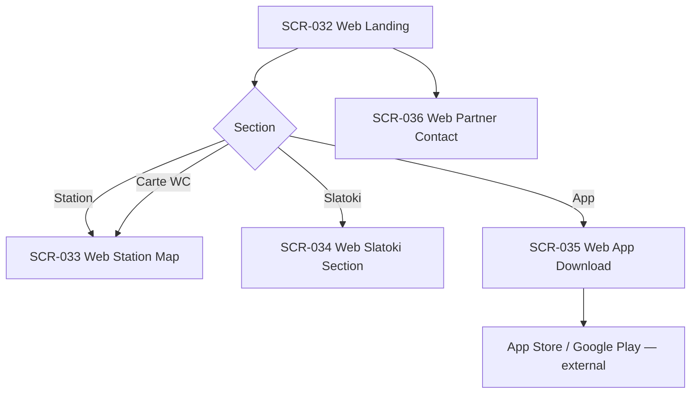
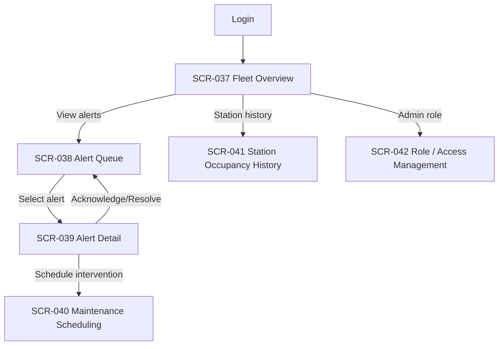
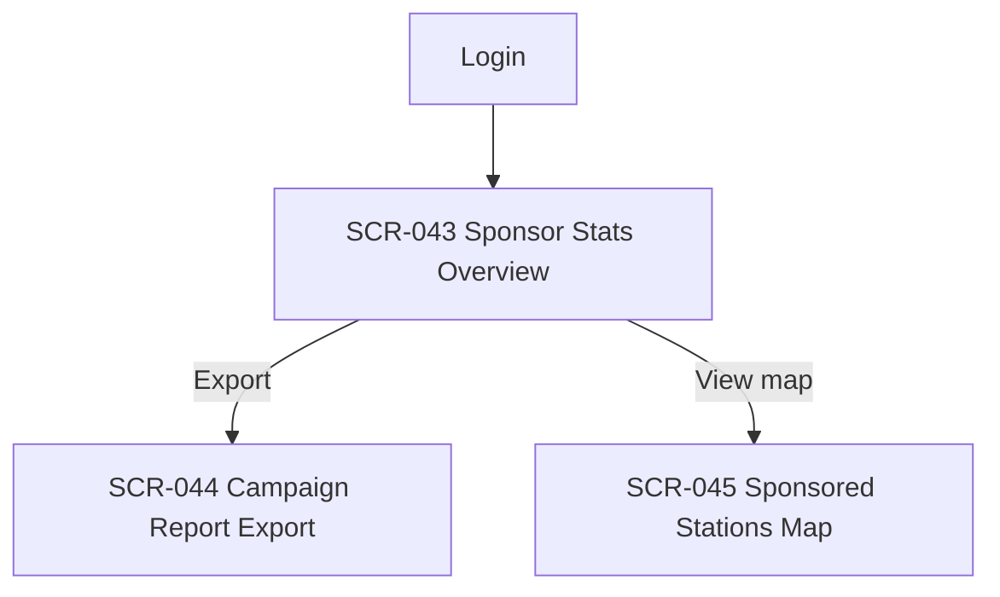

# Complete User Flows

| | |
|---|---|
| **Document ID** | RAH-DOC-038-USER-FLOWS |
| **Phase** | Phase 2 — UI/UX Design System and Product Design |
| **Version** | 1.0 |
| **Related** | [Screen Inventory](./screen-inventory.md) · [Sequence Diagrams (Phase 1, backend perspective)](../architecture/sequence-diagrams.md) |

> These are **navigation/UX flows** (screen-to-screen, decision points from the user's perspective) — complementary to, not a duplicate of, the Phase 1 [Sequence Diagrams](../architecture/sequence-diagrams.md), which show actor↔system↔backend message timing. Every node cites its `SCR-*` ID from the [Screen Inventory](./screen-inventory.md).

## 1. Map & Discovery (EPIC-01)

## 2. Slatoki (EPIC-02)

## 3. Mode Urgence (EPIC-03)

## 4. Payment & Unlock Journey (EPIC-04)

## 5. Profile & Account (EPIC-05)

## 6. Language, Theme & RTL Switching (EPIC-06, cross-cutting)

Applies uniformly across all 45 screens — this flow is referenced, not repeated, in every other flow.

## 7. Web Platform (EPIC-07)

## 8. Operator Dashboard (EPIC-08)

## 9. Sponsor Dashboard (EPIC-09)

## 10. Completion Status

| Item | Status |
|---|---|
| Flow for every UI-bearing epic (01–09) | ✅ Complete |
| Every flow node cites a Screen Inventory ID | ✅ Complete |
| Cross-cutting language/theme flow referenced, not duplicated, elsewhere | ✅ Complete |

**Phase 2 deliverable 6 of 10 — Complete User Flows: COMPLETE.**
