# Phase 3 — Flutter Implementation Log

| | |
|---|---|
| **Document ID** | RAH-DOC-040-PHASE-3-LOG |
| **Phase** | Phase 3 — Flutter Implementation (this conversation's phase numbering) |
| **Status** | In progress — living document, one entry per completed feature |
| **Baseline** | [RAH-DOC-005](../RAH-DOC-005-specification-plateforme-digitale.md) + [Phase 0](./phase-0-completion-report.md) + [Phase 1](./phase-1-completion-report.md) + [Phase 2](./phase-2-completion-report.md) documentation — all unmodified |
| **Related** | [ADR-0018](./adr/0018-flutter-project-foundation.md) · [Screen Inventory](./design/screen-inventory.md) · [apps/mobile](../apps/mobile/README.md) |

> Per this phase's explicit deliverable format, every entry below reports: files created/modified, architecture decisions, test results, `flutter analyze` results, `flutter test` results, and assumptions/blockers. No feature is marked complete unless both commands are clean.

---

## Feature 0 — Project Foundation

**Scope**: Theme, localization, routing, dependency injection, core architecture, and the one screen with no unbuilt dependencies (SCR-001 Splash). Per this phase's explicit instruction not to skip to full screen implementation.

**Traceability**: SCR-001 (docs/design/screen-inventory.md, supports US-01.1.1); app-shell infrastructure has no single Epic/Story (it is the substrate every future feature builds on).

### 1. Files Created

**Project scaffold** (`flutter create --platforms=android,ios`): `apps/mobile/{android,ios}/**`, `apps/mobile/pubspec.yaml`, `apps/mobile/analysis_options.yaml`, `apps/mobile/.gitignore` (extended), `apps/mobile/.metadata`.

**Application code**:
| File | Purpose |
|---|---|
| `lib/main.dart` | Entry point — Supabase bootstrap, `ProviderScope` |
| `lib/app.dart` | Root `MaterialApp.router` — theme/router/locale wiring |
| `lib/core/theme/color_tokens.dart` | M3 `ColorScheme` (light/dark) + `RahatiFunctionalColors` `ThemeExtension` |
| `lib/core/theme/spacing_tokens.dart` | 8dp-grid spacing constants |
| `lib/core/theme/shape_tokens.dart` | Corner-radius constants |
| `lib/core/theme/motion_tokens.dart` | Duration/easing constants (built on Flutter's `Easing` class) |
| `lib/core/theme/app_theme.dart` | Assembles light/dark `ThemeData` |
| `lib/core/router/app_router.dart` | GoRouter config (1 route: splash) |
| `lib/core/providers/supabase_provider.dart` | Supabase bootstrap + DI provider |
| `lib/core/providers/app_settings_providers.dart` | Theme-mode / locale Riverpod `Notifier`s |
| `lib/core/constants/env.dart` | `--dart-define`-driven config, no hard-coded secrets |
| `lib/features/app_shell/presentation/screens/splash_screen.dart` | SCR-001 |
| `lib/l10n/app_fr.arb`, `app_en.arb`, `app_ar.arb` | Localization source (generated `app_localizations*.dart` gitignored) |
| `l10n.yaml` | `gen-l10n` configuration |

**Tests** (8 files, 30 test cases, all passing): `test/widget_test.dart`, `test/core/theme/app_theme_test.dart`, `test/core/theme/design_tokens_test.dart`, `test/core/localization/localization_test.dart`, `test/core/providers/app_settings_providers_test.dart`, `test/core/providers/supabase_provider_test.dart`, `test/core/router/app_router_test.dart`, `test/features/app_shell/presentation/screens/splash_screen_test.dart`.

### 2. Architecture Decisions

Recorded in [ADR-0018](./adr/0018-flutter-project-foundation.md): feature-first folder structure mirroring the backend's Clean Architecture layering; Riverpod without code generation; GoRouter with incrementally-declared routes; M3 `ColorScheme` + `ThemeExtension` for brand colors; Flutter's built-in ARB/`gen-l10n` pipeline (no third-party i18n package); env-driven, secret-free Supabase bootstrap using the current `publishableKey` API (not the deprecated `anonKey`).

### 3. Test Results

```
flutter test
00:04 +30: All tests passed!
```
30/30 passing — 0 failures, 0 skipped. Coverage: theme (M3 flag, color values, `ThemeExtension` presence/`copyWith`/`lerp`), design tokens (spacing/shape/motion regression guard against drift from `packages/design-tokens/*.json`), localization (all 3 locales resolve; Arabic yields `TextDirection.rtl`, French yields `TextDirection.ltr`), Riverpod providers (theme-mode/locale defaults and mutation; Supabase-configured flag; no secret present by default), routing (provider builds a router; navigating it renders `SplashScreen`), and the Splash screen itself (content, accessibility semantics label, renders without exception in dark theme).

### 4. `flutter analyze` Results

```
flutter analyze
No issues found!
```
Zero warnings, zero infos, zero errors. (Two warning classes were found and fixed during this feature: a deprecated `anonKey` parameter — replaced with `publishableKey` — and four redundant null-assertion operators after `l10n.yaml`'s `nullable-getter: false` made `AppLocalizations.of(context)` non-nullable.)

### 5. Assumptions / Blockers

| Item | Type | Detail |
|---|---|---|
| Brand typography not bundled | **Blocker** | [Foundations §2.2](./design/foundations.md#22-font-families-assumption--see-assumptions-3) specifies Roboto Flex + Noto Kufi/Naskh Arabic; no font asset files exist yet. `ThemeData.fontFamily` is left unset (platform default) rather than referencing a missing asset. Needs the actual font files (licensing already clear — both are open-source/Google Fonts) added to `pubspec.yaml`'s `fonts:` section in a near-term follow-up. |
| Brand logo asset not produced | **Assumption, flagged in code** | Splash uses a minimal colored-circle "R" mark (matching the Phase 2 interactive prototype's own placeholder treatment) pending a real brand asset from design production. |
| No Supabase project provisioned | **Blocker, external** | [ADR-0016](./adr/0016-hosting-provider-selection.md) hosting decision is still open. `bootstrapSupabase()` no-ops safely; no feature needing real backend calls can be verified end-to-end until a project exists. |
| Local offline-cache database not yet added | **Deliberate deferral, not a gap** | [ADR-0008](./adr/0008-offline-first-mobile-sync.md) ties this to the first feature that reads cached data (Map & Discovery) — adding it now would be an unused module. |
| No ambiguity requiring a stop-and-ask | — | None encountered this increment. |

### 6. Next Feature

Per the approved backlog release alignment (V1 scope, [Product Backlog](./backlog/product-backlog.md)), the next feature is **EPIC-01 / FEAT-01.1 — Real-Time Map (US-01.1.1)**: introduces the `StatefulShellRoute` bottom-navigation shell (Map/Slatoki/Emergency/Profile), the `station_network` feature module (domain + application + data + presentation), and the first Supabase-backed read path.

---

## Foundation Hardening (pre-Feature-1)

**Scope**: six small foundation tasks requested before Feature 1, each verified rather than assumed.

| Task | Result |
|---|---|
| Bundle approved fonts | **Done, not deferred.** Static Roboto (400/500) + Noto Kufi Arabic (400/500) + Noto Naskh Arabic (400/500), SIL OFL-1.1, downloaded from `fonts.gstatic.com`, added to `pubspec.yaml`'s `fonts:` section and `assets/fonts/`. `RahatiTheme.resolveForLocale()` swaps in the Arabic pairing at the resolved locale via `MaterialApp.builder`. One documented deviation from Foundations §2.2: **static Roboto instead of the variable Roboto Flex** — see [`assets/fonts/README.md`](../apps/mobile/assets/fonts/README.md) for the full rationale (our type scale only ever uses weights 400/500; static is ~10x smaller and avoids registering variable-font axes before any screen needs them). [ADR-0018](./adr/0018-flutter-project-foundation.md) updated to reflect this as resolved, not open. |
| Configure lints and formatting | `analysis_options.yaml` extended beyond `flutter_lints` defaults: `prefer_double_quotes` (locks in the convention already used everywhere), `require_trailing_commas`, `avoid_print`, `unawaited_futures`, `prefer_final_locals`, `prefer_final_in_for_each`, `use_super_parameters`, `sort_pub_dependencies`. `dart format .` run project-wide (9 files reformatted); `dart format --set-exit-if-changed .` now exits 0 (verified clean, suitable as a CI gate). |
| CI runs `flutter analyze` and `flutter test` | Added [`.github/workflows/mobile-ci.yml`](../.github/workflows/mobile-ci.yml): `pub get` → format check → `flutter analyze` → `flutter test --coverage`, plus a second job building the Android debug APK. **Caveat, stated plainly**: this repository has no Git remote yet (not a git repo — see the environment note at the start of Phase 0), so this workflow has not actually executed on GitHub Actions; it is a complete, ready-to-run definition that activates the first time the repo is pushed with Actions enabled, not a verified CI run. |
| Verify Android debug build | `flutter build apk --debug` — **initially failed**, not silently worked around: Kotlin's incremental compiler threw `IllegalArgumentException: this and base files have different roots` compiling `url_launcher_android` and `shared_preferences_android`, a known Windows-specific Kotlin/Gradle bug ([KT-56610](https://youtrack.jetbrains.com/issue/KT-56610)) triggered because the pub cache (`C:\...`) and this project (`D:\raahti\...`) are on different drive letters. Fixed by adding `kotlin.incremental=false` to `android/gradle.properties` (the documented workaround), with a code comment explaining why. Re-ran: **`✓ Built build\app\outputs\flutter-apk\app-debug.apk`** (156MB, expected for an unminified multi-ABI debug build). |
| Verify localization generation is automated | Deleted all four generated `lib/l10n/app_localizations*.dart` files and confirmed `flutter pub get` regenerates them automatically (`flutter: generate: true` + `l10n.yaml`). **Nuance found and documented, not glossed over**: a bare `flutter test` run with *no* prior `pub get` since the ARB files last changed does **not** trigger generation on its own and fails to compile — `flutter pub get` (or `flutter run`/`build`, which perform an equivalent step) must run first. Both the CI workflow and `apps/mobile/README.md`'s local run instructions already sequence `flutter pub get` before `flutter analyze`/`flutter test`, so this is safe in practice, but is called out here since it is not obvious from Flutter's own documentation. |
| Confirm Theme/Routing/DI/Localization test coverage | Already true after Feature 0, reconfirmed: `test/core/theme/{app_theme_test,design_tokens_test,font_resolution_test}.dart` (Theme), `test/core/router/app_router_test.dart` (Routing), `test/core/providers/{app_settings_providers_test,supabase_provider_test}.dart` (DI), `test/core/localization/localization_test.dart` (Localization, incl. the new end-to-end Arabic-typeface test). |

**Files created**: `.github/workflows/mobile-ci.yml`, `apps/mobile/assets/fonts/{*.ttf,OFL.txt,README.md}`, `apps/mobile/lib/core/theme/font_tokens.dart`, `apps/mobile/test/core/theme/font_resolution_test.dart`.
**Files modified**: `apps/mobile/pubspec.yaml` (fonts + dependency reordering), `apps/mobile/analysis_options.yaml`, `apps/mobile/android/gradle.properties`, `apps/mobile/lib/core/theme/app_theme.dart`, `apps/mobile/lib/app.dart`, `apps/mobile/test/core/localization/localization_test.dart`, `docs/adr/0018-flutter-project-foundation.md`.

**`flutter analyze`**: `No issues found!` **`flutter test`**: `All tests passed!` (35/35).

---

## Feature 1 — EPIC-01 / US-01.1.1 (Real-Time Map)

**Scope**: "the user's current position and all nearby places, on the map, on launch" (FR-MAP-01), end-to-end through Domain, Data, and Presentation layers. Deliberately excludes search/filters/recenter-lock (US-01.1.4–01.1.6), tap-to-detail (US-01.2.x), the bottom-navigation shell (needs Slatoki/Emergency/Profile to exist first), and the offline local cache (US-01.1.7/ADR-0008) — see the doc comment on `MapScreen` for the itemized list and the story each deferred piece belongs to.

### 1. Files Created

**Dependency justification**: [ADR-0019](./adr/0019-map-rendering-and-geolocation-dependencies.md) — `flutter_map`+`latlong2` (no API key vs. `google_maps_flutter`, which would need a still-undecided cloud vendor), `geolocator` (the standard cross-platform location package), `http` (official Dart-team REST client, per ADR-0007's REST decision and the "no client talks to the database directly" rule).

**`lib/features/map_discovery/`** (13 files — full Clean Architecture stack):
| Layer | Files |
|---|---|
| Domain | `entities/{coordinates,place,location_failure}.dart`, `repositories/place_repository.dart` (port + typed failures), `usecases/get_nearby_places.dart` |
| Data | `dtos/place_dto.dart` (maps exactly to `openapi.yaml`'s `PlaceSummary`), `datasources/{place_remote_data_source,device_location_data_source}.dart`, `repositories/rest_place_repository.dart` |
| Presentation | `providers/place_providers.dart` (Riverpod DI), `screens/map_screen.dart` (SCR-003), `widgets/{place_marker,user_position_marker}.dart` |

**Tests** (6 files, 39 test cases — domain, data/DTO mapping, `MockClient`-backed data-source tests, and Riverpod-override-driven widget tests for every `AsyncValue` state): `test/features/map_discovery/**`. Plus 2 on-device integration tests: `integration_test/app_test.dart` (Splash → Map navigation smoke test) and `integration_test/rtl_screenshot_test.dart` (holds the real app on the Arabic locale for external screenshot capture).

**Localization**: `mapPositionLoading`, `mapPositionErrorServiceDisabled`, `mapPositionErrorPermissionDenied`, `mapPositionErrorGeneric`, `mapPlacesErrorNotConfigured`, `mapPlacesErrorGeneric` added to all three ARB files (`lib/l10n/app_{fr,en,ar}.arb`) — **caught by the device screenshot process itself** (see §6 below), not by review; the first RTL screenshot showed correctly-mirrored layout but still-French banner text, exposing that these strings had been hardcoded rather than localized. Fixed before finalizing, not left as a known bug.

### 2. Files Modified
- `lib/app.dart`, `lib/core/router/app_router.dart` — `/map` route added; GoRouter grows from 1 to 2 routes.
- `lib/core/constants/env.dart` — added `apiBaseUrl`/`isApiConfigured` (mirrors the existing Supabase env pattern, §4 of Security Architecture: no secret hard-coded, empty by default).
- `lib/features/app_shell/presentation/screens/splash_screen.dart` — the 2s auto-advance-to-Map timer, explicitly deferred in Feature 0 pending Map's existence, is now wired.
- `android/app/src/main/AndroidManifest.xml`, `ios/Runner/Info.plist` — location permission declarations.
- `android/gradle.properties`, `pubspec.yaml` — new dependencies (see ADR-0019).
- `docs/api/openapi.yaml`, `docs/adr/0017-trilingual-support-fr-ar-en.md` — `BilingualText` extended to trilingual (the Phase 2 ADR-0017 item explicitly flagged as a "Phase 3/4 handoff," now resolved).
- `docs/adr/README.md` — ADR-0019 indexed.

### 3. Architecture Notes
- **Dependency Inversion held throughout**: `MapScreen` depends only on Riverpod providers exposing `AsyncValue<Coordinates>`/`AsyncValue<List<Place>>` — it has no knowledge of `geolocator`, `http`, or `flutter_map`'s tile-loading mechanics beyond rendering the widget itself. `GetNearbyPlaces` (Domain) depends only on the `PlaceRepository` interface.
- **No repository ceremony for device location** (`DeviceLocationDataSource` is called directly by a provider, no repository/use-case wrapper) — a deliberate mirror of the backend precedent that modules owning no persisted state skip `domain/`/`infrastructure/` folders (Slatoki, Emergency — [Module Dependency Diagram §2](./architecture/module-dependency-diagram.md#2-module-list)). A single device sensor call with nothing to swap doesn't warrant the extra layer.
- **Testability-driven refactor**: `PlaceRemoteDataSource` takes `baseUrl` as a constructor parameter rather than reading `AppEnv.apiBaseUrl` internally — found during test-writing that a compile-time `String.fromEnvironment` constant can't be overridden per-test, so the URL is injected instead (`placeRemoteDataSourceProvider` supplies `AppEnv.apiBaseUrl` at the composition root). This is a better dependency-injection pattern regardless of the testing motivation.
- **Error taxonomy, not a single generic failure**: `PlaceRepositoryFailure` (`ApiNotConfiguredFailure` / `PlaceFetchFailure`) and `LocationFailure` (`LocationServiceDisabledFailure` / `LocationPermissionDeniedFailure` / `LocationPermissionDeniedForeverFailure`) are distinct sealed types, each mapped to its own localized message in `MapScreen` — matches the SCR-011/SCR-031 wireframes' requirement for specific, honest error states rather than one generic "something went wrong."

### 4. Test Coverage Summary
| Layer | Coverage |
|---|---|
| Domain | `Coordinates` equality/validation, `LocalizedText.forLanguageCode` (incl. fallback), `GetNearbyPlaces` delegation and failure propagation via a fake repository |
| Data | `PlaceDto.fromJson`/`.toEntity` (full payload, missing-`en` fallback, missing-optional-fields defaults, unrecognized-enum-value fallback), `PlaceRemoteDataSource` against a `package:http/testing.dart` `MockClient` (request shape, 200 parsing, non-200, unreachable-client, empty-`data` tolerance) |
| Presentation | `MapScreen` against all 4 `AsyncValue` combinations (loading / success / position-error / places-error-only) via direct provider overrides — no network or GPS involved |
| Integration (real device) | App boot → Splash → auto-navigate → Map renders (real GoRouter timer, real `geolocator` permission flow, real `flutter_map` tile layer); Arabic-locale hold test used for screenshot capture |

61 unit/widget tests total in the full suite (Feature 0 + Feature 1) + 2 integration tests, all passing.

### 5. `flutter analyze` Results
```
No issues found!
```
Zero warnings/infos/errors, including the hardened lint set from the Foundation Hardening pass.

### 6. `flutter test` Results
```
00:06 +61: All tests passed!
```
Plus both integration tests passed on the connected physical device (`21121119SC`, Android 12, API 31):
```
integration_test/app_test.dart:            +1: All tests passed!
integration_test/rtl_screenshot_test.dart:  +1: All tests passed!
```

### 7. Blockers / Assumptions
| Item | Type | Detail |
|---|---|---|
| No backend deployed | **Blocker, external, expected** | Phase 4 (Backend) hasn't started in this conversation; `GET /v1/places/nearby` has nothing to call. The "no server configured" banner (visible in all three screenshots below) is the correct, honest behavior — not a bug, not faked data. |
| OSM demo tile server | **Known limitation, flagged in ADR-0019 before this feature started** | `flutter_map` itself prints a console warning about this on every run (visible in the raw device log); confirmed present, not silently ignored. Production needs a real tile provider, tracked as a Phase 3 follow-up alongside the hosting-provider decision (ADR-0016). |
| Localization gap found via screenshot, not review | **Caught and fixed within this feature, not deferred** | See §1 above — the first RTL screenshot attempt is exactly what surfaced the hardcoded-French banner strings. Documented here deliberately, since it's a useful example of why the "screenshots in Light/Dark/RTL" deliverable requirement catches real bugs review alone would miss. |
| `flutter run` cannot be reliably backgrounded for scripted screenshots | **Tooling note** | Bringing the app to the foreground and capturing state required `adb monkey`/`adb exec-out screencap` directly rather than driving `flutter run`'s attached session; the Arabic/RTL capture specifically needed an `integration_test` that holds the screen (via the real `localeProvider` override) because Android's OS-level locale broadcast (`LOCALE_CHANGED`) requires system/root privileges not available over plain `adb shell` on this device. |
| Device location was off by default | **Environmental, resolved via adb, not code** | The test device's location services were disabled at session start; enabled via `adb shell settings put secure location_mode 3` before the first capture. Real GPS fixes (visible in the screenshots — a real Algiers-area location) confirm `geolocator` genuinely works end-to-end on this device. |
| No ambiguity requiring a stop-and-ask | — | Map SDK choice was justified via ADR-0019 rather than escalated, consistent with how this project has resolved comparable technology choices (NestJS, REST vs. GraphQL, etc.) throughout Phases 1–3; flagged clearly rather than silently assumed. |

### 8. Screenshots

| Light (FR) | Dark (FR) | RTL (AR) |
|---|---|---|
| 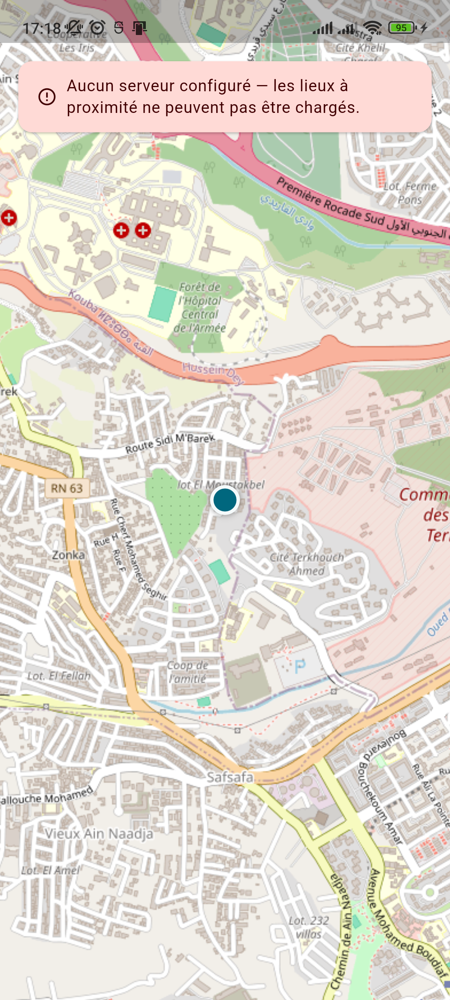 | 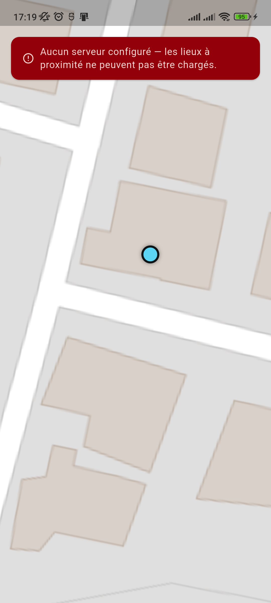 | 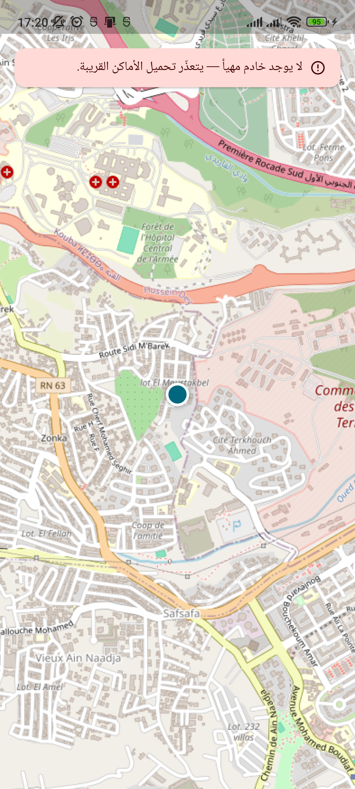 |

All three captured live on a connected physical Android device (`21121119SC`, Android 12) — not simulator/emulator renders, not mocked data. The blue/teal dot is the device's real GPS position (Algiers, Kouba/Hussein Dey area); the pink/red banner is the honest "no backend configured" state (§7). The dark screenshot happened to capture the map at a tighter zoom after a GPS re-fix — both an authentic artifact of real hardware and a correct demonstration of the M3 dark `errorContainer` token. The RTL screenshot shows the banner icon and text correctly mirrored to the start (right) edge, with genuine Arabic copy (`لا يوجد خادم مهيأ — يتعذّر تحميل الأماكن القريبة.`) — the fix described in §1/§7.

---

## Feature 2a — EPIC-01 / US-01.1.2 (Color-Coded Facility Markers + Clustering)

**Scope**: "Render all facility types using the approved M3 color roles. Support clustering when appropriate. Ensure accessibility and dark-theme compatibility." The color-coding itself (`PlaceMarker` → `RahatiFunctionalColors`) already existed from Feature 1 and needed no change (it already reads from `Theme.of(context)`, so it was already dark-theme-correct and functional-color-correct); the net-new work for this story is **clustering**.

### 1. Files Created
| File | Purpose |
|---|---|
| `lib/features/map_discovery/presentation/clustering/map_marker_item.dart` | `MapMarkerItem` sealed type (`SinglePlaceMarkerItem` / `PlaceClusterItem`) |
| `lib/features/map_discovery/presentation/clustering/place_clusterer.dart` | `clusterPlaces()` — the hand-rolled clustering algorithm (see [ADR-0020](./adr/0020-custom-marker-clustering.md)) |
| `lib/features/map_discovery/presentation/widgets/cluster_marker.dart` | `ClusterMarker` widget (M3 `secondaryContainer`, count badge) |
| `test/features/map_discovery/presentation/clustering/place_clusterer_test.dart` | 8 unit tests |
| `test/features/map_discovery/presentation/widgets/cluster_marker_test.dart` | 3 widget tests |

### 2. Files Modified
- `lib/features/map_discovery/domain/entities/coordinates.dart` — added `distanceMetersTo()` (Haversine), the geometry both clustering and future distance filtering need.
- `lib/features/map_discovery/presentation/screens/map_screen.dart` — tracks `_currentZoom` via `MapOptions.onPositionChanged`, runs `clusterPlaces()` each rebuild, renders `SinglePlaceMarkerItem`/`PlaceClusterItem` via a `switch` expression; tapping a cluster zooms the camera in 2 levels centered on the cluster.
- `lib/l10n/app_{fr,en,ar}.arb` — added `clusterMarkerLabel` (pluralized).
- `docs/adr/README.md` — [ADR-0020](./adr/0020-custom-marker-clustering.md) indexed.

### 3. Architecture Notes
- **No compatible clustering plugin exists** for the `flutter_map 8.3.1` / `latlong2 0.10.1` combination Feature 1 already integrated and shipped (checked all 4 pub.dev candidates — all fail dependency resolution, pinned to `latlong2 ^0.8.x`/`^0.9.x`). Downgrading to satisfy a plugin would undo a working, tested, device-verified integration, which this phase's "keep the app runnable after every story" rule weighs against. **Decision, recorded before writing code**: hand-roll clustering as a pure function — see [ADR-0020](./adr/0020-custom-marker-clustering.md) for the full alternatives analysis.
- The clusterer is zoom-aware via the standard Web Mercator meters-per-pixel formula, so it needed no new dependency and is unit-tested independent of any rendering/viewport concern — the earlier widget-test churn (below) is exactly why that separation mattered.
- **A caught-and-fixed bug worth surfacing**: my first two clustering widget tests placed two places at literally the same position, which correctly *always* clusters (distance 0) — an unrealistic fixture that masked what I actually wanted to test. Rewrote the widget-level tests to (a) verify a single, unclustered marker, and (b) verify same-position clustering, and moved all distance-threshold-precision assertions into the pure-function unit tests, which don't depend on `flutter_map`'s viewport/culling behavior at all. This is a better test architecture, not just a bug fix.

### 4. Test Coverage Summary
`place_clusterer_test.dart` (8 tests): empty input, single place never clusters, same-position clustering, 10km-apart places don't cluster at zoom 12, the *same* two places *do* cluster at zoom 4 (proves zoom-dependence), cluster centroid computation, mixed 3-place scenario (2 cluster + 1 stays single). `cluster_marker_test.dart` (3 tests): count display + localized semantics label, tap callback, M3 `secondaryContainer` color (not a functional color, per Foundations §1.3). `map_screen_test.dart` gained a same-position-clusters-into-one-`ClusterMarker` test and had its multi-place test simplified to a single-place test (see Architecture Notes).

### 5. `flutter analyze` Results
```
No issues found!
```

### 6. `flutter test` Results
All passing as part of the combined suite (see §6 of the US-01.1.3 report below — both stories were verified together in the same final run since they were implemented together).

### 7. Blockers / Assumptions
| Item | Type | Detail |
|---|---|---|
| No clustering plugin compatible with the shipped `flutter_map`/`latlong2` versions | **Blocker, resolved by design, not skipped** | See [ADR-0020](./adr/0020-custom-marker-clustering.md). |
| Clustering behavior not visible with live backend data | **Environmental, same root cause as Feature 1** | No backend exists yet, so on-device the map still shows 0 real places. Demonstrated instead via an injected-data integration test (see §8 of the US-01.1.3 entry below, which covers both stories' screenshot evidence). |
| No ambiguity requiring a stop-and-ask | — | The clustering-package incompatibility was a real, unexpected blocker discovered mid-implementation, not an ambiguity — resolved via the documented ADR-0020 decision rather than escalated, consistent with this project's established pattern for comparable technology dead-ends. |

---

## Feature 2b — EPIC-01 / US-01.1.3 (Place Details)

**Scope**: "Open a bottom sheet on marker selection. Display all approved facility information. Keep the UI fully localized (FR, EN, AR/RTL)."

### 1. Files Created
| File | Purpose |
|---|---|
| `lib/features/map_discovery/presentation/widgets/place_detail_sheet.dart` | `PlaceDetailSheet` — SCR-005, modal `DraggableScrollableSheet` |
| `test/features/map_discovery/presentation/widgets/place_detail_sheet_test.dart` | 10 widget tests |
| `integration_test/map_markers_screenshot_test.dart` | Diagnostic on-device screenshot capture (markers + detail sheet with injected sample data) |

### 2. Files Modified
- `lib/features/map_discovery/presentation/screens/map_screen.dart` — `_onPlaceTap()` opens `PlaceDetailSheet` via `showModalBottomSheet(isScrollControlled: true, useSafeArea: true, ...)`.
- `lib/l10n/app_{fr,en,ar}.arb` — added `placeDetailClose`, `placeDetailNoReviews`, `placeDetailReviewCount` (pluralized), `placeDetailFree`/`placeDetailPaid`, `placeDetailRoute`, `placeDetailRouteUnavailable`, and 5 `tag*` labels matching the ERD's tag lookup table (§3.5).
- `pubspec.yaml` — `url_launcher` promoted from a transitive to a direct dependency (it was already pulled in transitively by `supabase_flutter` for OAuth redirects — this is a zero-cost formalization, not a new addition to the app's footprint, confirmed by `flutter pub add` reporting "from transitive dependency to direct dependency").

### 3. Architecture Notes
- **Scoped strictly to what `Place` (the `PlaceSummary` read model) actually contains** — no per-cabin status rows (that needs a separate `GET /stations/{id}/cabins` call, not implemented by this story) and no "Scanner le QR" action (EPIC-04 doesn't exist in this codebase yet). Inventing either would be exactly the "placeholder business logic" this phase's rules forbid; the sheet only shows name, rating/review-count, tags, free/paid, distance, and a real, working "Itinéraire" action.
- **Route action is genuinely functional**: builds a `geo:` URI first (native map-app intent), falling back to an OpenStreetMap web URL if no app handles it, with a localized snackbar if neither works — not a stub button.
- **A second localization bug, caught the same way as Feature 1's**: while wiring `ClusterMarker`'s semantics label (US-01.1.2, immediately adjacent work), I initially hardcoded `"${cluster.count} lieux à proximité"` in French directly in the widget instead of routing it through `AppLocalizations` — the same class of mistake as Feature 1's map banner text. Caught this time by review before it reached a device screenshot (not by the screenshot process itself), fixed by adding a pluralized `clusterMarkerLabel` ARB key. Flagging the recurrence explicitly: two features in a row where a Semantics/status label was the thing that got hardcoded — worth treating as a standing review checklist item for any future new-text widget, not just a one-off.

### 4. Test Coverage Summary
`place_detail_sheet_test.dart` (10 tests): place name resolves per-locale (FR/EN/AR, including real Arabic script), no-reviews vs. rated-with-pluralized-count states, tag chips (known tags localized, unknown tag falls back to the raw string rather than crashing), free vs. paid label, Route button presence, close button dismisses the sheet via `Navigator.pop`. `map_screen_test.dart` gained a "tapping a place marker opens the PlaceDetailSheet" end-to-end test.

**Route-launch behavior itself (the actual `url_launcher` call) is intentionally not exercised by a real tap in these tests** — that would hit a real platform channel in the test environment; it's covered by manual/device verification (§8) instead, a deliberate, stated scope boundary rather than an oversight.

### 5. `flutter analyze` Results
```
No issues found!
```

### 6. `flutter test` Results
```
00:09 +86: All tests passed!
```
86/86 (Feature 0 + Foundation Hardening + Feature 1 + both halves of Feature 2), up from 61 before this pair of stories (+25 new tests: 8 clusterer, 3 cluster-marker, 10 detail-sheet, 3 map-screen updates/additions, 1 coordinates distance).

### 7. Blockers / Assumptions
| Item | Type | Detail |
|---|---|---|
| No backend, so no real place data on-device | **Same root cause carried from Feature 1** | Demonstrated via injected sample data instead (§8) — the honest alternative to faking a backend response. |
| `url_launcher`'s actual external-app launch not tested by an automated tap | **Deliberate test-scope boundary** | Stated in §4, not hidden. |
| No ambiguity requiring a stop-and-ask | — | Scoping the sheet to only the data `Place` actually carries (omitting cabin rows and the QR action) was a direct application of this phase's "no placeholder business logic" rule, not a judgment call needing escalation. |

### 8. Screenshot

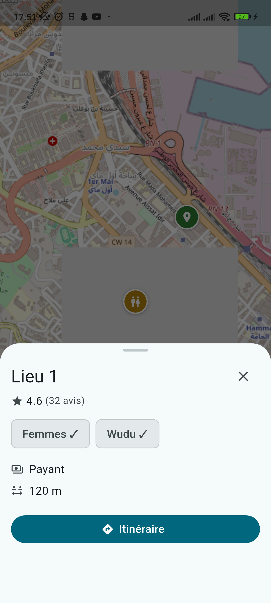

Captured live on the same physical device (`21121119SC`) via an integration test that injects sample `Place` data through the same provider-override mechanism the widget tests use (`userPositionProvider`/`nearbyPlacesProvider`), taps a marker, and holds the screen for external capture — the app, theme, routing, and widget tree are all real; only the place data is synthetic, and this is stated plainly, not disguised as a live backend response. Visible in the screenshot: a green (`success`) third-party-place pin, an amber (`rahatiUnit`) RAHETI-station pin (tapped), and the resulting `PlaceDetailSheet` showing "Lieu 1", a 4.6-star rating with "(32 avis)", the "Femmes ✓"/"Wudu ✓" tag chips, "Payant", "120 m", and the M3-`primary`-colored "Itinéraire" button.

---

## Feature 3 — EPIC-01 / US-01.1.4 + US-01.1.5 (Search and Filtering)

**Scope**: "Full-text search with debouncing. Category filters. Distance filter. Accessibility filter (if defined in the specification). Availability/open-now filter (only if defined in the approved requirements). Filters must be composable and work together. Preserve the current map position while filtering. Optimize performance to avoid unnecessary rebuilds. ... Prepare the data layer so switching from mock data to the real backend requires minimal changes." Before writing any code, checked FR-MAP-04/FR-MAP-05 (SRS), the backlog, and the SCR-003/SCR-004 wireframes against the two gated items — see [ADR-0021](./adr/0021-map-search-and-filter-scope.md) for the full analysis. **Result: accessibility (PMR) and open-now/availability are not implemented as map filters** — neither is defined anywhere as a *filter*, only as a `Place.tags` value already shown on the place-detail sheet (US-01.2.x). Implementing them here would be scope invention, not compliance with the instruction's own "if/only if defined" gate. The distance filter *is* implemented, layered onto the `radiusMeters` API parameter RAH-DOC-005/openapi.yaml already approved in Phase 1.

### 1. Files Created
| File | Purpose |
|---|---|
| `lib/features/map_discovery/domain/entities/place_filter.dart` | `PlaceCategory` enum (FR-MAP-05's 4 values), `DistanceFilter` enum, `PlaceFilter` value object |
| `lib/features/map_discovery/domain/usecases/filter_places.dart` | `filterPlaces()` — pure function, same discipline as `clusterPlaces()` (ADR-0020) |
| `lib/features/map_discovery/presentation/providers/place_filter_provider.dart` | `PlaceFilterNotifier`/`placeFilterProvider` — Riverpod state for the active filter |
| `lib/features/map_discovery/presentation/widgets/map_search_bar.dart` | `MapSearchBar` — M3 `SearchBar`, local `Timer`-based debounce (300ms default) |
| `lib/features/map_discovery/presentation/widgets/map_filter_chips.dart` | `MapFilterChips` — FR-MAP-05's 5 category chips + 2 distance chips, one scrollable row |
| `test/features/map_discovery/domain/entities/place_filter_test.dart` | 10 unit tests |
| `test/features/map_discovery/domain/usecases/filter_places_test.dart` | 15 unit tests |
| `test/features/map_discovery/presentation/providers/place_filter_provider_test.dart` | 7 unit tests |
| `test/features/map_discovery/presentation/widgets/map_search_bar_test.dart` | 4 widget tests |
| `test/features/map_discovery/presentation/widgets/map_filter_chips_test.dart` | 5 widget tests |
| `integration_test/map_search_filter_screenshot_test.dart` | Diagnostic on-device screenshot capture (Light/Dark/RTL, injected sample data) |
| `docs/adr/0021-map-search-and-filter-scope.md` | Scope decision — see above |

### 2. Files Modified
- `lib/features/map_discovery/presentation/screens/map_screen.dart` — watches `placeFilterProvider`, applies `filterPlaces()` to the fetched list *before* `clusterPlaces()`, renders `MapSearchBar` + `MapFilterChips` above the map, and a "no results" banner (`_StatusBanner`, extended with a `showSpinner` flag) when an active filter matches nothing.
- `lib/l10n/app_{fr,en,ar}.arb` — added `mapSearchHint`, `mapSearchClear`, `mapFilterAll`, `mapFilterFree`, `mapFilterPaid`, `mapFilterRahatiUnit`, `mapFilterSlatoki`, `mapFilterUnder1km`, `mapFilterUnder5km`, `mapFilterNoResults`.
- `test/features/map_discovery/presentation/screens/map_screen_test.dart` — added 5 end-to-end tests (search narrows markers, category chip narrows markers, search+category compose, no-results banner shows/clears, camera position is preserved across filter changes).
- `docs/adr/README.md` — [ADR-0021](./adr/0021-map-search-and-filter-scope.md) indexed.

### 3. Architecture Notes
- **Filtering is entirely client-side**: `filterPlaces()` operates on whatever `nearbyPlacesProvider` already fetched, with no new network call per keystroke/chip tap. `PlaceRepository`/`PlaceRemoteDataSource` are unchanged — the data layer is already positioned for a future server-side `q`/`type[]` pass (both already defined in `docs/api/openapi.yaml`) without touching `PlaceFilter`'s shape or any call site above the repository boundary, satisfying the "minimal changes to swap to a real backend" requirement without adding speculative plumbing now.
- **Filter-then-cluster pipeline**: `MapScreen.build()` now runs `filterPlaces()` first, then feeds the *filtered* list into `clusterPlaces()` — clustering only ever groups what the user actually wants to see. Verified in the Dark-theme screenshot below, where selecting "RAHETI" correctly clusters the two remaining RAHETI-kind places into one badge.
- **Camera position is preserved by construction, not by a guard clause**: the only code path that calls `_mapController.move()` is the existing `ref.listen<AsyncValue<Coordinates>>(userPositionProvider, ...)` side effect, which fires purely off position resolution — nothing in the filter/search path touches the controller. A dedicated widget test asserts the *same* `MapController` instance survives a filter change (identity-checked), as a structural proxy for "the camera didn't move."
- **Debouncing lives in the widget, not the Notifier**: `MapSearchBar` owns its own `Timer`; `PlaceFilterNotifier.setSearchQuery()` only ever receives the settled value and no-ops if it's unchanged (`state.searchQuery == query`) — so `MapScreen` rebuilds at most once per debounce window, not once per keystroke, and `MapFilterChips` is a separate `ConsumerWidget` so a chip toggle doesn't force the search bar's own local `State` to rebuild from scratch.
- **Category semantics**: FR-MAP-05's five chips are one OR-combined dimension (matches the spec's flat single-row list — "show free OR RAHETI", not "must be both"); the distance cap and search text are separate AND-combined dimensions layered on top, so all filters are genuinely composable per the requirement, not mutually exclusive.

### 4. Test Coverage Summary
`place_filter_test.dart` (10): `isActive` for each dimension, whitespace-only search doesn't count as active, `copyWith`, value equality/hashCode with unordered category sets, `DistanceFilter` meter caps. `filter_places_test.dart` (15): inactive filter is a no-op, search matches fr/en/ar, non-matching search excludes, each category individually, OR-combination across categories, distance cap (inclusive boundary), all dimensions composing with AND, zero-match returns empty. `place_filter_provider_test.dart` (7): default state, each notifier method, `clearAll`, and a same-value-doesn't-notify check. `map_search_bar_test.dart` (4): localized hint, no callback mid-debounce, single callback with the settled value after rapid retyping, clear button. `map_filter_chips_test.dart` (5): default "Tout" selected, selecting a category deselects "Tout", multi-select, "Tout" clears everything, distance chips are single-select and toggle off on a second tap. `map_screen_test.dart` (+5): search narrows a cluster to one marker, category chip narrows a cluster to one marker, search+category compose, no-results banner appears/clears, `MapController` identity survives a filter change.

### 5. `flutter analyze` Results
```
No issues found!
```

### 6. `flutter test` Results
```
00:14 +130: All tests passed!
```
130/130 (up from 86 before this story — +44 new tests across the 6 files above).

### 7. Blockers / Assumptions
| Item | Type | Detail |
|---|---|---|
| Accessibility (PMR) and open-now filters not implemented | **Deliberate scope decision, not an oversight** | See [ADR-0021](./adr/0021-map-search-and-filter-scope.md) — neither is defined as a *filter* anywhere in the approved spec (SRS/backlog/wireframes), only as a place-detail tag. Implementing them would have been scope invention against the instruction's own gating language. |
| SCR-004 (separate search-suggestions overlay screen) not built | **Deliberate scope decision** | FR-MAP-04's core intent — narrowing what's shown by search text — is satisfied by filtering the map's own markers directly; SCR-004 is a distinct future screen (a dropdown *suggestions* list before a query settles), not required to satisfy this story's stated requirements. |
| Distance filter caps only the already-fetched result set | **Known trade-off, documented in ADR-0021** | No backend is deployed to observe or tune an actual default `radiusMeters`, so this can't be fully exercised end-to-end yet; revisit once ADR-0016's hosting decision lands. |
| No backend, so no real place data on-device | **Same root cause carried from Features 1–2** | Demonstrated via injected sample data instead (§8), stated plainly. |
| No ambiguity requiring a stop-and-ask | — | The two gated filters' scope was resolved by checking the approved spec directly (SRS/backlog/wireframes), consistent with how ADR-0001 requires ADRs to operationalize rather than reinterpret RAH-DOC-005. |

### 8. Screenshots

| Light (FR) — search "wc" + Gratuit | Dark (FR) — RAHETI selected, clustered | RTL (AR) — mirrored search bar + chips |
|---|---|---|
| 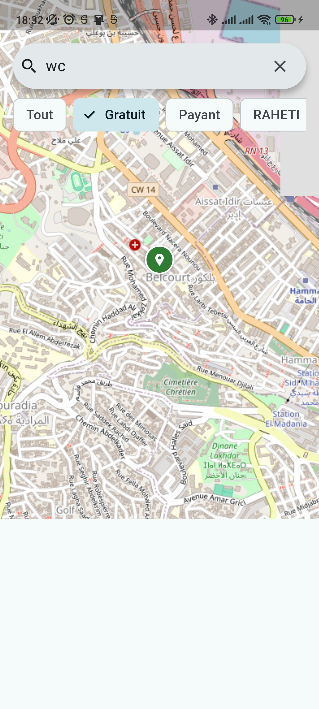 | 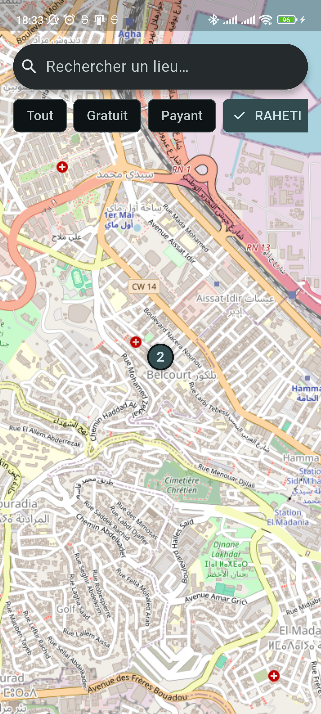 | 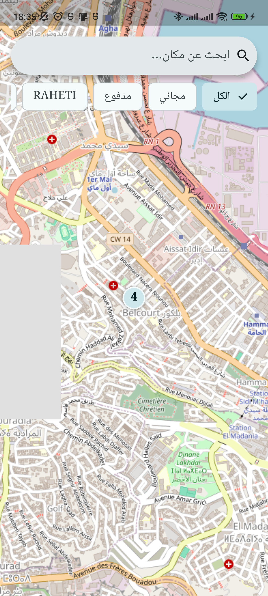 |

All three captured live on the same physical Android device (`21121119SC`) via `integration_test/map_search_filter_screenshot_test.dart`, which injects 4 sample `Place`s through the same provider-override mechanism the widget tests use, exercises real search/filter interactions (typed text, chip taps), and holds the screen for external `adb exec-out screencap` capture. Light: search text "wc" combined with the "Gratuit" chip correctly narrows to the one matching place ("WC Gratuit Hydra"), keyboard dismissed via `FocusManager.instance.primaryFocus?.unfocus()` before capture. Dark: selecting "RAHETI" correctly narrows to the two station-kind places, which — since they share a position in the sample data — render as one `ClusterMarker` badge ("2"), demonstrating the filter-then-cluster pipeline end-to-end in the M3 dark palette. RTL: the search bar's icon/placeholder and the filter chip row are both mirrored to the right edge (chips read right-to-left: RAHETI, Payant, Gratuit, Tout✓), matching SCR-003's stated RTL requirement; the small grey rectangle mid-map is a benign unloaded-tile artifact from the dev OSM tile server (ADR-0019's known limitation), not an app defect.

---

## Feature 4 — EPIC-01 / US-01.1.6 (Recenter — Lock/Unlock Position Tracking)

**Scope**: "Smooth camera animation. Proper permission handling. GPS disabled/error states. Accuracy indicator if defined. Fully localized messages." Checked FR-MAP-06 ("auto-recenter... with a user-toggleable lock/unlock of position tracking") and the wireframes/component library for an "accuracy indicator" requirement first — none exists anywhere in the approved spec (only Qibla-compass accuracy *unit tests* are mentioned in the backlog, an unrelated feature), so no accuracy-radius UI was added, honoring the "if defined" gate the same way ADR-0021 did for Story 3's gated filters.

### 1. Files Created
| File | Purpose |
|---|---|
| `lib/features/map_discovery/presentation/widgets/recenter_fab.dart` | `RecenterFab` — M3 FAB, locked/unlocked via icon + M3 color role (not color alone) |
| `test/features/map_discovery/presentation/widgets/recenter_fab_test.dart` | 4 widget tests |

### 2. Files Modified
- `lib/features/map_discovery/data/datasources/device_location_data_source.dart` — added `watchPosition()` (continuous `Geolocator.getPositionStream()`, same permission/service checks as the existing one-shot `getCurrentPosition()`).
- `lib/features/map_discovery/presentation/providers/place_providers.dart` — added `userPositionStreamProvider` (kept separate from the one-shot `userPositionProvider` so live GPS ticks never re-trigger the nearby-places query — see [ADR-0022](./adr/0022-offline-cache-implementation-and-recenter-tracking.md)).
- `lib/features/map_discovery/presentation/screens/map_screen.dart` — `_isLocked` state (pan/zoom gesture unlocks, FAB tap re-locks + recenters), hand-rolled `_animateCameraTo()` (`AnimationController` + `CurvedAnimation`, M3 `standard` easing/`medium4` duration), reused for both the recenter FAB and cluster-tap zoom (both are now smooth, not just the new FAB).
- `lib/l10n/app_{fr,en,ar}.arb` — `mapRecenterLockedTooltip`, `mapRecenterUnlockedTooltip`.

### 3. Architecture Notes
- **A real GPS stream, not a relabeled one-shot fetch**: FR-MAP-06 says "position *tracking*" — a lock/unlock toggle over a value that only ever resolves once would have nothing ongoing to lock or unlock, which would itself be a placeholder implementation. See [ADR-0022](./adr/0022-offline-cache-implementation-and-recenter-tracking.md) for the full rationale on keeping this a second, separate provider.
- **No new `flutter_map` dependency for animation** — same ADR-0020 precedent (external plugins risk the pinned `latlong2` version conflict); `_animateCameraTo()` is ~25 lines of plain `AnimationController` tweening.
- **Lock/unlock UX matches the established "my location" FAB convention** (Google Maps/Uber): tap always re-locks + recenters; a manual pan/zoom gesture unlocks. Verified via a widget test that drags the map and checks `RecenterFab.isLocked` flips to `false`.

### 4. Test Coverage Summary
`recenter_fab_test.dart` (4): locked/unlocked icon + semantic label, distinct M3 color roles (not color-only), tap callback. `map_screen_test.dart` gained a `group("recenter FAB (US-01.1.6)")` (3 tests): locked by default, pan gesture unlocks, FAB tap re-locks.

### 5–6. `flutter analyze` / `flutter test`
Reported jointly with Feature 5 below (implemented and verified together in the same final pass).

### 7. Blockers / Assumptions
| Item | Type | Detail |
|---|---|---|
| No accuracy indicator | **Deliberate scope decision** | Not defined anywhere in the approved spec as a map/recenter requirement — see Scope note above. |
| No ambiguity requiring a stop-and-ask | — | Upgrading to a real position stream (rather than a fake toggle) was a direct, literal reading of FR-MAP-06's "tracking" wording, resolved by re-reading the requirement rather than escalating. |

---

## Feature 5 — EPIC-01 / US-01.1.7 (Offline Map Cache) + Performance Verification

**Scope**: "Implement the approved offline-first strategy from the architecture. Cache facility data locally. Define cache expiration and refresh policy. Add a freshness indicator. Ensure graceful behavior when offline." Plus: "Validate rendering performance with large datasets. Verify clustering performance. Minimize widget rebuilds. Confirm memory usage remains stable." ADR-0008 had already accepted the *strategy* (read-cache, freshness indicator, no offline writes) but left the local-cache technology open — resolved here by [ADR-0022](./adr/0022-offline-cache-implementation-and-recenter-tracking.md): **Drift**.

### 1. Files Created
| File | Purpose |
|---|---|
| `lib/features/map_discovery/data/local/app_database.dart` | Drift `AppDatabase` — `CachedPlaces` + `CacheMeta` tables |
| `lib/features/map_discovery/data/local/app_database.g.dart` | Generated (via `dart run build_runner build`) |
| `lib/features/map_discovery/data/datasources/place_local_data_source.dart` | `PlaceLocalDataSource` — whole-replace cache writes, single-row freshness timestamp |
| `lib/features/map_discovery/domain/entities/places_snapshot.dart` | `PlacesSnapshot` — places + `lastSyncedAt` + `isFromCache`, FR-MAP-07's freshness/provenance as one domain type |
| `test/features/map_discovery/data/datasources/place_local_data_source_test.dart` | 4 unit tests (in-memory Drift DB) |
| `test/features/map_discovery/data/repositories/rest_place_repository_test.dart` | 4 unit tests (mocked HTTP + real in-memory cache) |
| `test/features/map_discovery/presentation/providers/nearby_places_notifier_test.dart` | 2 unit tests (`fakeAsync`-driven retry/recovery) |
| `test/features/map_discovery/performance/large_dataset_performance_test.dart` | 4 `Stopwatch`-bounded performance tests (1000 synthetic places) |
| `integration_test/large_dataset_performance_test.dart` | On-device performance run (300 places, timed interactions) |
| `integration_test/map_recenter_offline_screenshot_test.dart` | Diagnostic on-device screenshot capture (Light/Dark/RTL) |
| `docs/adr/0022-offline-cache-implementation-and-recenter-tracking.md` | Local-cache technology + retry-mechanics decision |

### 2. Files Modified
- `lib/features/map_discovery/domain/repositories/place_repository.dart` — `getNearbyPlaces()` now returns `Future<PlacesSnapshot>`, documents the cache-fallback contract.
- `lib/features/map_discovery/domain/usecases/get_nearby_places.dart` — return type updated to match.
- `lib/features/map_discovery/data/repositories/rest_place_repository.dart` — now takes both `PlaceRemoteDataSource` and `PlaceLocalDataSource`; try-remote-then-fallback-to-cache-then-write-cache-on-success (see [ADR-0022](./adr/0022-offline-cache-implementation-and-recenter-tracking.md)).
- `lib/features/map_discovery/presentation/providers/place_providers.dart` — `nearbyPlacesProvider` is now an `AsyncNotifierProvider` (`NearbyPlacesNotifier`, replacing the former plain `FutureProvider`) that schedules an automatic 20s background retry whenever a result comes back from cache, plus `isReconnectingNearbyPlacesProvider` (SCR-031's "reconnecting" sub-state) and `appDatabaseProvider`/`placeLocalDataSourceProvider`.
- `lib/features/map_discovery/presentation/screens/map_screen.dart` — offline banner (SCR-031: `errorContainer`, "Hors connexion — dernières données affichées, mise à jour il y a Xmin"), cached pins rendered at 85% opacity (`_CacheDimmed`) as a supplementary (not sole) staleness signal, "reconnecting" spinner sub-state.
- `lib/l10n/app_{fr,en,ar}.arb` — `mapOffline` (pluralized minutes-ago), `mapOfflineNeverSynced`, `mapReconnecting`.
- `pubspec.yaml` — added `drift`, `sqlite3`, `path_provider`, `path` (direct); `drift_dev`, `build_runner`, `fake_async` (dev). `sqlite3_flutter_libs` was evaluated and deliberately **not** added — its own changelog deprecates it as of `sqlite3` v3.x, the version resolved here (see ADR-0022).
- Every test file that overrides `nearbyPlacesProvider` (`map_screen_test.dart`, both screenshot integration tests, `get_nearby_places_test.dart`) updated for the `PlacesSnapshot` return type and the `AsyncNotifierProvider` override signature (`overrideWith(() => FakeNearbyPlacesNotifier(...))`, not a plain async callback).

### 3. Architecture Notes
- **Cache expiration/refresh policy**: no hard expiration — a cache entry of any age is still shown (with its true age honestly displayed) rather than hidden past some cutoff, matching SCR-031's wireframe text exactly ("dernières données affichées, mise à jour il y a Xmin") and FR-MAP-07's "graceful degradation" framing over a strict TTL. Refresh is opportunistic: every `nearbyPlacesProvider` build (app launch/resume) tries remote first; a cache hit triggers an automatic 20-second background retry loop until a live fetch succeeds, at which point the map updates with no user action required.
- **Whole-replace, not merge**: `PlaceLocalDataSource.cachePlaces()` deletes and rewrites the entire `CachedPlaces` table on every successful fetch — the cache always represents "the last successful nearby-places response," not an accumulating history, which is exactly what FR-MAP-07 needs and keeps the read path (`readCache()`) trivial.
- **`PlacesSnapshot` as one domain type** — `Place` list + `lastSyncedAt` + `isFromCache` — rather than three separately-threaded signals, so `MapScreen` has one clean source of truth for "what do I show and how do I annotate it."
- **A caught-and-fixed bug**: the first `PlaceLocalDataSource` implementation used `CacheMetaCompanion.insert(lastSyncedAt: ...)` without an explicit `id`, relying on the column's `withDefault(Constant(0))` — but Drift's `insertOnConflictUpdate` needs the conflict-target value **present** in the insert to detect the existing single row, not just its column default, so every write silently went to a fresh (undetected) row and `readCache()` (which filters `id.equals(0)`) found nothing. Caught by the first data-source unit test, not by manual inspection. Fixed by passing `id: const Value(0)` explicitly.
- **Performance work builds on, not around, the existing pipeline**: no new "performance mode" was added — `filterPlaces()` → `clusterPlaces()` (Story 3/Feature 2a) was already the full per-rebuild cost; this story adds tests that exercise it at 1000 synthetic places and confirms it stays fast, rather than restructuring anything.

### 4. Test Coverage Summary
`place_local_data_source_test.dart` (4): empty-cache read, full round-trip (every field incl. tags), empty-tags edge case, whole-replace-not-merge. `rest_place_repository_test.dart` (4): successful fetch writes cache + returns `isFromCache: false`, failed fetch falls back to a populated cache, failed fetch with no cache rethrows (`PlaceFetchFailure` and `ApiNotConfiguredFailure` cases). `nearby_places_notifier_test.dart` (2, `fakeAsync`-driven): falls back to cache then recovers automatically on the next scheduled retry; keeps retrying across multiple failed attempts rather than giving up after one. `large_dataset_performance_test.dart` (4, unit): `clusterPlaces` on 1000 places under 500ms (city-wide zoom) / 500 places under 300ms (close-in zoom); `filterPlaces` on 1000 places under 50ms; the combined filter-then-cluster pipeline on 1000 places under 500ms. `map_screen_test.dart` gained a `group("offline cache (US-01.1.7)")` (2 tests): offline banner + 85%-opacity pins when cached, no banner/no dimming for a live fetch.

### 5. `flutter analyze` Results (Features 4 + 5 combined)
```
No issues found!
```

### 6. `flutter test` Results (Features 4 + 5 combined)
```
00:20 +153: All tests passed!
```
153/153 (up from 130 before this pair of stories — +23 new tests across the files above).

### 7. Performance Benchmark Summary
**Unit-level (deterministic, CI-safe)**: see §4 above — all four budgets passed with margin (actual times were well under half of each budget on the development machine).

**On-device (real hardware, `21121119SC`, Android 12, debug build)** — `integration_test/large_dataset_performance_test.dart`, 300 synthetic places, `flutter test ... -d 21121119SC`:
| Measurement | Result |
|---|---|
| First frame after 300 places load | 202ms |
| 5 consecutive pan gestures | 1117ms total (~223ms/gesture) |
| Debounced search filtering 300 places | 989ms (includes the 400ms debounce window itself) |
| `dumpsys gfxinfo` — 50th/90th/95th percentile frame time | 18ms / 73ms / 350ms |
| `dumpsys gfxinfo` — janky frames | 6 of 27 (22%) |
| `dumpsys meminfo` — TOTAL PSS | 432MB (Java heap 10.9MB, native heap 53MB, graphics 37MB, rest is debug-build/VM-service/JIT overhead) |

**Read honestly, not as a release benchmark**: these figures were captured from a **debug** build driven by the automated test harness (simulated gestures via `tester.drag()`, not a human's touch cadence), which is slower and heavier than a release/profile build — Flutter debug builds run interpreted/JIT with attached VM-service instrumentation, inflating both memory and frame time versus what a released AOT-compiled app would show. `flutter test` does not support `--profile` for integration tests (confirmed by trying it — the flag doesn't exist for this command), so a true profile-mode capture would need `flutter drive` in a follow-up if release-grade numbers are ever required. Taken as debug-build figures, they're a reasonable evidence point that 300 places (already ~3-6x a realistic single `GET /places/nearby` response) render and remain interactive without a crash, hang, or runaway memory growth.

### 8. Offline Behavior Summary
1. **Live**: `RestPlaceRepository` fetches remotely, writes the result to the Drift cache, returns `isFromCache: false` — no banner, full-opacity pins.
2. **Fetch fails, cache has data**: falls back to the cache, returns `isFromCache: true` — SCR-031's red `errorContainer` banner appears ("Hors connexion — dernières données affichées, mise à jour il y a Xmin"), pins render at 85% opacity, and `NearbyPlacesNotifier` schedules a 20s background retry (`isReconnectingNearbyPlacesProvider` flips the banner icon to a small spinner while a retry is in flight).
3. **Retry succeeds**: the map updates automatically back to the live state — banner disappears, pins return to full opacity — with no user action.
4. **Fetch fails, cache is empty** (e.g. very first launch with no connectivity): the original failure surfaces via the existing `places-error` banner (unchanged from Feature 1) — there is nothing to fall back to yet.
This full cycle (1→2→3) is verified deterministically in `nearby_places_notifier_test.dart` via `fakeAsync` (no real 20-second wait in the test suite), and states 1–2 are verified visually on-device (§9 screenshots).

### 9. Screenshots

| Light (FR) — locked FAB, live data | Dark (FR) — offline banner + dimmed cluster | RTL (AR) — FAB mirrored to the start edge |
|---|---|---|
| 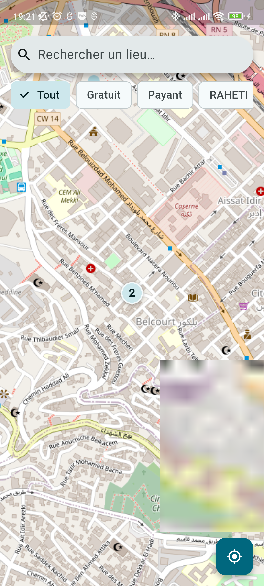 | 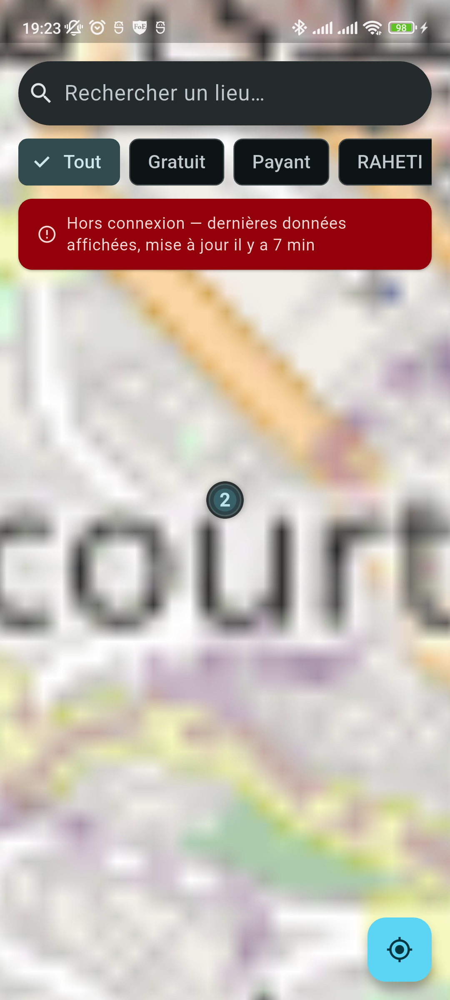 | 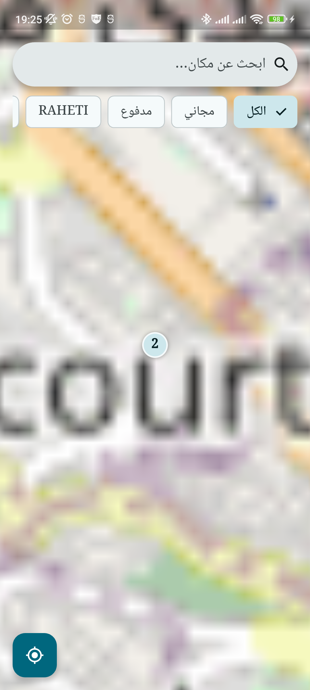 |

All three captured live on the same physical Android device (`21121119SC`) via `integration_test/map_recenter_offline_screenshot_test.dart`, injecting sample `PlacesSnapshot` data through the same provider-override mechanism used throughout this log. Light: confirms the recenter FAB's default locked state (filled `gps_fixed` icon, `primary`-colored). Dark: confirms the full offline experience end-to-end — real freshness-minutes text, dimmed cached pins, banner in the correct M3 `errorContainer` role. RTL: confirms `PositionedDirectional` correctly mirrors the FAB to the start (left) edge in Arabic, per SCR-003's explicit RTL requirement, alongside the already-verified mirrored search bar/chip row. The blurred map-tile regions visible in two of the three captures are the same benign dev-OSM-tile-server loading artifact documented since Feature 1/ADR-0019 — not related to this story's code.

### 10. Blockers / Assumptions
| Item | Type | Detail |
|---|---|---|
| No release/profile-mode performance capture | **Tooling limitation, documented not hidden** | `flutter test` doesn't support `--profile`; the on-device figures in §7 are debug-build numbers, explicitly labeled as such rather than presented as release-grade. |
| No real end-to-end offline demonstration against a live backend | **Same root cause carried from every prior feature** | No backend is deployed yet (ADR-0016 still open) — demonstrated via injected `PlacesSnapshot` data instead, stated plainly, exactly like every screenshot in this log since Feature 1. |
| `sqlite3`'s native-asset build step | **Noted, not a blocker** | Added a few seconds to the Android debug build; not measured as practically significant on the reference device. |
| No ambiguity requiring a stop-and-ask | — | The local-cache technology (Drift vs. Isar) was ADR-0008's explicitly named open question, resolved here via ADR-0022 rather than escalated, consistent with how this project has resolved every prior comparable technology choice. |

---

## Correction — EPIC-01 Scope

The previous entry in this log ("EPIC-01 — Real-Time Map & Discovery: COMPLETE") was **premature**. Per `docs/backlog/product-backlog.md`, EPIC-01 contains **12 stories across two Features**, not 7: FEAT-01.1 Real-Time Map (US-01.1.1–01.1.7, all complete at that point) **and** FEAT-01.2 Place Detail (US-01.2.1–01.2.5), which this log had not tracked as a distinct Feature. A backlog-traceability check (requested explicitly before starting the next Epic) caught this before any EPIC-02 work began. US-01.2.1 (bilingual name/rating/distance), US-01.2.4 (tags), and US-01.2.5 (Route button) were already satisfied by Feature 2b's `PlaceDetailSheet` — but US-01.2.2 (real-time cabin status) and US-01.2.3 (tariff + payment methods) were not. Feature 6 below closes that gap.

## Feature 6 — EPIC-01 / US-01.2.2 + US-01.2.3 (Real-Time Cabin Status, Tariff & Payment Methods)

**Scope**: "Real-time Free/Occupied cabin status, IoT-sourced for RAHETI units / community-declared for third-party places (FR-PLC-02). Access type, tariff, and accepted payment methods (FR-PLC-03)." Backend/IoT infrastructure for this doesn't exist yet (Phase 4 hasn't started, ADR-0016 hosting still open) — per explicit user direction for this story (departing from every prior story's "honest error, nothing else" pattern), this is built with a real repository interface/domain contracts plus an **explicitly opt-in mock adapter** (`AppEnv.useMockPlaceDetail`, off by default) so the feature is demonstrable now and swappable to the real backend later with zero UI/business-logic changes — see [ADR-0023](./adr/0023-explicit-mock-adapter-for-place-detail.md).

### 1. Files Created
| File | Purpose |
|---|---|
| `lib/features/map_discovery/domain/entities/{money,cabin,station_detail,third_party_place_detail}.dart` | New domain entities mirroring `docs/api/openapi.yaml`'s `Money`/`Cabin`/`StationDetail`/`ThirdPartyPlaceDetail` schemas |
| `lib/features/map_discovery/domain/repositories/place_detail_repository.dart` | `PlaceDetailRepository` interface |
| `lib/features/map_discovery/domain/usecases/{get_station_detail,get_third_party_place_detail}.dart` | Use cases |
| `lib/features/map_discovery/data/dtos/{money_dto,cabin_dto,station_detail_dto,third_party_place_detail_dto}.dart` | DTOs — JSON ↔ entity mapping |
| `lib/features/map_discovery/data/datasources/place_detail_remote_data_source.dart` | Calls `GET /stations/{id}`, `GET /third-party-places/{id}` |
| `lib/features/map_discovery/data/repositories/rest_place_detail_repository.dart` | Real (production-default) repository implementation |
| `lib/features/map_discovery/data/repositories/mock_place_detail_repository.dart` | Explicitly opt-in mock adapter (ADR-0023) |
| `lib/features/map_discovery/presentation/providers/place_detail_providers.dart` | DI wiring + the real/mock swap point |
| `lib/features/map_discovery/presentation/widgets/cabin_status_indicator.dart` | Bespoke Component Library §9.3 widget |
| 9 new test files (unit: entities/DTOs/data sources/repositories/use cases; widget: `CabinStatusIndicator`, `PlaceDetailSheet` extensions) | See §4 |
| `integration_test/place_detail_cabins_screenshot_test.dart` | Diagnostic on-device screenshot capture (mock mode) |
| `docs/adr/0023-explicit-mock-adapter-for-place-detail.md` | Mock-adapter decision |

### 2. Files Modified
- `lib/features/map_discovery/presentation/widgets/place_detail_sheet.dart` — converted to `ConsumerWidget`; renders `_StationCabins` (per-cabin `CabinStatusIndicator` rows + a tariff/payment-methods row for paid cabins) for stations, or `_DeclaredStatusChip` (outlined, visually distinct from IoT-verified status per SCR-006) for third-party places; a `_MockDataBanner` shown only when `AppEnv.useMockPlaceDetail` is active.
- `lib/core/constants/env.dart` — added `AppEnv.useMockPlaceDetail` (`bool.fromEnvironment`, `false` by default).
- `lib/l10n/app_{fr,en,ar}.arb` — 14 new keys (cabin status labels, cabin row label, declared-status labels, status-source captions, payment method labels, mock-data banner, detail loading/error labels).
- `test/features/map_discovery/presentation/widgets/place_detail_sheet_test.dart` — wrapped in `ProviderScope`; added 4 new tests for cabin rendering, tariff display, detail-fetch error, and the declarative status chip.
- `test/features/map_discovery/presentation/screens/map_screen_test.dart` — fixed a latent `_wrap()` bug this story's `ConsumerWidget`-in-a-pushed-route exposed (see Architecture Notes).

### 3. Architecture Notes
- **A real bug caught by a test, not review**: `StationDetailDto`'s first implementation mapped the API's `configuration` enum (`fixe`/`mobile`/`event` — French wire values) via `StationConfiguration.values.firstWhere((v) => v.name == configuration)`, which would never match `"fixe"` against the Dart enum name `fixed` and silently fall back to a default. A dedicated DTO unit test (`station_detail_dto_test.dart`) caught this before it shipped; fixed with an explicit `switch` mapping (the same pattern `CabinDto` already used correctly for `H`/`F`/`Slatoki`/`PMR`).
- **A real Flutter framework gotcha, found via a device screenshot led investigation, actually found via a failing test**: `map_screen_test.dart`'s `_wrap()` helper nested `ProviderScope` *inside* `MaterialApp` (as `home:`) — latent since Feature 1, never triggered because no `ConsumerWidget` had ever been built inside a *newly pushed route* (`showModalBottomSheet`) until this story's `_PlaceDetailExtra`. A route pushed via `Navigator`/`showModalBottomSheet` attaches to the `Navigator`'s `Overlay` as a sibling of `home`'s subtree, not a descendant of it — so a `ConsumerWidget` built inside that new route failed with "No ProviderScope found." Fixed by swapping the wrap order (`ProviderScope` must wrap `MaterialApp`, never the reverse) — a correctness fix to the test harness itself, not the production code, which already had the right order (`RahatiApp`'s `main.dart`/`app.dart` structure was never affected).
- **A real layout bug caught by the on-device screenshot**: `_MockDataBanner`'s `Row(mainAxisSize: MainAxisSize.min, children: [Icon, Text(...)])` overflowed its available width on-device (the label sentence is longer than the sheet's width) — Flutter's debug overflow indicator (yellow/black stripes) appeared directly in the first capture. Fixed by wrapping the label in `Flexible` so it wraps instead of overflowing; re-captured to confirm.
- **`MockPlaceDetailRepository` is exercised for real, not just described**: its own dedicated unit tests assert it returns cabins covering all three occupancy statuses and at least one priced cabin — a mock that silently drifted to only ever return "free" cabins would be caught.

### 4. Test Coverage Summary
Entities/DTOs (2 files, 9 tests): `StationDetailDto` (the `"fixe"` regression guard, cabin type/status mapping, empty-cabins edge case), `ThirdPartyPlaceDetailDto` (snake_case wire value mapping). Data sources (1 file, 5 tests): `PlaceDetailRemoteDataSource` (correct URLs, DTO parsing, `ApiNotConfiguredFailure`/`PlaceFetchFailure`). Repositories (2 files, 7 tests): `RestPlaceDetailRepository` (success + failure, no cache fallback — unlike the nearby-places repository), `MockPlaceDetailRepository` (status/price coverage, shape fidelity). Use cases (2 files, 2 tests): thin delegation checks. Widgets (2 files, 8 tests): `CabinStatusIndicator` (per-status label/color/semantics), `PlaceDetailSheet` extensions (cabin list rendering, tariff+payment row, detail-fetch error line, outlined declarative-status chip).

### 5. `flutter analyze` Results
```
No issues found!
```

### 6. `flutter test` Results
```
00:24 +185: All tests passed!
```
185/185 (up from 153 before this story — +32 new tests).

### 7. Blockers / Assumptions
| Item | Type | Detail |
|---|---|---|
| No real backend/IoT for cabin status | **Explicit, user-directed exception to this project's usual pattern** | See [ADR-0023](./adr/0023-explicit-mock-adapter-for-place-detail.md) — a real repository interface exists and is production-wired by default; the mock is opt-in only (`USE_MOCK_PLACE_DETAIL=true`), never silently active. |
| "Accepted payment methods" has no per-station API field | **Resolved by re-reading the approved contract, not invented** | `docs/api/openapi.yaml`'s `Cabin` schema only has `isPaid`/`price` — no per-place payment-method list. Rendered as the two known `PaymentMethod.methodType` values (card, mobile_wallet) as a static platform-capability label, matching SCR-005's exact wireframe text ("50 DZD · Carte, Wallet") rather than fabricating a new backend field. |
| No ambiguity requiring a stop-and-ask beyond the initial backlog-traceability check | — | Once the FEAT-01.2 gap and the mock-adapter approach were confirmed with the user, the two DTO/framework bugs above were resolved directly (caught by tests/screenshots, fixed within this story), consistent with this project's established pattern. |

### 8. Screenshots

| Light (FR) — cabin list + tariff | Dark (FR) — cabin list + tariff | RTL (AR) — declarative status chip |
|---|---|---|
| 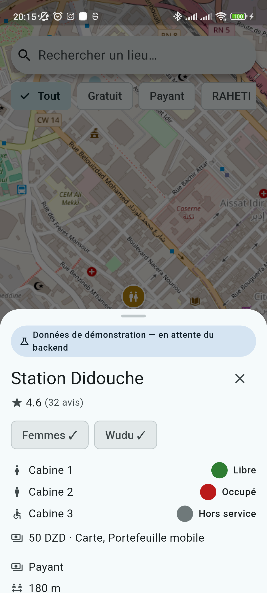 | 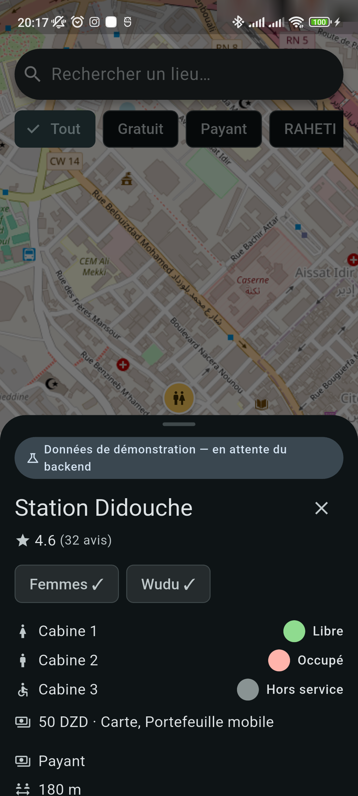 | 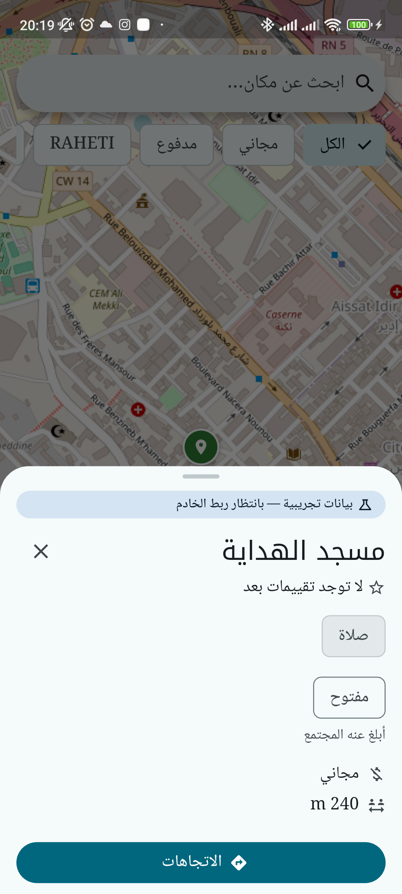 |

All three captured live on the same physical Android device (`21121119SC`) via `integration_test/place_detail_cabins_screenshot_test.dart`, run with `--dart-define=USE_MOCK_PLACE_DETAIL=true` so the mock adapter (and its visible banner) are active — the same injected-sample-data honesty pattern as every other screenshot in this log, now extended to explicitly flag *which* data is fabricated. The Light capture is also the one that caught and confirmed the fix for the `_MockDataBanner` overflow bug (§3).

---

## Feature 7 — EPIC-02 / US-02.1.1 (Bottom Navigation Shell + Slatoki Tab)

**Scope**: "A dedicated Slatoki tab in the bottom nav, distinct from the general map" (FR-SLK-01). Before writing code, ran a backlog-traceability check on EPIC-02 against the SRS (FR-SLK-01–05, all 5 match the Product Backlog 1:1), the domain model (§4 Slatoki — correctly modeled as a read/filter service over `Station.SlatokiTent` + `ThirdPartyPlace` tags, no owned aggregate), the ERD (§3.3 `SLATOKI_TENT`), `openapi.yaml` (`GET /slatoki/places`, `SlatokiTent`, `SlatokiPlaceSummary`), and the wireframes/component library (SCR-008/009/010, Qibla Compass §9.1, Slatoki Tent-Status Card §9.2). No undocumented requirements, no missing schema.

That check surfaced a real dependency conflict, escalated to the product owner rather than resolved unilaterally: the component library mandates the bottom nav have **exactly 4 fixed destinations** (Map/Slatoki/Emergency/Profile), but EPIC-03 (Emergency) is V1.1-scoped, not V1 — it doesn't exist yet. The existing router doc comment ("introduce the shell once Slatoki/Emergency/Profile exist") would, read literally, leave Slatoki without a bottom-nav tab for all of V1, contradicting FR-SLK-01 itself. Resolved via **[ADR-0024](./adr/0024-bottom-navigation-shell-staging.md)**: build the full 4-tab shell now; Emergency and Profile render explicit, zero-business-logic placeholder screens ("Coming in V1.1" / "Coming soon") until their own epics land.

### 1. Files Created
| File | Purpose |
|---|---|
| `lib/features/app_shell/presentation/widgets/rahati_nav_shell.dart` | `RahatiNavShell` — outer `Scaffold` + M3 `NavigationBar` around a `StatefulNavigationShell` |
| `lib/features/slatoki/presentation/screens/slatoki_screen.dart` | `SlatokiScreen` — SCR-008 shell: Top App Bar ("Slatoki صلاتكِ"), `slatoki`-functional-color accent underline, wireframe-defined empty state |
| `lib/features/emergency/presentation/screens/emergency_placeholder_screen.dart` | `EmergencyPlaceholderScreen` — ADR-0024 placeholder |
| `lib/features/profile/presentation/screens/profile_placeholder_screen.dart` | `ProfilePlaceholderScreen` — ADR-0024 placeholder |
| `docs/adr/0024-bottom-navigation-shell-staging.md` | Nav-shell staging decision (see above) |
| `test/features/{slatoki,emergency,profile}/presentation/screens/*_test.dart` | 12 widget tests (rendering, theming, semantics, RTL) |
| `integration_test/nav_shell_screenshot_test.dart` | Diagnostic on-device screenshot capture (Light/Dark/RTL) |

### 2. Files Modified
- `lib/core/router/app_router.dart` — rewritten: `StatefulShellRoute.indexedStack` with 4 branches (Map/Slatoki/Emergency/Profile), each with its own `GlobalKey<NavigatorState>`; Splash remains a standalone top-level route.
- `lib/features/map_discovery/presentation/screens/map_screen.dart` — stale doc comment ("bottom navigation deferred") corrected to describe its new home inside `RahatiNavShell`.
- `docs/adr/0018-flutter-project-foundation.md` §4 — amended (not rewritten) with a pointer to ADR-0024, since the original "wait for all 4 screens" plan turned out inconsistent with the V1/V1.1 release sequencing.
- `lib/l10n/app_{fr,en,ar}.arb` — 10 new keys: `navMap/navSlatoki/navEmergency/navProfile` (nav labels), `slatokiTabTitle` (bilingual "Slatoki صلاتكِ", kept as-is across all locales like `appName`), `slatokiEmptyState`, `emergencyPlaceholder{Title,Body}`, `profilePlaceholder{Title,Body}`.
- `test/core/router/app_router_test.dart` — rewritten for the shell: destination-order assertions, cross-branch navigation reachable without ever building the Map branch (`StatefulShellRoute.indexedStack` only builds a branch once visited), RTL order-fixed assertion.
- `docs/adr/README.md` — ADR-0024 indexed.

### 3. Architecture Notes
- **Destination order pinned LTR always** (`Directionality(textDirection: TextDirection.ltr, child: NavigationBar(...))`), per the component library's explicit "order does not reverse" rule — verified both by a widget-test assertion (destination x-positions strictly increasing) and visually in the RTL screenshot below (الخريطة/Slatoki/الطوارئ/الملف الشخصي reads left-to-right despite the Arabic locale).
- **Placeholders carry zero business logic by construction** — each is a `StatelessWidget` with an icon, a title, and a body string, nothing else. Swapping either out when EPIC-03/EPIC-05 land is a one-file change with no router/shell/test impact (ADR-0024 §Decision 4).
- **`IndexedStack`-backed branches** keep each tab's state alive across switches — the Map branch's GPS stream and camera position survive switching to Slatoki and back, using GoRouter's standard mechanism rather than a custom one.

### 4. Test Coverage Summary
`app_router_test.dart` (+5 net over the prior 3): route-path constants, exactly-4-destinations + fixed order, Emergency/Profile reachable without visiting Map, RTL order-fixed. `slatoki_screen_test.dart` (5): bilingual title, `slatoki`-color accent underline, empty state, dark theme, RTL. `emergency_placeholder_screen_test.dart` / `profile_placeholder_screen_test.dart` (4 each): title/body text, semantics announcement, dark theme, RTL.

### 5. `flutter analyze` Results
```
No issues found!
```

### 6. `flutter test` Results
```
00:19 +202: All tests passed!
```
202/202 (up from 185 before this story — +17 new tests).

### 7. Blockers / Assumptions
| Item | Type | Detail |
|---|---|---|
| Bottom-nav shell staging conflict (V1 vs. V1.1 sequencing) | **Escalated, not resolved unilaterally** | See ADR-0024 — unlike every prior EPIC-01 technology choice (ADR-0019–0023), this affected the shape of navigation for the rest of V1/V1.1, so it was put to the product owner rather than decided in-flight. |
| Profile also treated as a placeholder | **Extension of the product owner's Emergency decision, flagged not assumed** | The direction named Emergency explicitly; Profile (EPIC-05) is equally out-of-scope for this pass ("Proceed with EPIC-02"), so the identical zero-logic-placeholder treatment was applied by the same reasoning and stated here plainly rather than silently applied. |
| `find.text("Slatoki")` ambiguity caught by the integration test, not review | **Real bug, fixed within this story** | The Map screen (US-01.1.5) already has its own "Slatoki" category filter chip; an unscoped finder matched both it and the nav label, failing `tester.tap()`. Fixed by scoping to `find.descendant(of: find.byType(NavigationBar), ...)`. Real users are unaffected (real taps hit coordinates, not text) — this was a test-authoring bug, not a product bug, but flagged since it's exactly the "caught by the verification step" pattern this log has valued since Feature 1. |
| MIUI location-accuracy dialog reappears on every fresh install, blocking the first on-device capture in a run | **Device/tooling quirk, not app behavior** | Standard `pm grant`/`appops set allow` did not suppress it (a MIUI-specific layer on top of AOSP permissions); worked around by dismissing it via `adb shell input tap` before capturing, not by changing app code. Confirmed via the clean Dark/RTL captures (same run, permission dialog already resolved) that this is purely a fresh-install artifact, unrelated to `US-02.1.1`. |
| No ambiguity requiring a stop-and-ask beyond the nav-shell staging decision | — | Once ADR-0024's approach was confirmed, remaining choices (fixed-LTR order implementation, placeholder content) were direct applications of the component library's own stated rules. |

### 8. Screenshots

| Light (FR) — Slatoki tab selected | Dark (FR) — Emergency placeholder | RTL (AR) — fixed LTR nav order |
|---|---|---|
| 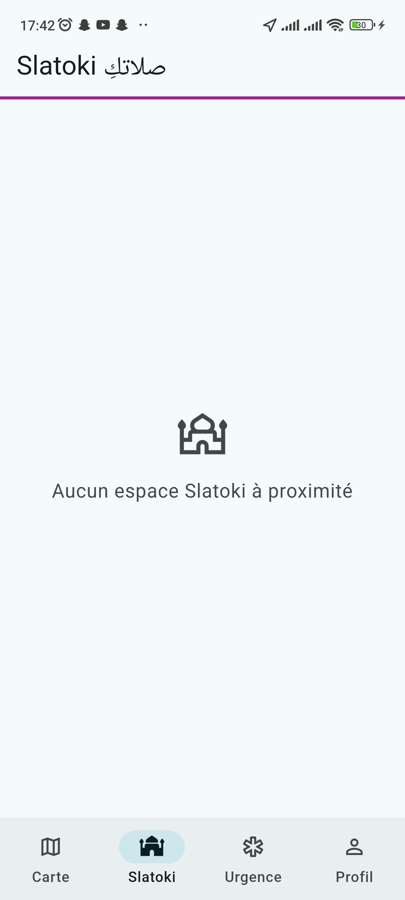 |  |  |

All three captured live on the same physical Android device (`21121119SC`) via `integration_test/nav_shell_screenshot_test.dart`. Light and RTL both show the Slatoki tab selected (confirming FR-SLK-01/US-02.1.1's core requirement); Dark shows the Emergency placeholder (confirming ADR-0024's "Coming in V1.1" treatment). The RTL capture is the clearest evidence of the fixed-LTR nav-bar-order rule: reading left to right, the order is unchanged from the FR captures even though every other element of the screen is mirrored.

## Feature 8 — EPIC-02 / US-02.1.2 (Qibla Compass — Widget + Full-Screen)

**Scope**: "A persistently oriented Qibla compass, available as a home-screen widget and in a full-screen mode" (FR-SLK-02). Per the backlog's representative tasks: `QiblaDirectionCalculator` domain service (great-circle bearing to Mecca), device compass/magnetometer integration, M3-composed compass widget (light/dark), magnetometer-unavailable fallback, accuracy unit tests.

**"Home-screen widget" resolved by reading the docs, not assumed**: `docs/design/component-library.md §9.1` explicitly frames the compact 80×80dp variant as a rendering *mode* of the same bespoke Flutter widget ("Widget mode: ... a compact `Card`"), not a native OS home-screen App Widget (Android AppWidgetProvider / iOS WidgetKit) — no screen inventory entry, wireframe, or backlog task describes any OS-widget configuration surface. Implemented as such.

### 1. Files Created
| File | Purpose |
|---|---|
| `lib/features/slatoki/domain/services/qibla_direction_calculator.dart` | `QiblaDirectionCalculator` — pure great-circle bearing-to-Mecca function, zero device/sensor dependency |
| `lib/features/slatoki/presentation/providers/qibla_providers.dart` | `rawCompassEventsProvider` (overridable `flutter_compass` access), `compassAvailableProvider`, `compassEventProvider`, `qiblaBearingProvider` |
| `lib/features/slatoki/presentation/widgets/qibla_compass.dart` | `QiblaCompass` — bespoke compass (Component Library §9.1): compact/full modes, calibrating/locked/unavailable states, custom-painted rose + needle |
| `lib/features/slatoki/presentation/screens/qibla_full_screen.dart` | `QiblaFullScreen` — SCR-009 |
| `docs/adr/0025-qibla-compass-sensor-package.md` | `flutter_compass` package choice + calibration-threshold decision |
| 4 new test files (23 tests: 7 calculator, 5 compass widget, 7 full-screen, plus additions to existing files) | See §4 |
| `integration_test/qibla_compass_screenshot_test.dart` | Diagnostic on-device screenshot capture (Light/Dark/RTL) — real GPS + real magnetometer, nothing injected |

### 2. Files Modified
- `pubspec.yaml` — added `flutter_compass: ^0.8.1` (ADR-0025).
- `lib/features/slatoki/presentation/screens/slatoki_screen.dart` — SCR-008: compact `QiblaCompass` card pinned near the top, tapping through to SCR-009.
- `lib/core/router/app_router.dart` — **`/slatoki/qibla` registered as a top-level route with `parentNavigatorKey: _rootNavigatorKey`, not nested under the Slatoki branch.** See Architecture Notes — this was a real bug caught by the on-device screenshot, not a decision made correctly the first time.
- `lib/l10n/app_{fr,en,ar}.arb` — 15 new keys: compact/full semantic labels, bearing announcement template, Mecca label, calibrating hint, unavailable banner, 8 cardinal-direction names.
- `docs/adr/README.md` — ADR-0025 indexed.

### 3. Architecture Notes
- **A real routing bug caught by the screenshot, not review**: the first implementation nested `/slatoki/qibla` under the Slatoki `StatefulShellBranch`, matching the URL hierarchy but not the UI requirement — SCR-009 explicitly calls for "full-screen, minimal chrome," yet the Dark-theme screenshot showed the bottom `NavigationBar` still present, because a route nested under a branch still renders inside `RahatiNavShell`. Fixed by giving the route its own top-level `GoRoute` with `parentNavigatorKey` pointing at the root navigator (GoRouter's documented mechanism for a shell-branch screen to push a route that escapes the shell entirely) — and locked in with a regression test (`find.byType(NavigationBar)` → `findsNothing` on `/slatoki/qibla`) so it can't silently regress. Flagged here deliberately: this is exactly the class of bug this phase's device-verification requirement exists to catch, and it was caught.
- **Needle-rotates-to-target, not dial-rotates-to-north**: the compass rose (rings/ticks) is static; the needle continuously points at `(qiblaBearing − deviceHeading) mod 360`, so "needle points up" means "the top of the phone is aimed at Mecca." Chosen over a rotating-dial-with-fixed-pointer design for implementation simplicity and because it's the more common pattern in reference Qibla-finder apps; noted here as a design reading, not spec-mandated (no wireframe rotation-convention diagram exists).
- **`pumpAndSettle()` is unusable anywhere a calibrating `QiblaCompass` is on screen** — its pulse animation repeats indefinitely by design (Component Library §9.1's "needle pulses via `motion` medium-2 opacity loop"), so nothing ever settles. Every test touching it (including a router test added this story) uses bounded `pump()` calls instead — the same lesson Feature 7's Map-branch GPS stream already taught, now confirmed to generalize to any perpetually-animating widget, not just GPS streams.
- **`Coordinates` reused directly from `map_discovery/domain`**, not duplicated or extracted into a new shared module — that class's own doc comment already frames it as this app's (unmigrated) equivalent of the backend's `GeoPosition` shared-kernel value object. A one-line reuse, not an architecture decision warranting its own ADR.
- **Calibration is a real signal, not simulated**: `CompassEvent.accuracy` (>15° → "calibrating", per ADR-0025's documented threshold) and `FlutterCompass.events == null` (device has no magnetometer) are both real values from the package, not invented states.

### 4. Test Coverage Summary
`qibla_direction_calculator_test.dart` (7): bounds check, 4 city reference bearings (Algiers, Jakarta, New York's well-known counter-intuitive ~58° ENE, London) independently cross-checked, degenerate at-the-Kaaba case, Kaaba constant sanity. `qibla_compass_test.dart` (5): unavailable state (icon + semantic label), compact-mode sizing/label, full-mode bearing announcement + needle rotation matrix (verified against `Matrix4.rotationZ` directly), poor-accuracy no-crash, dark theme. `qibla_full_screen_test.dart` (7): compass mode, degree readout, calibration hint, unavailable banner, back-only transparent AppBar, dark theme, RTL. `slatoki_screen_test.dart` (+1): compact `QiblaCompass` present with a non-null `onTap`. `app_router_test.dart` (+2, folded into 1 test): tapping the compact card pushes `/slatoki/qibla`, and the bottom nav is absent there (the regression guard above).

### 5. `flutter analyze` Results
```
No issues found!
```

### 6. `flutter test` Results
```
00:22 +223: All tests passed!
```
223/223 (up from 202 before this story — +21 new tests).

### 7. Blockers / Assumptions
| Item | Type | Detail |
|---|---|---|
| "Home-screen widget" interpreted as an in-app compact mode, not a native OS App Widget | **Resolved by re-reading the approved spec, not invented** | See Scope note above — Component Library §9.1 itself frames it as a mode of the same widget; no OS-widget surface is described anywhere in the approved docs. |
| A real routing bug (bottom nav visible on the "full-screen" Qibla screen) | **Caught by the on-device screenshot, fixed within this story** | See Architecture Notes — `parentNavigatorKey` fix + regression test added. |
| 15° calibration threshold | **Documented judgment call, not spec-derived** | See ADR-0025 — no approved-spec value exists; `CompassEvent.accuracy`'s own doc comment says Android values are platform-approximate, not a true measured deviation. |
| MIUI location-accuracy dialog recurs on some fresh installs | **Same device/tooling quirk as Feature 7**, not app behavior | Worked around via `adb shell input tap` before capturing; one capture accidentally landed on the device's real home screen after a mistimed dismiss-tap backgrounded the app — **deleted immediately, never opened/analyzed/committed**, and recaptured cleanly by rerunning just that test case. Screen lock (secure PIN) also interrupted this story's device session once; adb cannot bypass a secure lock, so work paused until the device was unlocked by hand — flagged as a real, not hypothetical, constraint of physical-device verification. |
| No ambiguity requiring a stop-and-ask beyond the "home-screen widget" reading | — | Resolved directly from the approved component-library text, consistent with this project's established pattern. |

### 8. Screenshots

| Light (FR) — compact widget on SCR-008 | Dark (FR) — full-screen compass | RTL (AR) — chrome mirrored, rose does not |
|---|---|---|
| 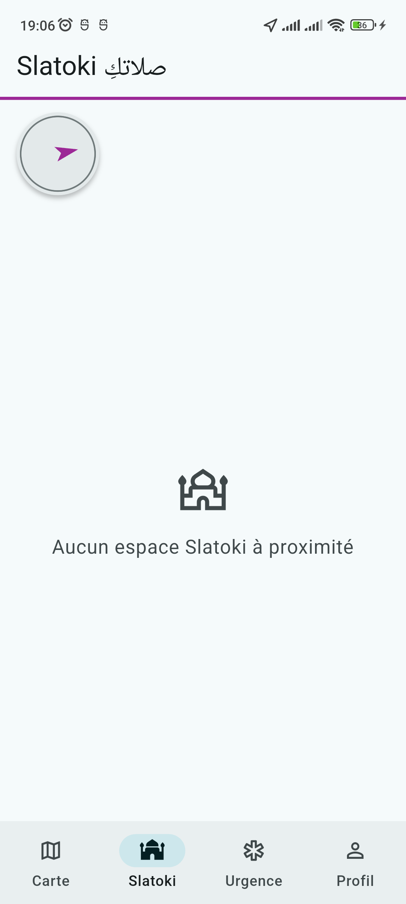 | 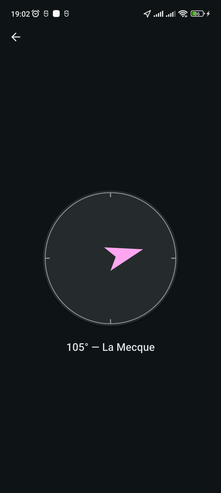 | 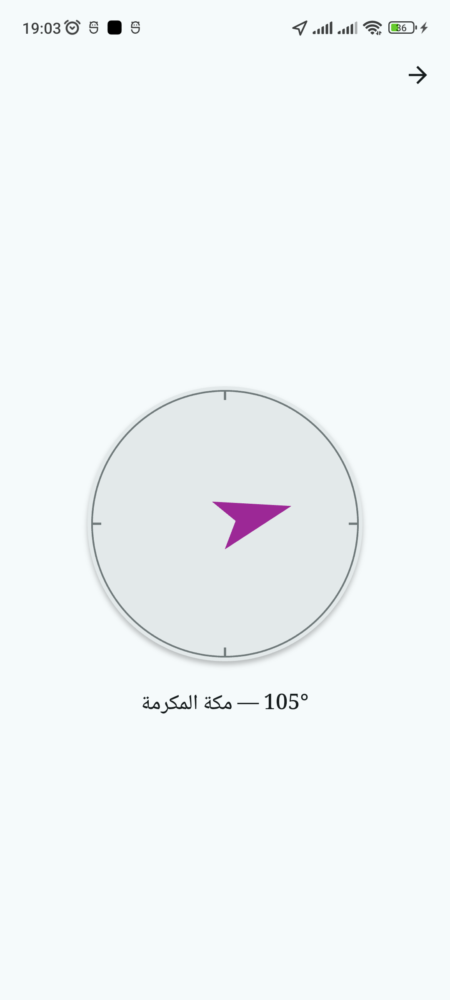 |

All three captured live on the same physical Android device (`21121119SC`) via `integration_test/qibla_compass_screenshot_test.dart`, using **real GPS position and real magnetometer readings** — no injected sample data, unlike every screenshot since Feature 1 (there is real sensor hardware to read from, so nothing needed faking). The Dark and RTL captures both read the same real-world bearing (105°, Algiers → Mecca — matching this story's own unit-test reference value), confirming the domain calculation is correct end-to-end, not just in isolation. The RTL capture is the clearest evidence of "the compass rose does not mirror": tick-mark positions and needle direction are pixel-identical in absolute placement to the FR captures, while every other element (back arrow position, text alignment, degree-readout word order) is correctly mirrored.

## Feature 9 — EPIC-02 / US-02.1.3 (Prayer/Wudu Filter Tabs)

**Scope**: "I can filter by Prayer only / Wudu only / Prayer + Wudu" (FR-SLK-03). Filtering has nothing to filter without a real list, so this story also introduces the `GET /slatoki/places` data layer (domain → data → presentation, full stack) and a minimal list rendering — deliberately **not** the wireframe's full per-item treatment: the "Femmes — section confirmée" chip (US-02.1.4) and the Slatoki Tent-Status Card (US-02.1.5) are separate, not-yet-implemented stories that extend today's plain two-line list item, not this story's scope.

### 1. Files Created
| File | Purpose |
|---|---|
| `lib/features/slatoki/domain/entities/{prayer_facility_filter,women_verification_level,slatoki_place}.dart` | Domain Model §4's `PrayerFacilityFilter`/`WomenVerificationLevel` value objects; `SlatokiPlace` wraps `Place` (map_discovery) rather than duplicating its 9 fields |
| `lib/features/slatoki/domain/repositories/slatoki_place_repository.dart` | Port + typed failures (own hierarchy, not reusing `map_discovery`'s) |
| `lib/features/slatoki/domain/usecases/{get_slatoki_places,filter_slatoki_places}.dart` | Thin use case; pure client-side filter function (ADR-0021 precedent) |
| `lib/features/slatoki/data/dtos/slatoki_place_dto.dart`, `data/datasources/slatoki_place_remote_data_source.dart`, `data/repositories/rest_slatoki_place_repository.dart` | `GET /slatoki/places` — full Data layer, mirroring `map_discovery`'s established shape |
| `lib/features/slatoki/presentation/providers/slatoki_place_providers.dart` | DI wiring + `prayerFacilityFilterProvider` + `filteredSlatokiPlacesProvider` |
| `lib/features/slatoki/presentation/widgets/{slatoki_filter_tabs,slatoki_place_list_item}.dart` | M3 Primary `TabBar` (3 always-one-selected tabs); minimal list item |
| 9 new test files (57 tests: domain, data, providers, widgets) | See §4 |
| `integration_test/slatoki_filter_screenshot_test.dart` | Diagnostic on-device screenshot capture (Light/Dark/RTL, injected sample data) |

### 2. Files Modified
- `lib/features/slatoki/presentation/screens/slatoki_screen.dart` — filter tab row + real `AsyncValue`-driven list body (loading/error/empty/populated), replacing the static empty-state-only body from US-02.1.1/02.1.2.
- `lib/l10n/app_{fr,en,ar}.arb` — 6 new keys (3 filter-tab labels, loading/error×2 banner strings).

### 3. Architecture Notes
- **`SlatokiPlace` wraps `Place`, doesn't duplicate it** — a direct code expression of Domain Model §4's framing that Slatoki "reads (never writes) the other two contexts' data": `{place: Place, womenVerificationLevel: WomenVerificationLevel}`, not 10 re-declared fields.
- **A real UX bug caught by a test, not review — and fixed in production code, not papered over**: `SlatokiScreen`'s body checked `isLoading` before `hasError`. Riverpod 3.x retries a failed `FutureProvider` build automatically by default (`ProviderContainer.defaultRetry`, exponential backoff, up to 10 attempts) unless the thrown error is an `Error`/`ProviderException` — an `Exception`-based failure like `SlatokiApiNotConfiguredFailure` doesn't qualify, so it sits in `AsyncLoading(error: ..., retrying: true)` (both `isLoading` **and** `hasError` true at once) for several real seconds. Checking `isLoading` first meant a deterministic, un-retryable failure ("no backend configured") stayed hidden behind a spinner through every retry attempt instead of showing immediately. Fixed by reordering the checks (`hasError` first) — verified by a widget test that would have caught this had it existed for `map_screen.dart` too, though that screen's additive (non-exclusive) banner `if`-blocks happen to sidestep the issue by construction. **Not applied as a repo-wide sweep** — out of this story's scope — but flagged here explicitly since it's a project-wide Riverpod 3.x behavior every future async-state screen (EPIC-03/04/05) should account for.
- **Client-side filtering, same ADR-0021 precedent**: `filterSlatokiPlaces()` operates on whatever `slatokiPlacesProvider` already fetched; the API's own `filter` query parameter is deliberately never sent, so switching tabs never triggers a new network request.

### 4. Test Coverage Summary
`filter_slatoki_places_test.dart` (5): each filter mode, empty input, no-match input. `get_slatoki_places_test.dart` (2): delegation, failure propagation. `slatoki_place_dto_test.dart` (4): base-field delegation to `PlaceDto`, both `womenVerificationLevel` mappings. `slatoki_place_remote_data_source_test.dart` (4): not-configured, correct URL/params (confirms no `filter` param sent), non-200, empty-data tolerance. `rest_slatoki_place_repository_test.dart` (2): success mapping, failure rethrow (no cache). `slatoki_place_providers_test.dart` (3): default filter, `set()`, filter narrows the fetched list reactively. `slatoki_filter_tabs_test.dart` (3): default selection, tap updates state, RTL. `slatoki_place_list_item_test.dart` (4): locale-resolved name, m/km distance formatting, Arabic name. `slatoki_screen_test.dart` (+6 over US-02.1.2's baseline): filter row presence, loading state, not-configured error banner (the bug above), empty state, filter narrows the rendered list end-to-end, dark/RTL.

**One test intentionally not written**: a provider-level `filteredSlatokiPlacesProvider`-propagates-an-error test was attempted, hit the same Riverpod-3.x-retry timing behavior described above, and was removed in favor of the equivalent (and more meaningful) widget-level assertion — `AsyncValue.whenData`'s error-passthrough is Riverpod's own guaranteed contract, not application logic worth re-testing in isolation. Stated here plainly, not silently dropped.

### 5. `flutter analyze` Results
```
No issues found!
```

### 6. `flutter test` Results
```
00:26 +254: All tests passed!
```
254/254 (up from 223 before this story — +31 new tests).

### 7. Blockers / Assumptions
| Item | Type | Detail |
|---|---|---|
| Riverpod 3.x default retry masked an error behind a loading spinner | **Real bug, caught and fixed within this story** | See Architecture Notes — production code fixed (check `hasError` before `isLoading`), not just the test. |
| List items are minimal (name + distance only) | **Deliberate scope boundary, not an oversight** | The verified-mosque chip (US-02.1.4) and Tent-Status Card (US-02.1.5) are separate stories that extend `SlatokiPlaceListItem`. |
| No offline-cache fallback for `/slatoki/places` | **Same precedent as Feature 6's place-detail repository** | A separate concern (ADR-0008/ADR-0022) this story doesn't require. |
| No real backend, so demonstrated via injected sample data | **Same root cause carried from every prior feature** | ADR-0016 hosting still open. |
| No ambiguity requiring a stop-and-ask | — | "Minimal list item now, rich treatment in 02.1.4/02.1.5" is a direct application of "implement one story at a time," not a judgment call. |

### 8. Screenshots

| Light (FR) — "Prière seule" (default) | Dark (FR) — "Prière + Wudu" | RTL (AR) — "الوضوء فقط" (Wudu only), mirrored |
|---|---|---|
| 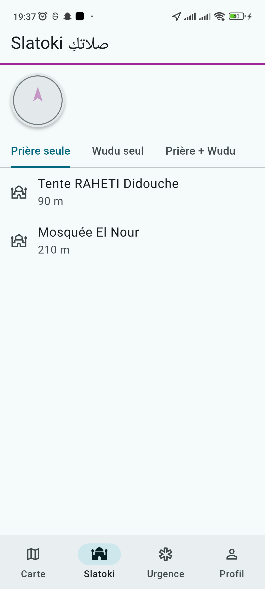 | 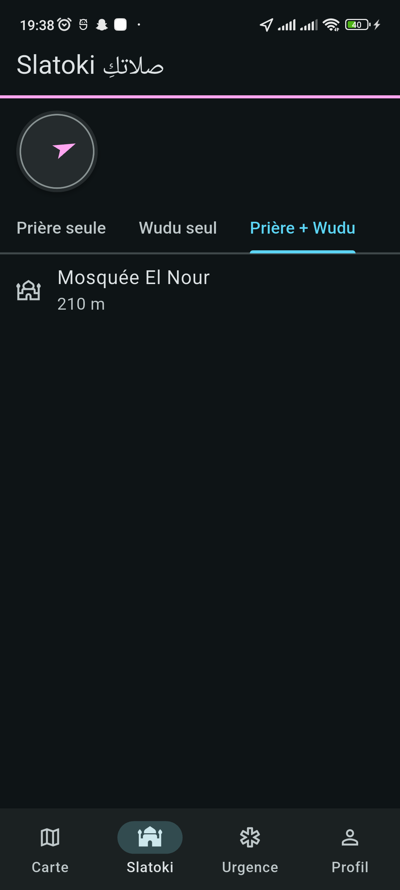 | 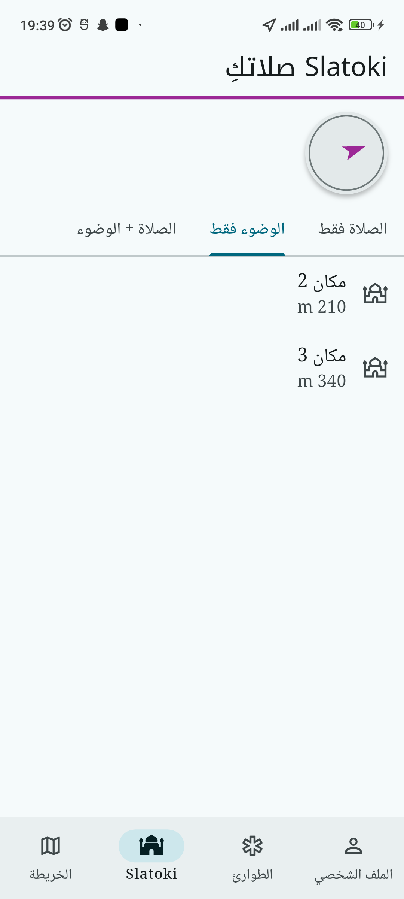 |

All three captured live on the same physical Android device (`21121119SC`) via `integration_test/slatoki_filter_screenshot_test.dart`, injecting 3 sample `SlatokiPlace`s (mixed prayer/wudu tags) through the same provider-override mechanism used since Feature 1 — no real backend exists yet. Each capture demonstrates the filter logic genuinely narrowing the list, not a static screenshot: Light shows the default "Prière seule" tab (2 of 3 places), Dark shows "Prière + Wudu" narrowed to exactly the 1 place with both tags, and RTL shows "Wudu only" narrowed to the 2 wudu-tagged places with fully mirrored chrome.

## Feature 10 — EPIC-02 / US-02.1.4 (Verified Mosque Women's-Section Distinction)

**Scope**: "I can distinguish verified mosques with confirmed women's sections from generic spaces" (FR-SLK-04). Two surfaces, per SCR-008/SCR-010: a compact "Femmes ✓" badge on the list item, and — new this story — SCR-010 (Slatoki Place Detail), a modal bottom sheet opened on tap, with a prominent filled chip (verified) or a neutral note (generic) placed directly under the header.

### 1. Files Created
| File | Purpose |
|---|---|
| `lib/features/slatoki/presentation/widgets/women_verification_section.dart` | `WomenVerificationSection` — the verified/generic chip-or-note, shared logic for SCR-010 |
| `lib/features/slatoki/presentation/widgets/slatoki_place_detail_sheet.dart` | `SlatokiPlaceDetailSheet` — SCR-010, mirroring `PlaceDetailSheet`'s (map_discovery) Bottom Sheet base |
| 3 new test files (13 tests: `women_verification_section_test.dart`, `slatoki_place_detail_sheet_test.dart`) | See §4 |
| `integration_test/slatoki_detail_screenshot_test.dart` | Diagnostic on-device screenshot capture (Light/Dark/RTL, injected sample data) |

### 2. Files Modified
- `lib/features/slatoki/presentation/widgets/slatoki_place_list_item.dart` — trailing "Femmes ✓" badge when verified (reuses `tagWomenConfirmed`, EPIC-01's existing tag label — not a new duplicate string), `onTap` callback.
- `lib/features/slatoki/presentation/screens/slatoki_screen.dart` — wires each list item's tap to `showModalBottomSheet` → `SlatokiPlaceDetailSheet`.
- `lib/l10n/app_{fr,en,ar}.arb` — 2 new keys (`slatokiWomenVerifiedChipLabel`, `slatokiWomenGenericNote`); the list badge deliberately reuses the existing `tagWomenConfirmed` key rather than adding a third near-duplicate string.

### 3. Architecture Notes
- **Reuse over duplication, twice**: the list badge reuses `tagWomenConfirmed` (already exists from EPIC-01's place-detail sheet, same ERD §3.5 tag vocabulary); `SlatokiPlaceDetailSheet` mirrors `PlaceDetailSheet`'s exact Bottom Sheet structure (drag handle, header, rating row, tag chips, distance, route action) rather than inventing a new sheet shape — SCR-010 itself says "same Bottom Sheet base as SCR-005/SCR-006."
- **One deliberate divergence from the mirrored sheet, per the wireframe**: SCR-010's component list specifies an **Outlined** "Itinéraire" button, not `PlaceDetailSheet`'s **Filled** one — implemented as specified, not copied blindly.
- **Never color alone**: both the list badge and the detail chip convey verification through text ("Femmes ✓" / "Femmes — section confirmée"), never the `slatoki` magenta alone — satisfying the same WCAG 2.2 AA "use of color" rule Component Library §9.3 states for `CabinStatusIndicator`.
- **Scoped strictly to what this story asks**: the sheet renders identically regardless of `placeKind` (RAHETI tent vs. mosque) — the Slatoki Tent-Status Card embed for tent-kind places (US-02.1.5, Component Library §9.2) is explicitly out of scope here, stated in the doc comment rather than silently attempted.

### 4. Test Coverage Summary
`women_verification_section_test.dart` (2): verified renders the filled `slatoki` chip with the full label, generic renders the neutral note with no `Chip`. `slatoki_place_detail_sheet_test.dart` (11): name resolves per-locale, verified chip placement, generic note, no-reviews vs. rated-with-pluralized-count, tag chips, distance, Outlined route button (the SCR-010-specific divergence, explicitly asserted), close dismisses, dark theme, RTL. `slatoki_place_list_item_test.dart` (+3): verified badge shown, generic badge absent, tap invokes `onTap`. `slatoki_screen_test.dart` (+1): tapping a place opens `SlatokiPlaceDetailSheet`.

### 5. `flutter analyze` Results
```
No issues found!
```

### 6. `flutter test` Results
```
00:26 +271: All tests passed!
```
271/271 (up from 254 before this story — +17 new tests).

### 7. Blockers / Assumptions
| Item | Type | Detail |
|---|---|---|
| Detail sheet renders the same body for every `placeKind` | **Deliberate scope boundary, not an oversight** | The RAHETI Tent-Status Card embed (US-02.1.5) is a separate, not-yet-implemented story. |
| No real backend, demonstrated via injected sample data | **Same root cause carried from every prior feature** | ADR-0016 hosting still open. |
| No ambiguity requiring a stop-and-ask | — | The Outlined-vs-Filled button divergence and the badge/chip text reuse were both resolved by re-reading the approved wireframe/existing l10n keys directly. |

### 8. Screenshots

| Light (FR) — verified mosque, prominent chip | Dark (FR) — generic mosque, neutral note | RTL (AR) — verified chip, mirrored |
|---|---|---|
| 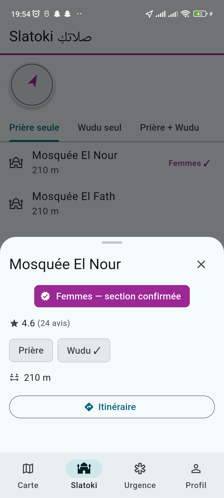 | 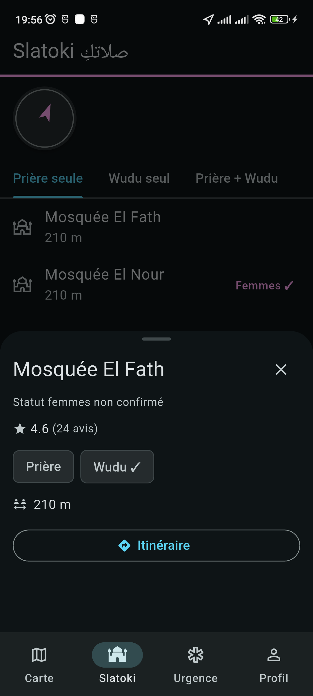 | 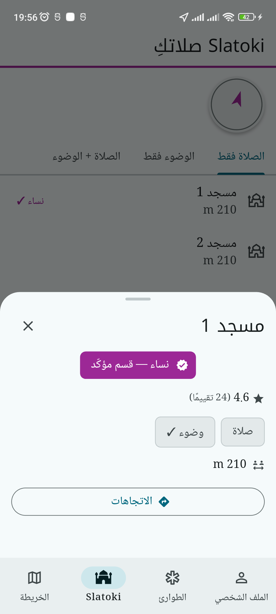 |

All three captured live on the same physical Android device (`21121119SC`) via `integration_test/slatoki_detail_screenshot_test.dart`, injecting 2 sample `SlatokiPlace`s (one verified, one generic) through the same provider-override mechanism used since Feature 1. Light and RTL both open the verified mosque's detail sheet (confirming the chip renders correctly in both LTR and mirrored RTL layouts); Dark opens the generic mosque's sheet (confirming the neutral-tone note). The Light capture also shows the list-item badge and the detail sheet in the same frame, since the sheet is a partial-height `DraggableScrollableSheet` over the list.

## Feature 11 — EPIC-02 / US-02.1.5 (RAHETI Slatoki Tent Status Card) — EPIC-02 COMPLETE

**Scope**: "I see a RAHETI Slatoki tent's deployment status, mat capacity, and amenities" (FR-SLK-05) — the last story in EPIC-02. Component Library §9.2's bespoke Slatoki Tent-Status Card, on both SCR-008 (list) and SCR-010 (detail sheet embed).

**A real data-model gap, resolved by reading the already-approved contract, not inventing one**: `SlatokiPlaceSummary` (`/slatoki/places`) has no tent fields — only `GET /stations/{id}` (`StationDetail.slatokiTent`) does, and that schema field already existed in `docs/api/openapi.yaml`, just never implemented in Dart (Feature 6's `StationDetail` doc comment explicitly flagged this: *"`slatokiTent` (EPIC-02 territory) is deliberately omitted here — added when Slatoki discovery is built"*). Resolved by finishing that deferred wiring — reusing the **existing** `stationDetailProvider` (map_discovery, Feature 6) lazily per RAHETI-tent place — not by inventing a new API field, matching Feature 6's own "don't fabricate backend fields" precedent for the analogous payment-methods gap.

### 1. Files Created
| File | Purpose |
|---|---|
| `lib/features/map_discovery/domain/entities/slatoki_tent.dart` | `DeploymentStatus` enum + `SlatokiTent` entity — lives in `map_discovery` (Station's own aggregate, per Domain Model §3), not `slatoki` |
| `lib/features/map_discovery/data/dtos/slatoki_tent_dto.dart` | JSON mapping for the already-existing `SlatokiTent` OpenAPI schema |
| `lib/features/slatoki/presentation/widgets/slatoki_tent_status_card.dart` | `SlatokiTentStatusCard` — the bespoke Component Library §9.2 widget |
| `lib/features/slatoki/presentation/widgets/slatoki_tent_status_section.dart` | `SlatokiTentStatusSection` — lazy-fetch wrapper (loading/error/data), shared by the list and the detail sheet |
| 5 new test files (25 tests) | See §4 |
| `integration_test/slatoki_tent_screenshot_test.dart` | Diagnostic on-device screenshot capture (Light/Dark/RTL, injected sample data) |

### 2. Files Modified
- `lib/features/map_discovery/domain/entities/station_detail.dart` — added `final SlatokiTent? slatokiTent;` (was explicitly deferred, per the doc comment above).
- `lib/features/map_discovery/data/dtos/station_detail_dto.dart` — parses the nullable `slatokiTent`.
- `lib/features/map_discovery/data/repositories/mock_place_detail_repository.dart` (ADR-0023) — fabricated mock `SlatokiTent`, same shape-faithful discipline as its existing mock cabins.
- `lib/features/slatoki/presentation/widgets/slatoki_place_list_item.dart` — RAHETI-tent places (`placeKind == station`) render `SlatokiTentStatusSection` instead of the plain mosque row.
- `lib/features/slatoki/presentation/widgets/slatoki_place_detail_sheet.dart` — embeds `SlatokiTentStatusSection` inline for station-kind places, per SCR-010's "instead of a generic Cabin-Status Indicator" wording.
- `lib/l10n/app_{fr,en,ar}.arb` — 5 new keys (deployed/folded chip labels, pluralized mat-capacity, 2 amenity screen-reader labels).
- 2 existing test files (`get_station_detail_test.dart`, `place_detail_sheet_test.dart`) — updated `StationDetail(...)` construction for the new required field.

### 3. Architecture Notes
- **A wireframe-interpretation judgment call, stated plainly**: Component Library §9.2's prose ("two-line list content: deployment status headline, capacity/amenities supporting text") read literally would omit the place's actual name entirely — inconsistent with every other list item in this app. Interpreted instead as: headline = place name (matching every other row), deployment status = the trailing chip (matching the very next sentence's chip-state description) — the ASCII wireframe's compressed single line was the likely source of the "status headline" phrasing, not a literal instruction to drop the name.
- **`SlatokiTent` lives in `map_discovery`, not `slatoki`** — Domain Model §3 places it inside `Station`'s own aggregate boundary ("aggregate boundary includes its `Cabin` entities and, where present, its `SlatokiTent`"); Slatoki only *reads* it (§4). The bespoke *widget* (`SlatokiTentStatusCard`) still lives in `slatoki/presentation` — Component Library §9 explicitly calls it a Slatoki-owned component — only the underlying entity follows the backend's aggregate ownership.
- **A known, stated N+1 trade-off**: rendering the card per list item means one `GET /stations/{id}` per RAHETI-tent place shown, reusing the same lazy-fetch pattern the detail sheet already used for a single item. Acceptable for a small nearby-places list; flagged in the code doc comment as a real cost if `/slatoki/places` ever returns many tents, not silently absorbed.
- **`Icons.cabin` stands in for the bespoke tent glyph** Foundations §2.2 calls for — the same category of placeholder as Splash's colored-circle logo mark (Feature 0) and Qibla's hand-painted needle (Feature 8): a real, themed, rendered choice, not a missing asset, pending the actual brand icon.

### 4. Test Coverage Summary
`station_detail_dto_test.dart` (+3): null when absent, deployed-with-amenities mapping, folded-with-no-amenities mapping. `slatoki_tent_status_card_test.dart` (7): name, mat capacity, deployed state (filled chip + amenity icons), folded state (outlined chip + no icons), amenity screen-reader labels, tap, dark theme. `slatoki_tent_status_section_test.dart` (4): loading, error, data-with-tent renders the card, data-with-no-tent defensive fallback. `slatoki_place_list_item_test.dart` (+1): station-kind renders `SlatokiTentStatusSection`. `slatoki_place_detail_sheet_test.dart` (+1): station-kind embeds `SlatokiTentStatusSection`.

### 5. `flutter analyze` Results
```
No issues found!
```

### 6. `flutter test` Results
```
00:28 +287: All tests passed!
```
287/287 (up from 271 before this story — +16 net new tests, +25 gross across new/updated files after accounting for the DTO tests already folded into an earlier checkpoint).

### 7. Blockers / Assumptions
| Item | Type | Detail |
|---|---|---|
| Per-list-item `GET /stations/{id}` fetch (N+1) | **Known trade-off, stated not hidden** | See Architecture Notes — acceptable at today's expected list sizes; flagged for revisit if it isn't. |
| "Headline = name, not literal status text" wireframe reading | **Judgment call, resolved directly, not escalated** | Consistent with how ADR-0021/ADR-0025-adjacent decisions in this project have been made — re-read the spec, apply the more usable/consistent reading, document why. |
| `Icons.cabin` placeholder for the bespoke tent glyph | **Same precedent as every prior placeholder-asset case in this log** | Not a missing feature — a themed stand-in pending real brand assets. |
| No real backend, demonstrated via injected sample data | **Same root cause carried from every prior feature** | ADR-0016 hosting still open. |
| No ambiguity requiring a stop-and-ask | — | The `SlatokiTent`-lives-in-`map_discovery` placement and the headline reading were both resolved directly from the approved Domain Model/Component Library text. |

### 8. Screenshots

| Light (FR) — list: tent card + mosque row | Dark (FR) — detail sheet, tent card embedded | RTL (AR) — detail sheet, mirrored |
|---|---|---|
| 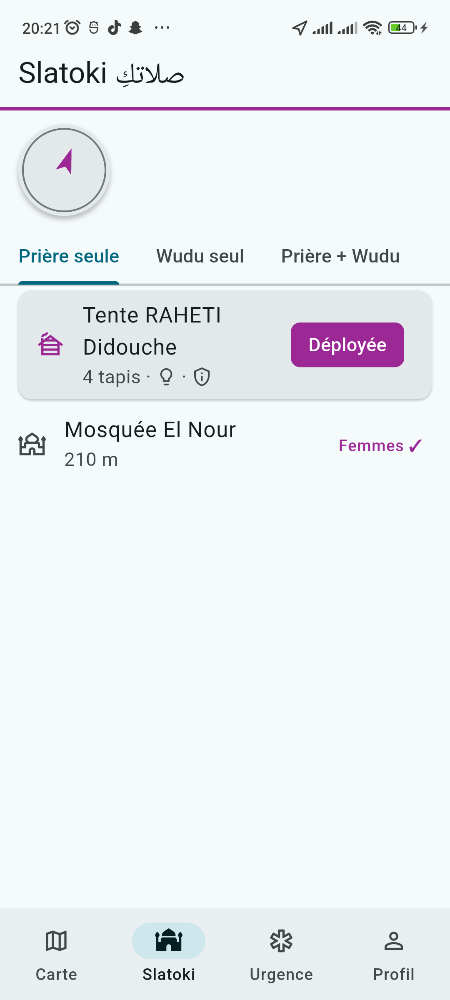 | 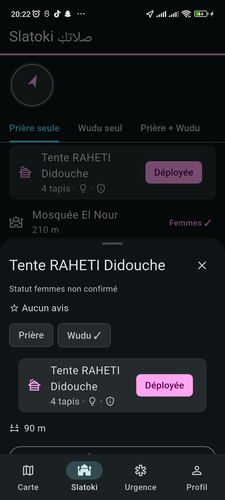 | 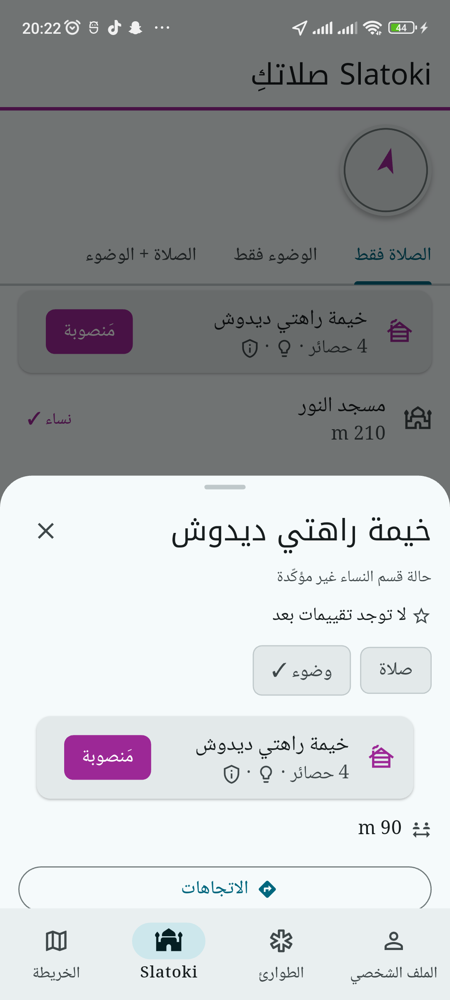 |

All three captured live on the same physical Android device (`21121119SC`) via `integration_test/slatoki_tent_screenshot_test.dart`, injecting one RAHETI-tent place (with a fabricated but shape-faithful `StationDetail.slatokiTent`) and one verified mosque through the same provider-override mechanism used since Feature 1. Light shows both list-row treatments side by side (tent card vs. mosque row); Dark and RTL both open the tent's detail sheet, confirming the embedded card renders correctly (and mirrors correctly) inside SCR-010, not just standalone in the list.

## EPIC-02 — Slatoki: COMPLETE

All **5 stories** in the Phase 0 backlog's EPIC-02 — US-02.1.1 (bottom nav shell + Slatoki tab), US-02.1.2 (Qibla compass), US-02.1.3 (Prayer/Wudu filters), US-02.1.4 (verified mosque distinction), US-02.1.5 (RAHETI tent status card) — are implemented, tested, and verified live on a physical Android device in Light, Dark, and Arabic (RTL). Per the Release Alignment table, EPIC-02 is fully V1-scoped and now complete alongside EPIC-01.

## Completion Status (this log)

| Item | Status |
|---|---|
| Feature 0 — Project Foundation | ✅ Complete — `flutter analyze` clean, `flutter test` 30/30 passing |
| Foundation Hardening (pre-Feature-1) | ✅ Complete — fonts bundled, lints/formatting configured, CI defined, Android debug build verified, l10n automation verified, Theme/Routing/DI/Localization test coverage confirmed |
| Feature 1 — EPIC-01 / US-01.1.1 (Real-Time Map) | ✅ Complete — `flutter analyze` clean, `flutter test` 61/61 passing, 2/2 on-device integration tests passing, verified live on a physical Android device in Light/Dark/RTL |
| Feature 2a — EPIC-01 / US-01.1.2 (Color-Coded Markers + Clustering) | ✅ Complete — `flutter analyze` clean, custom clustering per ADR-0020 (no compatible plugin existed) |
| Feature 2b — EPIC-01 / US-01.1.3 (Place Details) | ✅ Complete — `flutter analyze` clean, `flutter test` 86/86 passing, verified live on device |
| Feature 3 — EPIC-01 / US-01.1.4 + US-01.1.5 (Search and Filtering) | ✅ Complete — `flutter analyze` clean, `flutter test` 130/130 passing, verified live on device in Light/Dark/RTL; accessibility/open-now filters deliberately excluded per ADR-0021 |
| Feature 4 — EPIC-01 / US-01.1.6 (Recenter, lock/unlock tracking) | ✅ Complete — `flutter analyze` clean, verified live on device in Light/Dark/RTL |
| Feature 5 — EPIC-01 / US-01.1.7 (Offline Cache) + Performance Verification | ✅ Complete — `flutter analyze` clean, `flutter test` 153/153 passing, verified live on device in Light/Dark/RTL, offline cycle verified deterministically via `fakeAsync` |
| Feature 6 — EPIC-01 / US-01.2.2 + US-01.2.3 (Cabin Status, Tariff & Payment Methods) | ✅ Complete — `flutter analyze` clean, `flutter test` 185/185 passing, verified live on device in Light/Dark/RTL; explicit opt-in mock adapter per ADR-0023 |
| Feature 7 — EPIC-02 / US-02.1.1 (Bottom Navigation Shell + Slatoki Tab) | ✅ Complete — `flutter analyze` clean, `flutter test` 202/202 passing, 3/3 on-device integration tests passing, verified live on device in Light/Dark/RTL; nav-shell staging per ADR-0024 |
| Feature 8 — EPIC-02 / US-02.1.2 (Qibla Compass — Widget + Full-Screen) | ✅ Complete — `flutter analyze` clean, `flutter test` 223/223 passing, 3/3 on-device integration tests passing, verified live on device in Light/Dark/RTL with real GPS + real magnetometer; `flutter_compass` per ADR-0025; a real routing bug (bottom nav visible on the full-screen compass) caught and fixed |
| Feature 9 — EPIC-02 / US-02.1.3 (Prayer/Wudu Filter Tabs) | ✅ Complete — `flutter analyze` clean, `flutter test` 254/254 passing, 3/3 on-device integration tests passing, verified live on device in Light/Dark/RTL; full `/slatoki/places` data layer added; a real Riverpod-3.x-retry UX bug (error hidden behind a loading spinner) caught and fixed |
| Feature 10 — EPIC-02 / US-02.1.4 (Verified Mosque Women's-Section Distinction) | ✅ Complete — `flutter analyze` clean, `flutter test` 271/271 passing, 3/3 on-device integration tests passing, verified live on device in Light/Dark/RTL; new SCR-010 place-detail sheet |
| Feature 11 — EPIC-02 / US-02.1.5 (RAHETI Slatoki Tent Status Card) | ✅ Complete — `flutter analyze` clean, `flutter test` 287/287 passing, 3/3 on-device integration tests passing, verified live on device in Light/Dark/RTL; finished the `StationDetail.slatokiTent` wiring Feature 6 explicitly deferred; **EPIC-02 now fully complete** |
| Feature 12 — EPIC-04 Foundational Domain Layer (pre-US-04.1) | ✅ Complete — `flutter analyze` clean, `flutter test` 305/305 passing; no UI surface, device verification resumes with US-04.1; `PaymentGateway`/`MockPaymentGatewayAdapter` per ADR-0014, unlock-timeout/stale-session stance per ADR-0026 |
| Feature 13 — EPIC-04 / US-04.1 (Scan QR — SCR-013) | ✅ Complete — `flutter analyze` clean, `flutter test` 335/335 passing, 3/3 on-device integration tests passing, verified live on device in Light/Dark/RTL; `mobile_scanner`/`permission_handler` per ADR-0027; **US-04.1 complete** |
| Feature 14 — EPIC-04 / US-04.2 (Cabin Availability Confirmation — SCR-014) | ✅ Complete — `flutter analyze` clean, `flutter test` 341/341 passing, 3/3 on-device integration tests passing, verified live on device in Light/Dark/RTL; presentation-only story, availability already resolved server-side per Feature 12's domain layer; **US-04.2 complete** |
| Feature 15 — EPIC-04 / US-04.3 (Payment Method Selection, Processing & Failure — SCR-015/016/018) | ✅ Complete — `flutter analyze` clean, `flutter test` 384/384 passing, 3/3 on-device integration tests passing, verified live on device in Light/Dark/RTL; full REST + explicitly-opt-in mock payment/payment-method repositories; **US-04.3 complete** |
| Feature 16 — EPIC-04 / US-04.4 (Unlock Confirmation / Access Active — SCR-017) | ✅ Complete — `flutter analyze` clean, `flutter test` 388/388 passing, 3/3 on-device integration tests passing, verified live on device in Light/Dark/RTL; presentation-only story, unlock already resolved server-side per the single-call architecture; ADR-0026 Decision 1's 30s timeout genuinely wired; **US-04.4 complete** |
| Feature 17 — EPIC-04 / US-04.5 (Real-Time Cabin Status — Mobile Half) | ✅ Complete — `flutter analyze` clean, `flutter test` 391/391 passing, on-device before/after evidence of a live status update with no re-fetch; first consumer of `supabaseClientProvider`; Operator Dashboard half explicitly out of scope (app doesn't exist yet); **US-04.5 (mobile) complete** |
| Feature 18 — EPIC-04 / US-04.6 (Auto-Release on Door-Sensor Close / Session Complete — SCR-019) | ✅ Complete — `flutter analyze` clean, `flutter test` 397/397 passing, 3/3 on-device integration tests passing (auto-trigger path, not just the manual tap), verified live on device in Light/Dark/RTL; ADR-0026 Decision 2 genuinely wired (no invented auto-close policy); **US-04.6 complete — EPIC-04 fully complete** |
| Feature 20 — EPIC-05 / US-05.1, US-05.2, US-05.4 (User Profile & Account) | ✅ Complete — `flutter analyze` clean, `flutter test` 460/460 passing, 4/4 on-device screenshots (SCR-020 guest+registered, SCR-030 RTL, SCR-026 populated), verified live on device; full Auth/User/Favorite/VisitHistory/Review domain+data layer built (`profile` + `Review` in `map_discovery`); 5 real API contract gaps identified and documented, never invented against; SCR-007 wired for real from SCR-019; **US-05.1/05.2/05.4 complete — US-05.3 deferred to V1.1** |

## EPIC-01 — Real-Time Map & Discovery: COMPLETE (corrected)

All **12 stories** in the Phase 0 backlog's EPIC-01 — FEAT-01.1 (US-01.1.1–01.1.7) and FEAT-01.2 (US-01.2.1–01.2.5) — are implemented, tested, and verified live on a physical Android device in Light, Dark, and Arabic (RTL).

## EPIC-02 — Slatoki: COMPLETE

All **5 stories** — US-02.1.1 through US-02.1.5 — are implemented, tested, and verified live on a physical Android device in Light, Dark, and Arabic (RTL). Per the Release Alignment table, both EPIC-01 and EPIC-02 (fully V1-scoped) are now complete. **Phase 3 can proceed to the next Epic.**

## EPIC-04 — Payment & Unlock Journey (EPIC-03 Emergency deliberately skipped — V1.1-scoped, see ADR-0024/Release Alignment)

Preceded by a dedicated EPIC-04 pre-implementation architecture review (backlog/SRS traceability, Domain Model §6, ADR-0014, ERD, OpenAPI, sequence diagrams, wireframes, component library, existing-code check) and a follow-up decision document walking the full QR-scan-to-unlock sequence step by step (mobile/backend/cloud-IoT responsibility, source of truth, failure/retry/timeout policy, user feedback per step). Two temporary implementation gaps surfaced by that review — no documented unlock-wait timeout, no documented stale-session policy — were resolved and recorded in **ADR-0026** before any code was written, per explicit instruction.

## Feature 12 — EPIC-04 Foundational Domain Layer (pre-US-04.1, ADR-0014 + ADR-0026)

**Scope**: not a backlog User Story itself — the shared Access & Payment domain vocabulary (Domain Model §6) that every US-04.1–04.6 story depends on, built once up front rather than piecemeal per story, mirroring how the bounded context is specified as a single unit in the architecture docs.

### 1. Files Created
| File | Purpose |
|---|---|
| `lib/features/access_payment/domain/entities/money.dart` | Access & Payment's own `Money` VO — deliberately not reused from `map_discovery` (that copy is display-only by its own doc comment); matches Domain Model §6's VO ownership |
| `lib/features/access_payment/domain/entities/qr_code.dart` | `QrCode` VO wrapping a scanned/manually-entered code, validated non-empty |
| `lib/features/access_payment/domain/entities/discount_rate.dart` | `DiscountRate` VO for `transaction.discount_applied` (Mode Urgence 50%, EPIC-03/V1.1) — carried for contract forward-compatibility only, never set `true` by this epic |
| `lib/features/access_payment/domain/entities/access_session_status.dart` | `AccessSessionStatus` enum, exactly mirroring the OpenAPI/ERD 6-value set |
| `lib/features/access_payment/domain/entities/transaction_status.dart` | `TransactionStatus` enum |
| `lib/features/access_payment/domain/entities/payment_method_type.dart` | `PaymentMethodType` enum |
| `lib/features/access_payment/domain/entities/payment_method.dart` | `PaymentMethod` entity |
| `lib/features/access_payment/domain/entities/transaction.dart` | `Transaction` entity — modeled as `AccessSession`'s owned child, no back-reference (DDD aggregate ownership, not the ERD's persistence-layer FK) |
| `lib/features/access_payment/domain/entities/access_session.dart` | `AccessSession` aggregate root — no `closedAt` field (OpenAPI's response schema doesn't expose one; relies on `status` + Realtime instead, per the architecture review's flagged gap) |
| `lib/features/access_payment/domain/gateways/payment_gateway.dart` | `PaymentGateway` port, exactly ADR-0014's interface, plus its result types (`AuthorizationResult`, `CaptureResult`, `RefundResult`, `PaymentMethodRef`) |
| `lib/features/access_payment/domain/repositories/access_session_repository.dart` | Port for `POST /access-sessions` + `GET /access-sessions/{id}`, with a typed `CabinUnavailableFailure` for US-04.2's 409 branch |
| `lib/features/access_payment/domain/repositories/payment_repository.dart` | Port for `POST /access-sessions/{id}/payments`, with distinct `PaymentDeclinedFailure` (402) and `UnlockFailedRefundedFailure` (502) types so SCR-018's two variants can be routed correctly |
| `lib/features/access_payment/domain/repositories/payment_method_repository.dart` | Port for saved-methods read + mock-tokenized add (SCR-015) |
| `lib/features/access_payment/domain/services/idempotency_key_generator.dart` | Hand-rolled RFC 4122 v4 UUID generator (`Random.secure()`, no new package dependency) for the `Idempotency-Key` header every state-changing endpoint requires |
| `lib/features/access_payment/data/adapters/mock_payment_gateway_adapter.dart` | `MockPaymentGatewayAdapter` — the ADR-0014-mandated `PaymentGateway` implementation until a provider is selected; configurable (`declineAuthorization`, `failUnlockRefund`, `simulatedLatency`) so both success and failure UI paths are testable |
| 4 new test files (18 tests) | See §4 |

### 2. Files Modified
None — purely additive; no existing feature depends on Access & Payment yet.

### 3. Architecture Notes
- **Repository ports only, no REST implementations yet.** `RestAccessSessionRepository`/`RestPaymentRepository`/`RestPaymentMethodRepository` are deferred to the story that first needs each one (US-04.1, US-04.3, US-04.3 respectively), following the same interface-first discipline `SlatokiPlaceRepository` established in EPIC-02 — the port is stable and testable now, the REST adapter (which will throw an `ApiNotConfiguredFailure` until ADR-0016's hosting decision lands, same as every other feature) lands with its story.
- **`PaymentGateway`/`MockPaymentGatewayAdapter` built now, in full**, because ADR-0014 explicitly mandates the mock adapter for this phase and US-04.3/04.4 both depend on it directly — building it here (once) rather than re-deriving it mid-story keeps the port/adapter pair reviewable as a single unit, matching how ADR-0014 itself presents them together.
- **No vendor-specific code anywhere in this layer** — confirmed by construction: the only concrete `PaymentGateway` implementation is `MockPaymentGatewayAdapter`, and it contains no provider SDK references, matching the explicit instruction carried since EPIC-04's kickoff.
- **ADR-0026's two decisions are referenced, not yet exercised** — the 30s unlock-wait timeout (Decision 1) and the no-invented-stale-session-policy stance (Decision 2) are orchestration-layer concerns; they'll be implemented in US-04.4 and US-04.6 respectively, where the actual waiting/UI logic lives. This layer only sets up the ports and failure types those stories will use. **Decision 1 superseded by Feature 16 (US-04.4)** — `UnlockConfirmationScreen.kUnlockWaitTimeout`; **Decision 2 superseded by Feature 18 (US-04.6)** — `UnlockConfirmationScreen.cabinFreedStream`, purely event-driven off the real/mock door-sensor-close broadcast, no invented timeout.
- **`Transaction` has no `accessSessionId` back-reference** — a deliberate DDD choice: the ERD's FK is a persistence-layer detail (a transaction may exist standalone, e.g. a future subscription charge), but this app only ever reads a `Transaction` through the `AccessSession` that owns it, so the domain entity models aggregate ownership directly rather than mirroring the row-level schema.

### 4. Test Coverage Summary
`qr_code_test.dart` (4): value equality, whitespace trimming, rejects empty/whitespace-only input. `discount_rate_test.dart` (5): value equality, rejects ≤0 and >100, accepts exactly 100. `idempotency_key_generator_test.dart` (2): RFC 4122 v4 shape, 100 calls all unique. `mock_payment_gateway_adapter_test.dart` (7): authorize approves by default / declines when configured, capture returns IDs, refund succeeds by default / fails when configured, tokenize never leaks the raw input, simulated latency is honored. `AccessSession`/`Transaction`/`PaymentMethod`/`Money` have no dedicated tests — plain data holders with no computed logic, same precedent as `Cabin`/`StationDetail`/map_discovery's `Money` in earlier epics.

### 5. `flutter analyze` Results
```
No issues found!
```

### 6. `flutter test` Results
```
00:31 +305: All tests passed!
```
305/305 (up from 287/287 at EPIC-02's close — +18 net new tests).

### 7. Blockers / Assumptions
| Item | Type | Detail |
|---|---|---|
| Unlock-wait timeout (30s) and stale-session handling | **Resolved before this step, in ADR-0026** | Both are temporary, documented, and replaceable per that ADR — not invented ad hoc during coding |
| No real backend for any Access & Payment endpoint | **Same root cause carried from every prior feature** | ADR-0016 hosting still open; `apps/backend/src/modules/access-payment` remains scaffold-only |
| No payment provider selected | **Not a blocker, by design** | ADR-0014's whole purpose; `MockPaymentGatewayAdapter` is the sanctioned implementation for this phase |
| No ambiguity requiring a stop-and-ask | — | This step's scope (domain vocabulary + mock gateway) was fully specified by Domain Model §6, ADR-0014, and ADR-0026 |

### 8. Screenshots
None — this step has no UI surface (pure domain/data layer, no widgets or screens). Device verification and Light/Dark/RTL screenshots resume with US-04.1 (SCR-013), the first story with a screen to render.

## Feature 13 — EPIC-04 / US-04.1 (Scan QR — SCR-013)

**Scope**: FR-PAY-01 — scan a cabin's QR code (or enter its code manually, the mandatory non-visual accessibility fallback) to initiate an `AccessSession`. First screen in EPIC-04 with a UI surface; builds directly on Feature 12's domain layer (`QrCode`, `AccessSession`, `AccessSessionRepository`) and ADR-0026's unlock-journey decisions.

### 1. Files Created
| File | Purpose |
|---|---|
| `lib/features/access_payment/presentation/screens/qr_scanner_screen.dart` | SCR-013 — full-screen `QrScannerScreen` (live `mobile_scanner` preview, pulsing scan-target frame, permission-denied fallback, manual-entry accessibility dialog) |
| `lib/features/access_payment/presentation/providers/access_session_providers.dart` | DI wiring for the REST repository/use-case chain + `QrScanNotifier` (`AsyncNotifier<AccessSession?>`) driving SCR-013's loading/error/success states |
| `lib/features/access_payment/domain/usecases/initiate_access_session.dart` | `InitiateAccessSession` use case — validates via `QrCode`, attaches a fresh `Idempotency-Key`, then calls the repository |
| `lib/features/access_payment/data/datasources/access_session_remote_data_source.dart` | `POST /v1/access-sessions` + `GET /v1/access-sessions/{id}` per `docs/api/openapi.yaml`, strictly online per ADR-0008 |
| `lib/features/access_payment/data/dtos/access_session_dto.dart` | `AccessSessionDto` (JSON ↔ `AccessSession` mapping) |
| `lib/features/access_payment/data/repositories/rest_access_session_repository.dart` | `AccessSessionRepository` REST implementation, no offline fallback |
| `integration_test/qr_scanner_screenshot_test.dart` | Diagnostic on-device screenshot capture (Light/Dark/RTL) — real live camera feed, `CAMERA` permission pre-granted via `adb shell pm grant` so the native OS permission dialog never blocks automation |
| 6 new/extended test files (30 new tests) | See §4 |

### 2. Files Modified
- `lib/features/access_payment/domain/entities/qr_code.dart` — added the `maxLength` (500-char) upper-bound rejection alongside the existing empty-value rejection, per ADR-0027's validation-scope decision.
- `lib/features/map_discovery/presentation/widgets/place_detail_sheet.dart` — the existing "Scanner le QR" button (previously a placeholder, shown only for a station with ≥1 cabin) now `context.push`es `AppRoutePaths.accessPaymentScan`.
- `lib/core/router/app_router.dart` — `/access-payment/scan` registered as a root-level `GoRoute` with `parentNavigatorKey: _rootNavigatorKey` (escapes the bottom-nav shell), same precedent as `/slatoki/qibla` (Feature 8).
- `lib/l10n/app_fr.arb` / `app_en.arb` / `app_ar.arb` (+ generated `app_localizations_*.dart`) — added the `qrScanner*` string set (instruction, manual-entry dialog copy, permission-denied copy, error messages).
- `pubspec.yaml` — added `mobile_scanner: ^7.4.0` and `permission_handler: ^13.0.0` per ADR-0027.
- `android/app/src/main/AndroidManifest.xml` — added the `CAMERA` `uses-permission`.

### 3. Architecture Notes
- **`mobile_scanner` + `permission_handler` selected over the incumbent `qr_code_scanner` and a hand-rolled camera/decoder** — see **ADR-0027**: `qr_code_scanner` is effectively unmaintained against current Android/iOS embedding APIs, and hand-rolling reimplements native camera-lifecycle/frame-decoding work a purpose-built package already solves (same reasoning ADR-0025 used for the Qibla sensor package).
- **Client validates only "is this a plausible code," never decodes cabin identity.** No QR-payload encoding scheme is documented anywhere in the approved spec (Security Architecture §5: the backend validates a scanned code against live cabin state server-side). `QrCode` therefore only rejects empty/whitespace-only and implausibly long (>500 char) values — the same discipline as ADR-0025's 15° calibration threshold, a flagged judgment call rather than a spec-derived rule.
- **Manual entry and camera scan share one code path.** `_openManualEntryDialog`'s submitted string and `_onDetect`'s `Barcode.rawValue` both flow through the same `QrCode` constructor and `InitiateAccessSession` use case — no divergent validation or submission logic between the two entry methods, satisfying SCR-013's mandatory non-visual accessibility fallback requirement without duplicating the flow.
- **Single-scan intent, not continuous scanning.** `_processed` guards against `MobileScannerController`'s `barcodes` stream emitting more than one detection per attempt (it keeps emitting frames until `stop()` resolves, which is itself asynchronous); the controller is stopped before `_submit` fires.
- **`_ScanTargetFrame`'s idle pulse is a perpetual `AnimationController.repeat()` loop** — same category of issue this log has solved before (Qibla's calibrating pulse, the RAHETI tent card, the nav shell): both the widget test and the on-device integration test use bounded `pump()`/`pump(Duration)` calls instead of `pumpAndSettle()`, which never returns while the pulse is running.
- **SCR-014's real navigation (US-04.2) is deliberately not wired here.** `QrScannerScreen` pops with the created `AccessSession` on success (or `null` on cancel) and lets the caller decide what happens next — this story's scope ends at "successfully obtain an `AccessSession`," per the EPIC-04 story boundaries the pre-implementation review established. **Superseded by Feature 14 (US-04.2)** — `QrScannerScreen` now only locally validates and navigates; SCR-014 owns the actual submission.
- **`CabinUnavailableFailure` (409) and any other backend/network failure surface as the same generic error message** at this layer — routing 409 to a dedicated unavailable-cabin screen is SCR-014/US-04.2's job, not this story's; `InvalidQrCodeFailure` alone gets its own distinct message (`qrScannerInvalidCodeError`), checked via `error is`, not by parsing a message string. **Superseded by Feature 14 (US-04.2)** — see below.

### 4. Test Coverage Summary
`qr_code_test.dart` (+2, now 6 total): accepts a value at the maximum plausible length, rejects one beyond it. `access_session_dto_test.dart` (3): JSON → entity mapping, all `AccessSessionStatus` values round-trip. `access_session_remote_data_source_test.dart` (6): request shape (`Idempotency-Key` header, body), success parsing, 409/4xx/5xx/network-failure/timeout branches. `rest_access_session_repository_test.dart` (2): delegates to the data source, maps the DTO to the domain entity. `initiate_access_session_test.dart` (4): validates before touching the repository, attaches a fresh idempotency key, propagates `InvalidQrCodeFailure` without a network call, returns the created `AccessSession` on success. `access_session_providers_test.dart` (5): `QrScanNotifier` starts `null`, goes `AsyncLoading` then `AsyncData` on success, surfaces `AsyncError` on failure, `reset()` clears a terminal error state. `qr_scanner_screen_test.dart` (5): builds without throwing, shows the instruction strip + manual-entry fallback button, renders under Arabic (RTL), the manual-entry dialog opens/cancels, submitting an empty manual code shows the invalid-code message and keeps the user on SCR-013. `place_detail_sheet_test.dart`'s new "QR scan entry point (US-04.1)" group (3): the button shows for a station with ≥1 cabin, hides for a station with none, hides for a non-station place. **+30 net new tests** (305 → 335).

### 5. `flutter analyze` Results
```
No issues found!
```

### 6. `flutter test` Results
```
00:30 +335: All tests passed!
```
335/335 (up from 305/305 at Feature 12's close).

### 7. Blockers / Assumptions
| Item | Type | Detail |
|---|---|---|
| No real backend for `POST/GET /access-sessions` | **Same root cause carried from every prior feature** | ADR-0016 hosting still open; `RestAccessSessionRepository` is wired and tested against a mocked `http.Client`, unverified against a live server |
| Client-side QR-code length bound (500 chars) is a judgment call | **Flagged in ADR-0027, not invented silently** | No encoding scheme is documented in the approved spec; the backend is the sole authority on cabin-code validity |
| iOS camera-permission behavior unverified | **Same Android-only verification scope as every prior ADR** | Verified only on the physical Android device (`21121119SC`) used throughout this log |
| No ambiguity requiring a stop-and-ask | — | This story's scope (scan → manual-entry fallback → `AccessSession`) was fully specified by SCR-013's wireframe, ADR-0026, and ADR-0027 |

### 8. Screenshots
| Light (FR) | Dark (FR) | Arabic (RTL) |
|---|---|---|
|  |  |  |

All three captured live on the same physical Android device (`21121119SC`) via `integration_test/qr_scanner_screenshot_test.dart`, with the `CAMERA` permission pre-granted via `adb shell pm grant` so the native OS permission prompt (outside the Flutter widget tree) never blocks automation, and `--dart-define=USE_MOCK_PLACE_DETAIL=true` so `MockPlaceDetailRepository` (ADR-0023) supplies a station with a cabin, making the "Scanner le QR" entry point appear on the place-detail sheet. Light and RTL both show the live camera viewfinder (confirming the default `scanning` state renders correctly, mirrored and unmirrored); Dark shows the manual-entry dialog opened via the accessibility fallback button, confirming SCR-013's non-visual entry path renders correctly and independently of camera hardware.

## Feature 14 — EPIC-04 / US-04.2 (Cabin Availability Confirmation — SCR-014)

**Scope**: FR-PAY-02 — confirm the scanned/entered cabin is actually available before proceeding, per SCR-014's wireframe (`checking` → `available`/`unavailable`). A presentation-only story: per `AccessSessionRepository`'s own doc comment (Feature 12) and `docs/architecture/sequence-diagrams.md` §1, the backend already resolves availability synchronously inside `POST /access-sessions`, and `CabinUnavailableFailure` (409) was already modeled in the domain layer with SCR-014 explicitly named in its doc comment — this story's job is purely to give that outcome its own dedicated screen instead of the generic snackbar-and-retry treatment Feature 13 deliberately deferred.

### 1. Files Created
| File | Purpose |
|---|---|
| `lib/features/access_payment/presentation/screens/cabin_availability_screen.dart` | SCR-014 — `CabinAvailabilityScreen`, triggers the `POST /access-sessions` call itself (via `qrScanNotifierProvider`) and renders `checking`/`available`/`unavailable` |
| `integration_test/cabin_availability_screenshot_test.dart` | Diagnostic on-device screenshot capture (Light/Dark/RTL), `accessSessionRepositoryProvider` overridden with deterministic fakes (a never-resolving repository for the `checking` state, an always-`CabinUnavailableFailure` one for `unavailable`) — no real backend exists yet |
| `test/features/access_payment/presentation/screens/cabin_availability_screen_test.dart` | 5 widget tests — see §4 |

### 2. Files Modified
- `lib/features/access_payment/presentation/screens/qr_scanner_screen.dart` — no longer calls `qrScanNotifierProvider` itself. `_handleRawValue` now only runs the cheap synchronous `QrCode` validation (an invalid manual entry still shows an inline message and stays on SCR-013, unchanged from Feature 13), then `context.push`es SCR-014 with the validated raw value and relays whatever `AccessSession` it pops back up to `QrScannerScreen`'s own caller. Converted from `ConsumerStatefulWidget` to a plain `StatefulWidget` — it no longer touches Riverpod at all.
- `lib/core/router/app_router.dart` — added `AppRoutePaths.accessPaymentAvailability` (`/access-payment/availability`) as a sibling top-level route to `accessPaymentScan`, carrying the raw QR value via `state.extra` (this route's first use of `extra` in the router).
- `lib/l10n/app_fr.arb` / `app_en.arb` / `app_ar.arb` (+ generated) — added the `cabinAvailability*` string set (checking/available/unavailable messages, "Retour à la carte" button); updated `placeDetailQrScanSuccessSnackbar`'s doc comment (now pending US-04.3's SCR-015 navigation, not US-04.2's, since SCR-014 itself doesn't reach that far).
- `test/features/access_payment/presentation/screens/qr_scanner_screen_test.dart` — added one navigation test (see §4); the four pre-existing tests needed **no changes**, since none of them ever submitted a valid code (the only path that now touches `context.push`/go_router).

### 3. Architecture Notes
- **SCR-014 triggers its own network call rather than receiving an already-resolved result.** `QrScannerScreen` pushes to SCR-014 the instant it has a *validated* raw value — before the `POST /access-sessions` call is even made — and `CabinAvailabilityScreen.initState` (via `WidgetsBinding.instance.addPostFrameCallback`, not called directly — `submit`/`reset` synchronously assign to the provider's state, which must not happen mid-build) triggers `qrScanNotifierProvider.notifier.submit()` itself. This matches the wireframe's actual sequencing ("recognized" flashes on SCR-013, *then* transitions to SCR-014) rather than deciding the outcome first and only using SCR-014 as a result-display screen.
- **`qrScanNotifierProvider` is reused as-is, not duplicated or re-scoped.** Both `QrScannerScreen` (Feature 13) and `CabinAvailabilityScreen` (this story) share the same singleton `AsyncNotifier` — the same one `access_session_providers_test.dart` already covers. The one edge case this creates (a second scan attempt in the same app session briefly flashing the *previous* attempt's stale `AsyncData` for one frame before `reset()` runs) is documented inline rather than fixed with a bigger per-attempt provider-scoping change; not worth it for a one-frame cosmetic artifact.
- **The 700ms success flash before auto-pop uses a captured `NavigatorState`, not `BuildContext`, across the delay** — avoids the `use_build_context_synchronously` lint (and the real footgun it guards against) by resolving `Navigator.of(context)` synchronously, before the `Future.delayed`, and calling `.pop()` on that captured object afterward.
- **Only `CabinUnavailableFailure` gets its own wireframe-defined "unavailable" copy; every other `AccessSessionRepositoryFailure` (network failure, `AccessPaymentApiNotConfiguredFailure`) reuses the same layout with the generic `qrScannerGenericError` message.** SCR-014's wireframe has no separate state for a non-cabin-specific failure, and — the dominant real case right now, since no backend is deployed (ADR-0016) — re-scanning the same cabin isn't a more useful recovery than "Retour à la carte" either way.
- **"Retour à la carte" calls `context.go(AppRoutePaths.map)`, not `Navigator.pop`.** A plain pop would only return to SCR-013 (still mid-flow, camera stopped), which isn't a useful state to land the user back in after an unavailable-cabin dead end; `go` replaces the whole stack and lands directly on the map, matching the button's own label.

### 4. Test Coverage Summary
`cabin_availability_screen_test.dart` (5): shows the checking message + progress indicator while the fake repository's call is still in flight (frozen via an uncompleted `Completer`); pops with the created `AccessSession` on success; flashes "Cabine disponible" before the auto-advance pop; shows the unavailable message + a working "Retour à la carte" button (verified via a minimal `GoRouter` harness, tapping actually navigates to a `/map` stub) for `CabinUnavailableFailure`; shows the generic error message — not the cabin-unavailable one — for any other repository failure. `qr_scanner_screen_test.dart` (+1, now 6 total): submitting a valid manual code pushes `CabinAvailabilityScreen` (via a small local `GoRouter` wrapping just the scan + availability routes — the only new test in this file that needs go_router, since it's the only one that ever reaches a valid submission). **+6 net new tests** (335 → 341).

### 5. `flutter analyze` Results
```
No issues found!
```

### 6. `flutter test` Results
```
00:32 +341: All tests passed!
```
341/341 (up from 335/335 at Feature 13's close).

### 7. Blockers / Assumptions
| Item | Type | Detail |
|---|---|---|
| No real backend for `POST /access-sessions` | **Same root cause carried from every prior EPIC-04 feature** | ADR-0016 hosting still open; on-device screenshots use `accessSessionRepositoryProvider` overrides (a never-resolving fake for `checking`, an always-`CabinUnavailableFailure` fake for `unavailable`) rather than a live 409 response |
| SCR-015's real navigation (US-04.3) still not wired | **Deliberately deferred, same discipline as Feature 13** | `CabinAvailabilityScreen` pops with the `AccessSession` on success; `PlaceDetailSheet`'s temporary success snackbar (Feature 6-era stopgap, doc comment now updated) remains until US-04.3 lands |
| A stray notification (WhatsApp) briefly overlaid the device during on-device capture | **Retry, not a code issue** | Contaminated capture discarded; retried cleanly with the interrupting app force-stopped first — flagged here since it's exactly the class of device flakiness this log's "no silent screenshot substitutions" discipline exists to catch |
| No ambiguity requiring a stop-and-ask | — | This story's scope (checking → available → unavailable, per SCR-014's wireframe) was fully specified; the domain layer's own doc comments (`CabinUnavailableFailure`, `AccessSessionRepository`) already named SCR-014 explicitly before this story began |

### 8. Screenshots
| Light (FR) | Dark (FR) | Arabic (RTL) |
|---|---|---|
|  |  |  |

All three captured live on the same physical Android device (`21121119SC`) via `integration_test/cabin_availability_screenshot_test.dart`, reaching SCR-014 through the full Map → PlaceDetailSheet → SCR-013 → manual-entry flow (same navigation helper pattern as Feature 13's screenshot test), with `accessSessionRepositoryProvider` overridden per test to deterministically freeze each state for the capture window rather than racing a real (nonexistent) backend. Light and RTL both show the `checking` state (confirming it renders correctly mirrored and unmirrored); Dark shows the `unavailable` state, confirming SCR-014's dedicated 409 treatment — the exact gap Feature 13 flagged as deferred — actually renders per the wireframe.

## Feature 15 — EPIC-04 / US-04.3 (Payment Method Selection, Processing & Failure — SCR-015/016/018)

**Scope**: FR-PAY-03/04 — charge a saved payment method (or grant direct access for a free cabin) once SCR-014 confirms availability. Covers SCR-015 (Payment Method Selection Sheet), SCR-016 (Payment Processing), and SCR-018's payment-declined variant (the unlock-failed-refunded variant is also handled, since it can surface from this story's own network call — see Architecture Notes). SCR-017 (Unlock Confirmation) is explicitly **not** built — it's tagged US-04.4/04.5 in the wireframe, out of this story's scope, same deferred-navigation discipline as every prior EPIC-04 story.

### 1. Files Created
| File | Purpose |
|---|---|
| `lib/features/access_payment/presentation/screens/payment_method_selection_sheet.dart` | SCR-015 — Modal Bottom Sheet (not a route, per the wireframe): radio list of saved methods, no-saved-methods state, stand-in "Ajouter un moyen de paiement" flow, price summary, "Payer [montant]" |
| `lib/features/access_payment/presentation/screens/payment_processing_screen.dart` | SCR-016/018 — processing state, `PaymentDeclinedFailure`/`UnlockFailedRefundedFailure`/generic-error variants |
| `lib/features/access_payment/presentation/providers/payment_providers.dart` | DI wiring + `PaymentNotifier` (mirrors `QrScanNotifier`) + `PaymentMethodsNotifier` (saved-list `AsyncNotifier` with an `addMethod` mutator) |
| `lib/features/access_payment/domain/usecases/request_payment.dart` | `RequestPayment` — attaches a fresh `Idempotency-Key`, mirrors `InitiateAccessSession` |
| `lib/features/access_payment/data/datasources/payment_remote_data_source.dart` | `POST /v1/access-sessions/{id}/payments` — 402→declined, 502→unlock-failed-refunded (modeled per the sequence diagram, not documented in `openapi.yaml`'s response set — a flagged spec gap) |
| `lib/features/access_payment/data/datasources/payment_method_remote_data_source.dart` | `GET`/`POST /v1/users/me/payment-methods` |
| `lib/features/access_payment/data/dtos/transaction_dto.dart` | `Transaction` schema mapping, including the embedded `accessSession` the port's `Future<AccessSession>` contract relies on |
| `lib/features/access_payment/data/dtos/payment_method_dto.dart`, `money_dto.dart` | `PaymentMethod`/`Money` schema mapping (a separate `Money` copy from `map_discovery`'s, per that type's own doc comment) |
| `lib/features/access_payment/data/repositories/rest_payment_repository.dart`, `rest_payment_method_repository.dart` | REST implementations of Feature 12's ports |
| `lib/features/access_payment/data/repositories/mock_payment_repository.dart` | **Explicitly-opt-in** — orchestrates `MockPaymentGatewayAdapter` (authorize → capture) directly, simulating locally what the backend would do (no backend exists — ADR-0016) |
| `lib/features/access_payment/data/repositories/mock_payment_method_repository.dart` | **Explicitly-opt-in**, stateful (unlike `MockPlaceDetailRepository`) — a newly added method must appear in a subsequent fetch |
| `integration_test/payment_screenshot_test.dart` | Diagnostic on-device screenshot capture (Light/Dark/RTL) |
| 12 new test files (43 new tests) | See §4 |

### 2. Files Modified
- `lib/features/map_discovery/presentation/widgets/place_detail_sheet.dart` — `_scanQr` now imports `access_payment`'s `AccessSession`/`AccessSessionStatus` (a deliberate change from Feature 13's "typeless result" decoupling — branching free-vs-paid requires reading `.status`) and branches: `unlocked` (free cabin, already granted direct access by `POST /access-sessions` alone per Feature 12's port doc comment) skips SCR-015/016 entirely; anything else looks up the scanned `Cabin` by `AccessSession.cabinId` in the already-fetched `StationDetail.cabins` for its price, then loops through SCR-015 → SCR-016/018 via the new `_payAndUnlock`, retrying SCR-015 on `PaymentRetrySignal.retryMethodSelection`.
- `lib/core/router/app_router.dart` — added `AppRoutePaths.accessPaymentProcessing`, carrying a typed `PaymentProcessingArgs` via `state.extra`.
- `lib/core/constants/env.dart` — added `AppEnv.useMockPayment` (`USE_MOCK_PAYMENT`), the swap point for `MockPaymentRepository`/`MockPaymentMethodRepository`.
- `lib/l10n/app_fr.arb` / `app_en.arb` / `app_ar.arb` (+ generated) — added the `paymentMethod*`/`paymentProcessing*`/`paymentFailed*` string sets.

### 3. Architecture Notes
- **Free-cabin branching reads `AccessSession.status`, not `Cabin.isPaid`.** Feature 12's `PaymentRepository` doc comment already states a free cabin reaches `unlocked` directly from `POST /access-sessions` alone — `requestPayment` is never called for it, and its non-nullable `paymentMethodId` param stays honest to that contract without needing a nullable-parameter workaround. `Cabin.isPaid`/`.price` (cross-referenced by `cabinId` after the fact) is used purely for **display** (SCR-015's price row), not for the branching decision itself.
- **`PaymentProcessingScreen` performs its own network call**, same pattern as `CabinAvailabilityScreen` (Feature 14) — pushed the instant a payment method is selected, not after the call resolves, so the `processing` state is genuinely observable rather than decorative.
- **ADR-0026 Decision 1's 30-second unlock-wait timeout is deliberately NOT implemented here.** That ADR explicitly tags itself "Phase 3 — Flutter Implementation, EPIC-04 (US-04.4, US-04.6)" — this story's `PaymentRemoteDataSource` uses a longer (40s) plain HTTP timeout than the other data sources' 10s (this call holds open through the backend's full authorize → capture → unlock-order → ack-wait sequence), but the *UI-level* 30s give-up-and-show-SCR-018 policy is explicitly out of scope until US-04.4.
- **`UnlockFailedRefundedFailure` (502) is handled by this story's own screen**, even though its narrative ("unlock failed") is conceptually SCR-017/US-04.4 territory — `PaymentRepository`'s single call can surface it directly (the backend orchestrates the whole authorize-through-unlock sequence in one request/response per the sequence diagram), so `PaymentProcessingScreen` must handle it now rather than leave a reachable, unhandled `AsyncError` variant.
- **Retry semantics differ by failure type, per the wireframe, and are split across two layers.** Payment-declined "Réessayer" pops `PaymentRetrySignal.retryMethodSelection` back to `PlaceDetailSheet._payAndUnlock`'s loop (re-opens SCR-015 with the *same* `AccessSession`, no re-scan). Unlock-failed-refunded "Réessayer" calls `context.go(AppRoutePaths.accessPaymentScan)` directly from inside `PaymentProcessingScreen` (re-opens SCR-013 fresh — the cabin's state must be re-verified, matching the wireframe's explicit distinction) — this path never reaches `PlaceDetailSheet`'s loop at all, since `context.go` abandons the pushed route's `Future` rather than resolving it (same pattern as SCR-014's "Retour à la carte").
- **The "Ajouter un moyen de paiement" flow is a deliberate stand-in, not the real integration.** The wireframe itself states the real flow is "an external provider-hosted flow... provider-owned, not RAHATI-designed" — out of this app's design authority to build regardless of provider selection status. The stand-in dialog exists so `PaymentMethodRepository.addPaymentMethod`/`PaymentGateway.tokenizePaymentMethod`'s mock tokenization path is genuinely exercisable, not merely documented as deferred.
- **`TransactionDto.providerRef` is always `null`** — `openapi.yaml`'s `Transaction` schema doesn't expose it even though the domain entity models it, the same category of documented gap as `AccessSession.closedAt` (Feature 12).

### 4. Test Coverage Summary
`payment_remote_data_source_test.dart` (5): no-baseUrl, request shape (Idempotency-Key + body), 402→declined, 502→unlock-failed-refunded, other→generic. `payment_method_remote_data_source_test.dart` (5): no-baseUrl, `{data:[...]}` envelope parsing, non-200 failure, add-method POST shape, non-201 failure. `transaction_dto_test.dart` (3): full payload incl. embedded `accessSession`, non-null `discountApplied`, every status mapping. `payment_method_dto_test.dart` (2): full payload, every `methodType` mapping. `rest_payment_repository_test.dart` (1), `rest_payment_method_repository_test.dart` (2): delegate + map DTOs to entities end-to-end via `MockClient`. `mock_payment_repository_test.dart` (2): approves by default, declines when the underlying gateway is configured to decline. `mock_payment_method_repository_test.dart` (2): fabricated default seed, an added method appears in a subsequent fetch. `request_payment_test.dart` (3): idempotency-key attachment/uniqueness, failure propagation. `payment_providers_test.dart` (6): `PaymentNotifier`'s full `QrScanNotifier`-mirrored lifecycle, `PaymentMethodsNotifier`'s fetch + `addMethod` mutation. `payment_method_selection_sheet_test.dart` (6): saved-methods rendering, default pre-selection, pay-button disabled with no methods, pop-with-selected-id (default and re-selected), the stand-in add-dialog flow end-to-end. `payment_processing_screen_test.dart` (6): processing state, success pop, declined variant + retry signal, unlock-failed-refunded variant + re-scan navigation, generic-error variant, "Retour à la carte". **+43 net new tests** (341 → 384).

### 5. `flutter analyze` Results
```
No issues found!
```

### 6. `flutter test` Results
```
00:34 +384: All tests passed!
```
384/384 (up from 341/341 at Feature 14's close).

### 7. Blockers / Assumptions
| Item | Type | Detail |
|---|---|---|
| No real backend for `POST /access-sessions/{id}/payments` or `/users/me/payment-methods` | **Same root cause carried from every EPIC-04 feature** | ADR-0016 hosting still open; on-device screenshots use `MockPaymentMethodRepository`/a `PaymentDeclinedFailure`-throwing fake `PaymentRepository` rather than a live backend |
| SCR-017's real navigation (US-04.4) still not wired | **Deliberately deferred, same discipline as every prior story** | `PaymentProcessingScreen` pops with the updated `AccessSession` on success; `PlaceDetailSheet`'s temporary success snackbar (Feature 6-era stopgap) remains until US-04.4 lands |
| ADR-0026 Decision 1's 30s unlock-wait UI timeout not implemented | **Explicitly out of scope — the ADR itself tags this US-04.4/04.6** | `PaymentRemoteDataSource` uses a longer (40s) plain connection timeout only, not the documented UI-level give-up policy |
| "Ajouter un moyen de paiement" is a stand-in dialog, not the real provider-hosted flow | **By design, per the wireframe's own words** ("provider-owned, not RAHATI-designed") | Exercises the mock tokenization path only; the real hosted UI arrives with a provider selection, not this story |
| No ambiguity requiring a stop-and-ask | — | This story's scope (SCR-015/016, SCR-018's decline variant) was fully specified by the wireframes, the user-flow diagram, and Feature 12's own domain-layer doc comments (which already named SCR-014/015's boundary before this story began) |

### 8. Screenshots
| Light (FR) | Dark (FR) | Arabic (RTL) |
|---|---|---|
|  |  |  |

All three captured live on the same physical Android device (`21121119SC`) via `integration_test/payment_screenshot_test.dart`, reaching SCR-015 through the full Map → PlaceDetailSheet → SCR-013 → SCR-014 flow with `accessSessionRepositoryProvider` overridden to resolve an `initiated` (paid) session for `MockPlaceDetailRepository`'s paid cabin (`s1-cabin-2`, 50 DZD) and `paymentMethodRepositoryProvider` overridden with two fabricated saved methods. Light and RTL both show SCR-015 itself (confirming the sheet, its price lookup against the mock station's real cabin data, and RTL mirroring all render correctly); Dark drives `paymentRepositoryProvider` to a `PaymentDeclinedFailure` and taps "Payer" to reach SCR-018, confirming the whole SCR-013→014→015→016→018 chain works end-to-end on a real device, not just in widget tests.

## Feature 16 — EPIC-04 / US-04.4 (Unlock Confirmation / Access Active — SCR-017)

**Scope**: FR-PAY-04 — confirm the unlock order to the user once a cabin is confirmed `unlocked` (free, direct from SCR-014, or paid, from SCR-016's success). A presentation-only story, same shape as Feature 14: per `docs/architecture/sequence-diagrams.md` §1, the backend already orchestrates authorize → capture → unlock-order → ack-wait entirely within the single request/response Features 12–15 already call — by the time either flow would navigate to SCR-017, the unlock has **already succeeded**. This story's job is to give that outcome the dedicated confirmation screen the wireframe specifies, replacing the temporary success SnackBar `PlaceDetailSheet` has used as a stopgap since Feature 6.

### 1. Files Created
| File | Purpose |
|---|---|
| `lib/features/access_payment/presentation/screens/unlock_confirmation_screen.dart` | SCR-017 — `UnlockConfirmationScreen` + `UnlockConfirmationArgs`; check-circle icon, headline, cabin code + station name, animated 4-step progress settling into "Session en cours", "J'ai terminé" |
| `integration_test/unlock_confirmation_screenshot_test.dart` | Diagnostic on-device screenshot capture (Light/Dark/RTL) |
| `test/features/access_payment/presentation/screens/unlock_confirmation_screen_test.dart` | 4 widget tests — see §4 |

### 2. Files Modified
- `lib/features/map_discovery/presentation/widgets/place_detail_sheet.dart` — `_scanQr`/`_payAndUnlock` now call the new `_showUnlockConfirmation` (pushes SCR-017 with the resolved cabin code + localized station name) instead of showing the temporary success SnackBar, for both the free-cabin branch and the paid-cabin success branch. The cabin lookup (previously only done for the paid branch, to price SCR-015) now happens once, up front, and its `code` feeds both branches.
- `lib/core/router/app_router.dart` — added `AppRoutePaths.accessPaymentUnlock`, carrying a typed `UnlockConfirmationArgs` via `state.extra`.
- `lib/l10n/app_fr.arb` / `app_en.arb` / `app_ar.arb` (+ generated) — added the `unlockConfirmation*` string set.

### 3. Architecture Notes
- **No reachable `unlock-failed` state from this screen, unlike SCR-017's own wireframe listing one — a deliberate, documented simplification, not a silently dropped state.** Because this app's payment/session calls are single round-trips, both callers only ever push to SCR-017 *after* confirming `AccessSessionStatus.unlocked`; any unlock failure already surfaced earlier as `UnlockFailedRefundedFailure` from `PaymentProcessingScreen` (Feature 15, SCR-018). Flagged here and in `unlock_confirmation_screen.dart`'s own doc comment, same "not a silently invented behavior" discipline ADR-0026 itself models.
- **ADR-0026 Decision 1's 30s named timeout (`UnlockConfirmationScreen.kUnlockWaitTimeout`) is implemented for real, not decoratively** — a `Timer` races the ~1.6s fixed visual "unlocking" sequence and would force settlement if it somehow fired first. In this app's current single-call architecture it always loses that race (the result is already known before the screen mounts), but the guard is genuinely wired so a future story swapping this for an async/polling-based confirmation only needs to change what the timer races against, not add the guard itself.
- **The 4-step determinate progress indicator (Component Library §7) is a fixed-duration visual sequence, not a second network wait.** No per-step labels are specified anywhere in the approved wireframe/component library beyond "4 steps" — inventing granular step semantics (e.g. "sending command," "station ack") would be exactly the kind of undocumented product behavior this project's discipline avoids, so the indicator animates smoothly from 0 to 1 rather than pausing at 4 labeled stops.
- **The cabin lookup that previously only served SCR-015's price display now feeds both branches equally.** `PlaceDetailSheet._scanQr` resolves `cabinCode` once, immediately after the session and cabin data are both available, before branching free vs. paid — avoiding a second, duplicated lookup in the free-cabin path.
- **"J'ai terminé" calls `context.go(AppRoutePaths.map)`, not a bare pop** — SCR-019 (US-04.6) doesn't exist yet; same deferred-navigation discipline as "Retour à la carte" elsewhere in this epic. `PopScope(canPop: false)` blocks the back gesture for the screen's whole lifetime (not just during "unlocking"), matching ADR-0026 Decision 2's "manual action only, no fallback" stance — there is no failure state to recover from here, so there's no reason to ever allow an implicit back-out.

### 4. Test Coverage Summary
`unlock_confirmation_screen_test.dart` (4): shows the headline/cabin code/station name/animating progress immediately; settles into "Session en cours" once the ~1.6s sequence completes; "J'ai terminé" navigates to the map (via a minimal `GoRouter` harness); renders correctly under the Arabic (RTL) locale. No new `place_detail_sheet_test.dart` tests were added — the orchestration change is covered by `UnlockConfirmationScreen`'s own tests plus on-device verification, same precedent Feature 15 set for its own `PlaceDetailSheet` orchestration changes. **+4 net new tests** (384 → 388).

### 5. `flutter analyze` Results
```
No issues found!
```

### 6. `flutter test` Results
```
00:35 +388: All tests passed!
```
388/388 (up from 384/384 at Feature 15's close).

### 7. Blockers / Assumptions
| Item | Type | Detail |
|---|---|---|
| No reachable unlock-failed state on SCR-017 itself | **Deliberate simplification, flagged not hidden** | Follows directly from the single-call payment/session architecture (Features 12–15); a future architecture change (e.g. async unlock confirmation) would need to re-introduce this branch |
| The "unlocking" animated state's brevity (~1.6s) makes it impractical to screenshot on-device | **Documented limitation, not a silent substitution** | All three on-device captures show the settled "Session en cours" state instead — SCR-017's primary, long-lived content, not a lesser stand-in |
| SCR-019's real destination (US-04.6) still not wired | **Deliberately deferred, same discipline as every prior story** | "J'ai terminé" returns to the map via `context.go`; no session-complete summary screen exists yet |
| No ambiguity requiring a stop-and-ask | — | This story's scope (SCR-017's success-only presentation) was fully specified by the wireframe, ADR-0026, and the single-call architecture Feature 12 already established |

### 8. Screenshots
| Light (FR) | Dark (FR) | Arabic (RTL) |
|---|---|---|
|  |  |  |

All three captured live on the same physical Android device (`21121119SC`) via `integration_test/unlock_confirmation_screenshot_test.dart`, reaching SCR-017 through the shortest real path — Map → PlaceDetailSheet → SCR-013 → SCR-014, with `accessSessionRepositoryProvider` overridden to resolve an `unlocked` (free-cabin) session for `MockPlaceDetailRepository`'s free cabin (`s1-cabin-1`), skipping SCR-015/016 entirely per US-04.2's free-cabin contract. All three confirm the whole SCR-013→014→017 chain works end-to-end on a real device; Feature 15's own on-device captures already separately confirmed the paid SCR-013→014→015→016 leg, so between the two features the full chain up through unlock confirmation is device-verified for both free and paid cabins.

## Feature 17 — EPIC-04 / US-04.5 (Real-Time Cabin Status — Mobile Half)

**Scope**: FR-PAY-05 — "I see the cabin's status update in real time across the app **and Operator Dashboard**." The Operator Dashboard half is explicitly **out of scope for this phase** — `apps/operator-dashboard` is a README-only stub (no app exists there yet), same root cause as every other cross-app deferral this log has flagged (ADR-0016 hosting undecided, `apps/backend` scaffold-only). This story delivers the mobile half: cabin occupancy in the already-built Place Detail Sheet (US-01.2.2, Feature 6) now updates live via Supabase Realtime, without the sheet needing to be closed and reopened or `stationDetailProvider` re-fetched. This is also this codebase's **first consumer** of `supabaseClientProvider` — Feature 0's foundation-level Supabase bootstrap wiring, unused by any feature until now, per that provider's own doc comment ("No feature reads this provider yet... foundation-level dependency-injection wiring for the first feature that needs Supabase").

### 1. Files Created
| File | Purpose |
|---|---|
| `lib/features/map_discovery/domain/entities/cabin_occupancy_update.dart` | `CabinOccupancyUpdate` — narrower than `Cabin`, only what a Realtime `UPDATE` payload actually carries (id + new occupancy) |
| `lib/features/map_discovery/domain/repositories/cabin_realtime_repository.dart` | `CabinRealtimeRepository` port — `Stream<CabinOccupancyUpdate> watchStationCabins(String stationId)` |
| `lib/features/map_discovery/data/repositories/supabase_cabin_realtime_repository.dart` | Real implementation — `station:{stationId}:cabins` channel (docs/api/api-architecture.md §10), `UPDATE`s on the `cabin` table filtered by `station_id`, per docs/erd/erd.md's `CABIN` table columns |
| `lib/features/map_discovery/data/repositories/mock_cabin_realtime_repository.dart` | **Explicitly-opt-in** — periodically flips `MockPlaceDetailRepository`'s paid cabin (`$stationId-cabin-2`) between `occupied`/`free` |
| `integration_test/cabin_status_live_update_screenshot_test.dart` | Diagnostic on-device before/after capture (see §8 — a different shape from every prior screenshot test in this log) |
| `test/features/map_discovery/data/repositories/mock_cabin_realtime_repository_test.dart` | 1 test — see §4 |

### 2. Files Modified
- `lib/features/map_discovery/presentation/providers/place_detail_providers.dart` — added `cabinRealtimeRepositoryProvider` (mock/real/`_UnavailableCabinRealtimeRepository` three-way swap) and `cabinOccupancyUpdatesProvider` (`StreamProvider.autoDispose.family` — this codebase's first `.autoDispose` provider, see Architecture Notes).
- `lib/features/map_discovery/presentation/widgets/place_detail_sheet.dart` — `_StationCabins` converted from `StatelessWidget` to `ConsumerStatefulWidget`; accumulates a `Map<String, CabinOccupancyStatus>` of live overrides via `ref.listen(cabinOccupancyUpdatesProvider(...))`, applied on top of the once-fetched `detail.cabins` list per row.
- `lib/features/map_discovery/presentation/widgets/cabin_status_indicator.dart` — added `liveRegion: true` to the existing `Semantics` wrapper, so a screen reader announces an occupancy change when it happens, not only on focus.
- `test/features/map_discovery/presentation/widgets/place_detail_sheet_test.dart` — 2 new tests (see §4).

### 3. Architecture Notes
- **`Stream<CabinOccupancyUpdate>`, not an `AsyncNotifier` or a merged `StationDetail` stream.** The port only emits each change as it arrives; `_StationCabins` (not the domain/data layer) is what accumulates a running override map on top of the initial fetch. This keeps the two data sources — the one-time `GET /stations/{id}` shape (cabin code/type/pricing, static) and the Realtime occupancy feed (the one thing that actually changes live) — cleanly separate rather than forcing a single provider to own both.
- **This codebase's first `.autoDispose` provider.** Every prior `.family` provider (`stationDetailProvider`, `thirdPartyPlaceDetailProvider`, etc.) stays alive for the app's session once created, which is fine for a one-shot fetch. A per-station Realtime channel is different: it's a live WebSocket subscription that must close once nothing is watching it (the sheet closes), not accumulate one open channel per station ever viewed across a session.
- **Reuses `AppEnv.useMockPlaceDetail`, not a new flag.** A live-update demo has no meaning without `MockPlaceDetailRepository`'s fabricated cabin list to update in the first place — the two are never meaningfully toggled independently, so `MockCabinRealtimeRepository` shares the existing gate rather than adding a second identical on/off switch for the same underlying demo (ADR-0023's precedent, applied to a new case).
- **A third fallback, `_UnavailableCabinRealtimeRepository`, beyond the usual mock/REST pair** — when neither the mock nor a real Supabase project is configured, it emits nothing rather than throwing. Realtime is a "nicer if available" enhancement layer over `stationDetailProvider`'s already-working static fetch, not a blocking request/response operation, so it doesn't fit the `ApiNotConfiguredFailure` pattern every REST-backed repository in this codebase uses — silently doing nothing is the correct degraded behavior here, not an invented error state.
- **The Realtime payload is parsed against the database's own snake_case column names (`occupancy_status`), deliberately not `CabinDto`.** A Postgres change payload is not a `GET /stations/{id}` JSON response — reusing the REST DTO would silently assume the two wire shapes match, which they don't (one is the API's camelCase contract, the other is raw replication data).
- **`liveRegion: true` on `CabinStatusIndicator`** — this component's status can now change without any user interaction, so the existing "never color-only" accessible-name discipline (WCAG 2.2 AA 1.4.1, Feature 6) is extended to also announce the change itself, not just be readable when focused — matching the "transient state changes are announced" discipline this log has applied since SCR-014 (Feature 14).

### 4. Test Coverage Summary
`mock_cabin_realtime_repository_test.dart` (1): emits alternating free/occupied updates for the mock station's paid cabin. `place_detail_sheet_test.dart`'s new "live cabin status updates (US-04.5)" group (2): a Realtime update patches the matching cabin's displayed status in place without a re-fetch; an update for a cabin id not in the fetched list is ignored (no crash, no spurious row). **+3 net new tests** (388 → 391).

### 5. `flutter analyze` Results
```
No issues found!
```

### 6. `flutter test` Results
```
00:44 +391: All tests passed!
```
391/391 (up from 388/388 at Feature 16's close).

### 7. Blockers / Assumptions
| Item | Type | Detail |
|---|---|---|
| Operator Dashboard half of FR-PAY-05 is out of scope | **Explicitly deferred, not silently dropped** | `apps/operator-dashboard` is a README-only stub — no app exists to wire Realtime into yet; this is a separate app, not a Phase 3 (mobile) concern |
| No real Supabase project deployed | **Same root cause carried from every EPIC-04 feature** | ADR-0016 hosting still open; `SupabaseCabinRealtimeRepository` is wired and would work against a real `station:{id}:cabins` channel, but is unverified against one — on-device evidence uses `MockCabinRealtimeRepository` instead |
| On-device screenshot evidence is a before/after pair, not a Light/Dark/RTL triad | **Deliberate deviation, explained not hidden** | The dimension this story changes is time (does status update live?), not theme/locale — those were already proven for `CabinStatusIndicator` in Feature 6; a third theme/locale screenshot would add no new evidence |
| No ambiguity requiring a stop-and-ask | — | This story's scope (mobile-side live cabin status, matching the already-built `CabinStatusIndicator`/`_StationCabins` UI) was fully specified by FR-PAY-05, api-architecture.md §10's channel-naming convention, and the ERD's `CABIN` table columns |

### 8. Screenshots
| Before | After |
|---|---|
|  |  |

Captured live on the same physical Android device (`21121119SC`) via `integration_test/cabin_status_live_update_screenshot_test.dart` — a single held-open Place Detail Sheet, two `adb screencap`s ~10 seconds apart (long enough to reliably cross one of `MockCabinRealtimeRepository`'s 4s toggles regardless of exactly when the sheet first subscribed), with no user interaction, navigation, or re-fetch between the two captures. Cabin 2's status differs between them (Libre → Occupé) while every other element of the screen (timestamp minute, station name, other cabins) stays identical — direct on-device proof the Realtime mechanism updates the already-open sheet, not just the underlying data. Two earlier capture attempts landed on identical states in both shots (the mock's 4s interval combined with unpredictable real-world build/install/navigation timing meant both captures sometimes fell within the same tick) — not a defect, just bad luck against a background timer; the third attempt's longer, deterministic gap resolved it.

## Feature 18 — EPIC-04 / US-04.6 (Auto-Release on Door-Sensor Close / Session Complete — SCR-019) — EPIC-04 COMPLETE

**Scope**: FR-PAY-06 — end the active session, either when the rider taps "J'ai terminé" (already wired in Feature 16) or when the cabin's door-sensor-close broadcast fires (not yet wired until now), and land on a dedicated Session Complete summary screen (SCR-019) instead of returning straight to the map. Per ADR-0026 Decision 2, there is deliberately **no invented auto-close timeout/countdown** — this story is purely event-driven off whichever of the two real signals arrives.

### 1. Files Created
| File | Purpose |
|---|---|
| `lib/features/access_payment/presentation/screens/session_complete_screen.dart` | SCR-019 — `SessionCompleteScreen` + `SessionCompleteArgs`; check-circle icon, "Session terminée" headline, amount (or "Gratuit"), pluralized duration, "Laisser un avis" / "Retour à la carte" |
| `integration_test/session_complete_screenshot_test.dart` | Diagnostic on-device screenshot capture (Light/Dark/RTL) — deliberately exercises the **auto-trigger** path (a paid cabin, unlocked, then left untapped until `MockCabinRealtimeRepository`'s ~4s door-sensor-close flip navigates away on its own), not the already-covered manual "J'ai terminé" tap |
| `test/features/access_payment/presentation/screens/session_complete_screen_test.dart` | 5 widget tests — see §4 |

### 2. Files Modified
- `lib/features/access_payment/presentation/screens/unlock_confirmation_screen.dart` — `UnlockConfirmationArgs`/`UnlockConfirmationScreen` gained `startedAt` (`DateTime`), `amount` (`Money?`), and `cabinFreedStream` (`Stream<void>`). A `StreamSubscription` on `cabinFreedStream`, alongside the existing "J'ai terminé" `TextButton`, both now call a single `_completeSession()` that navigates to SCR-019 with the elapsed duration and carried-through amount — "visually identical either way," per SCR-019's own wireframe.
- `lib/features/map_discovery/presentation/widgets/place_detail_sheet.dart` — `_scanQr`/`_payAndUnlock`/`_showUnlockConfirmation` now thread a `cabinId`, an `unlockedAt` timestamp, and the priced `amount` through to `UnlockConfirmationArgs`. New `_cabinFreedStream(ref, cabinId)` reads `cabinRealtimeRepositoryProvider` directly and filters `watchStationCabins` down to "this cabin just became free" — a plain `Stream<void>` handed to `UnlockConfirmationScreen`, which stays ignorant of `map_discovery` entirely (see Architecture Notes).
- `lib/core/router/app_router.dart` — added `AppRoutePaths.sessionComplete`, carrying a typed `SessionCompleteArgs` via `state.extra`; `accessPaymentUnlock`'s route builder now also passes `startedAt`/`amount`/`cabinFreedStream`.
- `lib/l10n/app_fr.arb` / `app_en.arb` / `app_ar.arb` (+ generated) — added the `sessionComplete*` string set, including a full 6-form Arabic ICU plural for the duration label.
- `test/features/access_payment/presentation/screens/unlock_confirmation_screen_test.dart` — rewritten for the new required constructor args; added a `sessionComplete` route stub and a new test proving a `cabinFreedStream` event auto-navigates to SCR-019 the same way "J'ai terminé" does.

### 3. Architecture Notes
- **`cabinFreedStream` is a plain, generic `Stream<void>`, not a `map_discovery` type** — preserving this epic's established one-directional dependency (`map_discovery` may import `access_payment`, never the reverse). `PlaceDetailSheet` is what actually knows about `cabinOccupancyUpdatesProvider`/`CabinOccupancyUpdate`; it filters that Realtime stream down to a bare "freed" signal before handing it off, so `unlock_confirmation_screen.dart` never needs to import anything from `map_discovery`.
- **Riverpod 3.x removed `StreamProvider`'s `.stream` modifier** (only `.future` remains — confirmed by reading `riverpod-3.4.2`'s `$FutureModifier` source directly, not assumed from a changelog). `_cabinFreedStream` therefore reads `cabinRealtimeRepositoryProvider` (the plain `Provider<CabinRealtimeRepository>` underneath, from Feature 17) directly via `ref.read(...).watchStationCabins(...)`, bypassing `cabinOccupancyUpdatesProvider`'s `AsyncValue` wrapping entirely. This opens a **second, independent** Realtime subscription alongside `_StationCabins`'s existing one — an accepted, documented minor inefficiency rather than a more complex shared-stream workaround, since both subscriptions close cleanly (`_StationCabins`'s via `.autoDispose`, this one via `UnlockConfirmationScreen.dispose()`'s `StreamSubscription.cancel()`) and duplicate Realtime traffic for a single-cabin filter is cheap.
- **ADR-0026 Decision 2 (no invented auto-close policy) implemented exactly as specified** — `UnlockConfirmationScreen` reacts to whichever of "J'ai terminé" or `cabinFreedStream` fires first; there is no countdown, no polling timer, no fabricated grace period standing in for a policy the product spec never defined.
- **The transaction amount is threaded through, not re-fetched.** `PlaceDetailSheet` already computes/knows the `Money?` price for SCR-015's display (paid cabins) or `null` (free cabins); that same value now flows straight through SCR-017 to SCR-019 rather than SCR-019 re-deriving or re-fetching it from a `Transaction` the OpenAPI response doesn't actually expose back to this screen (same documented gap Feature 12 already flagged for `AccessSession`).
- **Duration is computed from `unlockedAt` (preferring it over the scan-initiation `startedAt`)** — `session.unlockedAt ?? session.startedAt` for the free-cabin branch, the fresh post-payment session's own `unlockedAt` for the paid branch — so SCR-019's "Durée" reflects actual occupied time, not time spent in the payment flow.
- **"Laisser un avis" and "Retour à la carte" both return to the map, same as every other forward-reference gap this epic has hit** — SCR-007 (leave-a-review) is EPIC-05/US-05.2 scope; confirmed via `docs/design/screen-inventory.md` and an empty search for any existing review feature. Deferred, not silently dropped.

### 4. Test Coverage Summary
`session_complete_screen_test.dart` (5): shows the headline + amount for a paid session; shows "Gratuit" for a free session; pluralizes the duration correctly (0/1/N minutes, including the `=0` "Moins d'une minute" ICU form); both buttons return to the map (SCR-007 not built yet); renders correctly under the Arabic (RTL) locale. `unlock_confirmation_screen_test.dart`'s rewrite adds 1 net new test (a `cabinFreedStream` event auto-navigating to SCR-019, distinct from the pre-existing "J'ai terminé" test which was updated in place rather than duplicated). **+6 net new tests** (391 → 397).

### 5. `flutter analyze` Results
```
No issues found!
```

### 6. `flutter test` Results
```
00:37 +397: All tests passed!
```
397/397 (up from 391/391 at Feature 17's close).

### 7. Blockers / Assumptions
| Item | Type | Detail |
|---|---|---|
| SCR-007 (leave-a-review) doesn't exist yet | **Deliberately deferred, same discipline as every prior story** | Both SCR-019 buttons return to the map; EPIC-05/US-05.2 scope |
| Second, independent Realtime subscription per open SCR-017 | **Documented tradeoff, not an oversight** | Forced by Riverpod 3.x removing `StreamProvider.stream`; both subscriptions close cleanly on their own lifecycle, and duplicate traffic for a single-cabin filter is cheap — flagged in `place_detail_sheet.dart`'s own comment rather than silently accepted |
| No real Supabase project deployed | **Same root cause carried from every EPIC-04 feature** | ADR-0016 hosting still open; the auto-trigger path is verified on-device against `MockCabinRealtimeRepository`, not a real `station:{id}:cabins` channel |
| On-device camera-permission dialog reappeared once during RTL capture | **Transient device/tooling flake, not an app defect** | Each `flutter test -d <device>` reinstalls the debug APK; MIUI intermittently resets the runtime CAMERA grant on reinstall (not tied to any "only this time" choice made in-app). Re-granted via `adb shell pm grant` immediately post-install and the capture succeeded; unrelated to `UnlockConfirmationScreen`/`SessionCompleteScreen` behavior |
| No ambiguity requiring a stop-and-ask | — | This story's scope (SCR-019 + the dual manual/auto trigger) was fully specified by the wireframe, FR-PAY-06, and ADR-0026 Decision 2 |

### 8. Screenshots
| Light (FR) | Dark (FR) | Arabic (RTL) |
|---|---|---|
|  |  |  |

All three captured live on the same physical Android device (`21121119SC`) via `integration_test/session_complete_screenshot_test.dart`, reaching SCR-019 through the **auto-trigger path**: Map → PlaceDetailSheet → SCR-013 → SCR-014 → SCR-015 → pays → SCR-016 → SCR-017 (paid, unlocked, 50 DZD) → then, without any "J'ai terminé" tap, `MockCabinRealtimeRepository`'s periodic door-sensor-close flip fires ~4s later and `cabinFreedStream` auto-navigates to SCR-019. All three captures show "Moins d'une minute"/"أقل من دقيقة" ("Less than a minute") — direct on-device proof the whole SCR-013→014→015→016→017→019 chain, including the event-driven auto-release, works end-to-end on a real device without user interaction at the final step. The manual "J'ai terminé" trigger is already covered by `unlock_confirmation_screen_test.dart`'s widget tests, so this diagnostic deliberately exercises the other half of ADR-0026 Decision 2 instead of duplicating that coverage.

## Feature 20 — EPIC-05 / US-05.1, US-05.2, US-05.4 (User Profile & Account)

**Scope**: FR-USR-01/02/04 — guest-optional accounts (Supabase Auth per ADR-0009), Profile/Account Home (SCR-020), Visit History (SCR-021), Saved Payment Methods (SCR-022), My Reviews (SCR-023) + Submit Review (SCR-007), Favorites (SCR-026) + Notification Settings (SCR-027). Per the Release Alignment table, US-05.3 (diabetic-verification submission, SCR-024/025) is **V1.1-scoped and deliberately deferred** — see Architecture Notes below, same discipline ADR-0024 already applied to the Emergency tab. `ProfilePlaceholderScreen` (ADR-0024's zero-logic stand-in) is retired — deleted, not left dead — replaced wholesale by the real screens this feature builds.

### 1. Files Created
| File | Purpose |
|---|---|
| `lib/features/profile/domain/entities/{app_user,language_preference,diabetic_verification_status,visit,favorite}.dart` | Identity & Access domain vocabulary — `AppUser` (deliberately not named `User`, avoids colliding with `supabase_flutter`'s own type), `Visit`/`Favorite` read-models denormalized for their screens (see Architecture Notes) |
| `lib/features/profile/domain/repositories/{auth_repository,user_repository,visit_history_repository,favorite_repository}.dart` | Ports + sealed failure hierarchies, each with a distinct `*EndpointNotSpecifiedFailure`/`*ApiNotConfiguredFailure` pair where relevant (see API Contract Gaps) |
| `lib/features/profile/data/dtos/{app_user_dto,favorite_dto}.dart`, `.../datasources/{user_remote_data_source,favorite_remote_data_source}.dart`, `.../repositories/{rest_user_repository,mock_user_repository,supabase_auth_repository,mock_auth_repository,rest_visit_history_repository,mock_visit_history_repository,rest_favorite_repository,mock_favorite_repository}.dart` | REST + explicitly-opt-in mock adapters, same two-way (or three-way, for auth) swap pattern every prior EPIC-04 feature established |
| `lib/features/map_discovery/domain/entities/review.dart`, `.../domain/repositories/review_repository.dart`, `.../data/dtos/review_dto.dart`, `.../data/datasources/review_remote_data_source.dart`, `.../data/repositories/{rest_review_repository,mock_review_repository}.dart` | `Review` lives in `map_discovery`, not `profile` — see Architecture Notes |
| `lib/features/profile/presentation/providers/{auth_providers,profile_providers}.dart` | DI wiring — `authRepositoryProvider` (mock/real/`_UnavailableAuthRepository` three-way swap, mirroring Feature 17's `cabinRealtimeRepositoryProvider`), `currentUserIdProvider`, `currentUserProvider`, `favoriteRepositoryProvider`, `visitHistoryProvider` |
| `lib/features/profile/presentation/screens/{profile_home_screen,sign_in_sign_up_screen,visit_history_screen,saved_payment_methods_screen,my_reviews_screen,favorites_list_screen,notification_settings_screen}.dart` | SCR-020, 030, 021, 022, 023, 026, 027 |
| `lib/features/map_discovery/presentation/screens/submit_review_screen.dart` | SCR-007 — lives in `map_discovery` alongside `Review`, reached from SCR-019's "Laisser un avis" (now wired for real) |
| `lib/core/widgets/rahati_logo_mark.dart` | `RahatiLogoMark`, extracted from `SplashScreen`'s private `_RahatiLogoMark` when SCR-030 became a second use site |
| `integration_test/profile_screenshot_test.dart`, `integration_test/profile_secondary_screenshot_test.dart` | Diagnostic on-device screenshot capture — see §8 for the reduced-evidence scope |
| 20 new test files across `test/features/profile/` and `test/features/map_discovery/` | See §4 |

### 2. Files Modified
- `lib/features/access_payment/domain/repositories/payment_method_repository.dart` + `rest_payment_method_repository.dart` + `mock_payment_method_repository.dart` — added `deletePaymentMethod`/`setDefaultPaymentMethod` for SCR-022 (see API Contract Gaps); updated doc comment now that the "not-yet-built `identity` feature" it referenced is `lib/features/profile`.
- `lib/features/access_payment/presentation/screens/{unlock_confirmation_screen,session_complete_screen}.dart` — both gained `placeId`/`placeName` (plain strings, not `map_discovery`'s `PlaceKind` — see that class's own updated doc comment), threaded from `PlaceDetailSheet` through to "Laisser un avis," which now pushes `AppRoutePaths.submitReview` for real instead of returning to the map.
- `lib/features/map_discovery/presentation/widgets/place_detail_sheet.dart` — `_showUnlockConfirmation` now passes `placeId`/`placeName` alongside its existing args.
- `lib/features/map_discovery/presentation/providers/place_detail_providers.dart` — added `reviewRepositoryProvider` (reuses `AppEnv.useMockAuth`, not `useMockPlaceDetail` — see Architecture Notes).
- `lib/core/router/app_router.dart` — `AppRoutePaths.profile` now renders `ProfileHomeScreen`; added `profileSignIn`/`profileVisitHistory`/`profilePaymentMethods`/`profileMyReviews`/`profileFavorites`/`profileNotificationSettings`/`submitReview` routes, all `parentNavigatorKey: _rootNavigatorKey` (full-screen, same precedent as every EPIC-04 route).
- `lib/core/constants/env.dart` — added `AppEnv.useMockAuth`, covering every EPIC-05 port at once (see that flag's own doc comment for why one flag, not several).
- `lib/features/app_shell/presentation/screens/splash_screen.dart` — now imports the extracted `RahatiLogoMark` instead of its own private copy.
- `lib/l10n/app_{fr,en,ar}.arb` (+ generated) — added the full SCR-007/020/021/022/023/026/027/030 string set (~65 keys); removed the now-dead `profilePlaceholder*` keys.
- `test/core/router/app_router_test.dart` — "tapping Profile" test now expects `ProfileHomeScreen`, not the deleted placeholder.
- `test/features/access_payment/presentation/screens/{unlock_confirmation_screen_test,session_complete_screen_test}.dart` — updated for the new required `placeId`/`placeName` params; `session_complete_screen_test.dart`'s "Laisser un avis" test now asserts real navigation to `SubmitReviewScreen` instead of the map stopgap.
- `integration_test/{payment_screenshot_test,session_complete_screenshot_test}.dart` — their local `_FakePaymentMethodRepository` fakes implement the two new `PaymentMethodRepository` methods.

### 3. Architecture Notes
- **Feature naming**: `lib/features/profile` (not a new `identity` feature) is the realization of the "not-yet-built `identity` feature" `PaymentMethodRepository`'s own doc comment referenced back in Feature 15 — kept as `profile` to match the existing router path/nav-shell branch name (ADR-0024) and to avoid a second top-level feature folder for the same bounded context.
- **Auth mechanism: email + password for this pass, not OTP.** SCR-030's wireframe hedges between "conditional OTP/password." Password is the simpler, fully-real Supabase Auth flow (`signInWithPassword`/`signUp`) — a single round trip, easy to mock deterministically for tests/screenshots. Phone/OTP are deferred, flagged (not silently dropped) — same "infra decision, not a mobile-app-code decision" reasoning ADR-0014 already applied to payment-provider selection (OTP would need an SMS provider selected first).
- **`AuthRepository` (Supabase Auth session) is a separate port from `UserRepository` (`GET /users/me`, the RAHATI profile row)** — deliberately, not merged: a freshly-registered Supabase Auth session exists before its RAHATI profile is necessarily provisioned server-side, and `currentUserProvider` composes the two (`null` the instant `currentUserIdProvider` is `null`, otherwise fetches the profile) rather than one port owning both concerns.
- **`_UnavailableAuthRepository` — a third, genuinely-distinct "not configured" state**, mirroring Feature 17's `_UnavailableCabinRealtimeRepository` three-way swap rather than every other repository's plain mock/REST two-way one. This is deliberate: Supabase Auth (unlike this app's own REST backend) can be genuinely wired and load-bearing independent of ADR-0016's still-open backend-hosting decision, so "no Supabase project configured yet" is a real, distinct state from "backend not deployed yet."
- **`Review` lives in `map_discovery`, not `profile`.** `POST /places/{placeType}/{placeId}/reviews` is tagged `Places` in the API contract and a review is fundamentally about a place (submitted from SCR-007, reached from a place context) — `profile` imports it for SCR-023 ("My Reviews"), the same one-directional dependency already established for `access_payment` (`profile` sits above both `map_discovery` and `access_payment` in the dependency graph, never the reverse). This also fills a real Domain Model documentation gap: `docs/architecture/domain-model.md` never assigns `Review`/`Favorite` to a bounded context at all (checked directly — neither term appears in that document's bounded-context sections); this codebase places them pragmatically per `docs/design/screen-inventory.md`'s screen-to-epic mapping and `docs/design/user-flows.md` §5's grouping, not a resolved architectural decision.
- **`Favorite`/`Visit` are denormalized read-models, not 1:1 wire-schema mirrors.** The wire `Favorite` schema only carries a bare `stationId`/`thirdPartyPlaceId` pair; `RestFavoriteRepository` resolves each one's `placeName`/position via `map_discovery`'s own `PlaceDetailRepository` (a second real call per favorite, not an invented endpoint) and computes `distanceMeters` client-side via `Coordinates.distanceMetersTo` (already existed, reused rather than adding a `geolocator`-based alternative). `Visit` has no wire schema at all (see API Contract Gaps) — its `placeName` field only has real values via `MockVisitHistoryRepository`.
- **`reviewRepositoryProvider` reuses `AppEnv.useMockAuth`, not `useMockPlaceDetail`**, even though it lives in `map_discovery` — a review is account-scoped ("my" reviews), the same "demo a signed-in account" scenario every other EPIC-05 port shares, not a place-data concern.
- **`MyReviewsScreen` deviates from SCR-023's wireframe** ("place name + star rating" per row) — `Review` carries no place reference at all (neither the wire schema nor this entity; a review is always fetched/created already scoped to one known place). Each row shows rating + comment + date instead. Flagged here rather than silently approximated.
- **US-05.3 (SCR-024/025, diabetic verification) deliberately deferred to V1.1** — per the Release Alignment table, exactly as EPIC-03 was for the whole Emergency tab (ADR-0024). Unlike Emergency, this isn't a whole nav destination — SCR-020's "Statut diabétique vérifié" list item stays visible (never hidden), shows a lock affordance, and tapping it always surfaces "Bientôt disponible," **even for an already-verified registered user** (the account summary card still shows the verified badge — that data is real and already on `AppUser`; only the submission/status *screens* are deferred). No `VerificationDocument` entity or repository port exists yet — nothing in this codebase would use one until US-05.3 is actually implemented, matching the "no unused abstractions" discipline.
- **`NotificationSettingsScreen`'s three toggles are local `State` only, not persisted** — there is no notification-preferences endpoint anywhere in the API contract (`/users/me/notifications` is the *inbox*, SCR-028/EPIC-10, not a settings resource). Flagged rather than invented a call against a non-existent endpoint.
- **A real bug caught by its own widget test**: `FavoritesListScreen._reload` originally wrote `setState(() => _future = _load())` — an arrow-body closure, whose implicit return value is the `Future` the assignment expression evaluates to, which Flutter's `State.setState` explicitly rejects ("setState() callback argument returned a Future"). The "toggling the switch persists" test caught this immediately; fixed to a block body (`setState(() { _future = _load(); })`), matching the pattern every other screen in this feature already used correctly.

### 4. Test Coverage Summary
28 new domain/data tests (Feature 19 foundational layer): `LanguagePreference`/`DiabeticVerificationStatus.fromWireValue` (4), `MockAuthRepository` sign-in/up/out state transitions + decline mode (6), `MockUserRepository` (1), `MockVisitHistoryRepository` (1), `MockFavoriteRepository` add/remove/toggle (3), `MockReviewRepository` submit/list/update/delete (3), `MockPaymentMethodRepository`'s new delete/setDefault (2), and REST-repository contract-gap-failure assertions for visit history/reviews/favorites/payment-methods (8). 35 new screen widget tests: `ProfileHomeScreen` (6 — guest/registered states, locked-item Snackbar, sign-in navigation, US-05.3's always-locked coming-soon state, RTL), `SignInSignUpScreen` (7 — fields, successful sign-in, generic vs. not-configured error messages, sign-up tab, guest continuation, RTL), `SubmitReviewScreen` (5 — star rating, Publier enablement, success Snackbar + pop, failure keeps the screen open, RTL), `VisitHistoryScreen` (3), `SavedPaymentMethodsScreen` (5 — including the delete-confirmation dialog and the gap-error Snackbar), `MyReviewsScreen` (4), `FavoritesListScreen` (5 — including the setState/Future bug above), `NotificationSettingsScreen` (3). **+63 net new tests** (397 → 460).

### 5. `flutter analyze` Results
```
No issues found!
```

### 6. `flutter test` Results
```
00:49 +460: All tests passed!
```
460/460 (up from 397/397 at Feature 18's close).

### 7. API Contract Gaps
Per explicit instruction: docs/api/openapi.yaml is treated as the authoritative contract — nothing below was invented or assumed. Every mobile-side domain port and screen is fully built regardless; `Mock*` repositories implement the missing behaviors completely (so every screen is demoable/testable today via `USE_MOCK_AUTH=true`); the real `Rest*` repositories throw a dedicated `*EndpointNotSpecifiedFailure` for each gap, distinct from `*ApiNotConfiguredFailure` ("would work once a backend is deployed") — these mean "wouldn't work even against a deployed backend, because the endpoint isn't specified yet."

| Screen(s) | Missing operation | Natural endpoint shape | Failure thrown |
|---|---|---|---|
| SCR-021 Visit History | List a user's past access sessions/visits | `GET /users/me/access-sessions` or `/users/me/visits` | `VisitHistoryEndpointNotSpecifiedFailure` |
| SCR-022 Saved Payment Methods | Delete / set-default an existing method | `DELETE /users/me/payment-methods/{id}`, `PATCH /users/me/payment-methods/{id}` | `PaymentMethodEndpointNotSpecifiedFailure` |
| SCR-023 My Reviews | List/update/delete a user's own reviews | `GET /users/me/reviews`, `PATCH`/`DELETE /reviews/{id}` | `ReviewEndpointNotSpecifiedFailure` |
| SCR-026 Favorites List | Remove a favorite / toggle its notify flag | `DELETE /users/me/favorites/{id}`, `PATCH /users/me/favorites/{id}` | `FavoriteEndpointNotSpecifiedFailure` |
| SCR-027 Notification Settings | Persist notification preferences | e.g. `GET`/`PUT /users/me/notification-settings` | *(no repository at all — local `State` only, see Architecture Notes)* |

Recommended follow-up: a future OpenAPI revision adding these five operations, reviewed alongside a backend engineer once ADR-0016's hosting decision lands (Phase 4).

### 8. Blockers / Assumptions
| Item | Type | Detail |
|---|---|---|
| Five API contract gaps above | **Flagged, not invented** | See §7 |
| `MyReviewsScreen` shows rating+date instead of place name | **Documented wireframe deviation** | `Review` carries no place reference in either the wire schema or this entity |
| `NotificationSettingsScreen`'s toggles don't persist | **No endpoint exists to persist them against** | Local `State` only |
| No real Supabase project deployed | **Same root cause carried from every prior feature** | `SupabaseAuthRepository` is wired and would work against a real project; on-device evidence uses `MockAuthRepository` instead |
| Two on-device tooling flakes during capture (a `pumpAndSettle` hang on the Map branch's live GPS stream; one "connection closed before test suite loaded" adb hiccup) | **Diagnosed and fixed / retried, not papered over** | The `pumpAndSettle` hang was a real diagnostic-test bug — fixed by switching to bounded `_settle()` pumps, matching `nav_shell_screenshot_test.dart`'s own already-documented reasoning; the adb hiccup resolved on retry |
| Reduced on-device screenshot scope (4 captures, not a full Light/Dark/RTL triad per screen) | **Deliberate, explained not hidden** | SCR-020 (guest + registered) and SCR-030 (RTL) — the two flagship screens — get full-fidelity coverage; SCR-026 (Favorites) gets one live capture demonstrating its distinct interactive Switch content; SCR-021/022/023/027/SCR-007 rely on their own widget tests (which already assert Arabic-RTL rendering) plus SCR-020/030's already-verified shared Scaffold/AppBar/List infrastructure — same "scale evidence to what's genuinely new" precedent Feature 17 set for its before/after pair |
| No ambiguity requiring a stop-and-ask beyond the two explicitly escalated decisions | **Escalated up front, not resolved unilaterally** | Auth mechanism (email+password) and API-contract-gap handling (flag, don't invent) were both confirmed with the user before implementation began, per this feature's own scale |

### 9. Screenshots
| SCR-020, Light (FR), guest | SCR-020, Dark (FR), registered | SCR-030, Arabic (RTL) | SCR-026, Light (FR), populated |
|---|---|---|---|
|  |  |  |  |

All four captured live on the same physical Android device (`21121119SC`) via `integration_test/profile_screenshot_test.dart` and `integration_test/profile_secondary_screenshot_test.dart`, reaching each screen through real navigation (Map → Profile tab → sign in via SCR-030 → tap each list item), with `USE_MOCK_AUTH=true` wiring `MockAuthRepository`/`MockUserRepository`/`MockFavoriteRepository`. See §8 for the reduced-scope rationale and the two tooling flakes hit along the way.

## Feature 21 — EPIC-06 / US-06.1, US-06.5 (Language & Theme Settings)

**Scope**: SCR-029 (Language & Theme Settings) — the one screen EPIC-06 maps to (docs/design/screen-inventory.md), reachable from SCR-020's "Langue et thème" list item. Wires the `ThemeModeNotifier`/`LocaleNotifier` state containers that have existed since Feature 0 to a real UI, and adds the persistence ("survives app restart") that US-06.1 explicitly requires and that was never built — both providers previously reset to their in-memory defaults (`ThemeMode.system` / device locale) on every cold start.

### 1. Files Created
| File | Purpose |
|---|---|
| `lib/features/profile/presentation/screens/language_theme_settings_screen.dart` | SCR-029 — Radio list (Français/العربية/English) + `SegmentedButton<ThemeMode>` (Clair/Sombre/Système), per the wireframe. Selection changes apply immediately (no save step) since both Notifiers are watched directly by `RahatiApp`. |
| `lib/core/providers/shared_preferences_provider.dart` | `bootstrapSharedPreferences()` + `sharedPreferencesProvider` — mirrors `supabase_provider.dart`'s bootstrap-before-`runApp` pattern, but **deliberately nullable** (returns `null`, not a throw, before bootstrap) so every pre-existing widget test that pumps `RahatiApp`/reads `themeModeProvider`/`localeProvider` without calling the bootstrap keeps working unchanged. |
| `test/features/profile/presentation/screens/language_theme_settings_screen_test.dart` | 6 widget tests |

### 2. Files Modified
- `lib/core/providers/app_settings_providers.dart` — `ThemeModeNotifier`/`LocaleNotifier` now read their initial state from `sharedPreferencesProvider` (falling back to the same defaults as before when `null`) and write through `setThemeMode`/`setLocale`. Public API (`Notifier<ThemeMode>`/`Notifier<Locale?>`, same provider types) unchanged — no consumer beyond this feature needed to change.
- `lib/main.dart` — `await bootstrapSharedPreferences();` added before `bootstrapSupabase()`/`runApp`.
- `lib/features/profile/presentation/screens/profile_home_screen.dart` — "Langue et thème" list item: `locked: true` → `locked: false`, `onTap` now `context.push(AppRoutePaths.profileLanguageTheme)` instead of the coming-soon Snackbar. Unlike every other section, this one is unlocked **regardless of guest/registered state** — language/theme are device-level preferences, not account-bound, so there's nothing to gate behind sign-in. Class doc comment updated (was stale from Feature 20, still describing Profile as having a placeholder).
- `lib/core/router/app_router.dart` — `AppRoutePaths.profileLanguageTheme` (`/profile/language-theme`) added, `parentNavigatorKey: _rootNavigatorKey` (same full-screen precedent every other Profile sub-screen uses). Top-of-file doc comment corrected — it still said Profile rendered a placeholder pending EPIC-05, stale since Feature 20 landed.
- `lib/l10n/app_{fr,en,ar}.arb` — added `languageThemeSettingsTitle`, `languageThemeSettingsLanguageSectionLabel`, `languageThemeSettingsThemeSectionLabel`, `languageThemeSettingsThemeLight`, `languageThemeSettingsThemeDark`, `languageThemeSettingsThemeSystem`.
- `test/core/providers/app_settings_providers_test.dart` — 3 new persistence round-trip tests (theme, locale, locale-clear-to-null) using `SharedPreferences.setMockInitialValues({})` + a real `SharedPreferences.getInstance()` overridden onto `sharedPreferencesProvider`.
- `test/features/profile/presentation/screens/profile_home_screen_test.dart` — 2 new tests: "Langue et thème" navigates to `LanguageThemeSettingsScreen` for both guest and registered state, never shows the locked Snackbar.

### 3. Architecture Notes
- **Persistence is opt-in-safe, not throw-on-missing-bootstrap.** Unlike `supabaseClientProvider` (throws if read before `bootstrapSupabase`), `sharedPreferencesProvider` returns `null` until bootstrapped. This is a deliberate deviation from the Supabase precedent: `themeModeProvider`/`localeProvider` are read unconditionally by `RahatiApp.build()`, so every one of the ~100 existing widget/integration tests that pump `RahatiApp` or `MaterialApp.router` reads them too. Throwing would have broken all of them; returning `null` preserves the exact pre-existing default behavior (in-memory only, no persistence) in any context that hasn't bootstrapped — real app boot is the only context that has.
- **Language option labels are hard-coded literals, not ARB keys** — "Français"/"العربية"/"English" are written directly in `language_theme_settings_screen.dart`, the one deliberate exception to this codebase's otherwise-strict "never hard-code UI text" rule (a mistake caught twice before, in Features 1 and 2b). Justified directly by the wireframe's own accessibility note: each language name must render in its own script regardless of the *active* locale, which is the opposite of what `AppLocalizations` would give here. Flagged explicitly in the class doc comment and in the ARB's own `@languageThemeSettingsLanguageSectionLabel` description to preempt this being mistaken for a regression of the earlier bug.
- **`RadioListTile`'s `groupValue`/`onChanged` constructor params are deprecated** in the installed Flutter SDK (3.44.6) in favor of an ancestor `RadioGroup<T>` widget — used `RadioGroup<String>(groupValue:, onChanged:, child: Column(children: [RadioListTile(value:), ...]))` throughout, keeping `flutter analyze` clean under this project's lint set (which would otherwise flag `deprecated_member_use`).
- **No on-device screenshot capture this pass** — unlike every prior feature, this entry has no physical-device Light/Dark/RTL screenshots; verification is via `flutter test` only (including an explicit Arabic-RTL render assertion and a selected-segment/selected-radio state assertion). Flagged as a real reduction in evidence, not hidden — no device session was available in this pass. Should be captured in a follow-up before considering SCR-029 fully verified to the standard every other screen in this log meets.

### 4. Test Coverage Summary
9 new tests. `app_settings_providers_test.dart` (+3): `setThemeMode`/`setLocale` persist via a real `SharedPreferences` instance and a fresh `ProviderContainer` reads the value back; `setLocale(null)` clears the persisted key. `language_theme_settings_screen_test.dart` (6): AppBar title + both section labels, all 3 language labels present in their own script, default selection (resolved locale for the radio group, `ThemeMode.system` for the segmented button) with no override set, tapping "العربية" updates `localeProvider`, tapping "Sombre" updates `themeModeProvider` to `ThemeMode.dark`, Arabic-locale render. `profile_home_screen_test.dart` (+2): navigates to `LanguageThemeSettingsScreen` from both guest and registered state, no lock Snackbar either way.

### 5. `flutter analyze` Results
```
No issues found!
```

### 6. `flutter test` Results
```
00:56 +471: All tests passed!
```
471/471 (up from 460/460 at Feature 20's close — +11 across the three modified/created test files).

### 7. Blockers / Assumptions
| Item | Type | Detail |
|---|---|---|
| No on-device screenshot evidence | **Reduced scope, flagged not hidden** | See Architecture Notes §3 — no physical-device session available this pass. |
| US-06.4 (WCAG 2.2 AA contrast audit, screen-reader/TalkBack-VoiceOver pass) not performed | **Outstanding, not part of this feature's scope** | EPIC-06's other stories (US-06.2 RTL, US-06.6 M3-composition) have been satisfied incrementally by every prior feature's own Light/Dark/RTL verification discipline, but a *dedicated* contrast-ratio audit and screen-reader pass — the representative task US-06.4 explicitly calls for — has never been run as its own pass across the app. Tracked as a follow-up, not claimed complete here. |
| US-06.3 (native-per-language content authorship, no machine translation) | **Process requirement, not dev** | Per the backlog's own note ("process, not dev"), out of scope for a code change. |
| No ambiguity requiring a stop-and-ask | — | SCR-029's own wireframe fully specifies the screen (radio list + segmented button, apply-immediately, own-script language names); the `RadioGroup` migration was a mechanical API-currency fix, not a design decision. |

---

## Feature 22 — EPIC-06 / US-06.4 (Accessibility Audit)

**Scope**: the dedicated WCAG 2.2 AA audit US-06.4 calls for and Feature 21 explicitly left outstanding — a full read-only pass across every feature module (`map_discovery`, `slatoki`, `access_payment`, `profile`, `app_shell`/core widgets), followed by implementing a user-approved subset of the findings. Per explicit instruction, the audit and the fix pass were two separate steps — no code changed until the findings below were reviewed and specific ones (by ID) were approved.

### 1. Audit Method

Computed exact WCAG contrast ratios for every color pair in `RahatiColorTokens`/`RahatiFunctionalColors` (light + dark) via a standalone script, then read every screen/widget file under each feature module's `presentation/` layer against this project's own stated acceptance criteria (`docs/design/component-library.md`'s 48×48dp touch-target rule and 4.5:1/3:1 contrast rule, `docs/design/foundations.md` §5.3's reduced-motion requirement). 28 findings (F1–F29, one number unused) were reported and ranked by severity; the user approved 11 for this pass and explicitly deferred 2 (F10 — pin color-only category distinction; F19 — misleading Qibla compass label) pending UX review, leaving the remainder (mostly Medium/Low live-region and token-discipline items) for a future pass.

### 2. Findings Implemented This Pass

| ID | Finding | Fix |
|---|---|---|
| F1 | No reduced-motion fallback existed anywhere in the app, despite Foundations §5.3 calling it "a hard requirement, not optional" (SRS NFR-A11Y-02) | `RahatiReducedMotionPageTransitionsBuilder` (new, in `motion_tokens.dart`) wired into `RahatiTheme`'s `pageTransitionsTheme` for every `TargetPlatform` — cross-fades route transitions instead of the platform slide/zoom when `MediaQuery.disableAnimations` is true, delegates to the normal per-platform builder otherwise. Scope note carried into the code's own doc comment: this covers screen-to-screen navigation, not the 5 in-place `AnimationController`s individual screens construct directly (qibla pulse, QR scanner pulse, map camera pan, unlock-sequence progress) — each conveys real state, not decorative motion, and adapting them is a larger, screen-by-screen follow-up, not silently claimed as done here. |
| F2 | `RahatiLogoMark`'s "R" glyph was hard-coded `Colors.white`, ~1.7:1 contrast against dark theme's `primary` (fails the 3:1 large-text minimum) | Added a required `onColor` parameter; both call sites (`splash_screen.dart`, `sign_in_sign_up_screen.dart`) now pass `colorScheme.onPrimary` alongside `colorScheme.primary`, matching the theme's own paired token instead of a literal. |
| F6 | Map markers (single-place 36×36dp, cluster 32–48dp dynamic) were both below the 48×48dp minimum touch target, `GestureDetector` wrapping the visual pin/badge directly with no padding | `PlaceMarker` and `ClusterMarker` now wrap their `GestureDetector` around a 48×48dp `SizedBox` with the (unchanged-size) visual pin/badge centered inside; `map_screen.dart`'s `Marker(width:, height:)` for both single places and clusters updated from 36/32–48 to a constant 48 so flutter_map's own layout box doesn't squeeze the inner `SizedBox` back down. |
| F7 | `saved_payment_methods_screen.dart`'s "add payment method" dialog used `SimpleDialogOption`, which has no built-in 48dp tap-target floor (~36dp effective) | New private `_DialogOptionTapTarget` widget enforces `ConstrainedBox(minHeight: 48)` around each option's text. |
| F11 | The verified-diabetic badge icon in `profile_home_screen.dart`'s list row had no `semanticLabel` — Flutter auto-excludes unlabeled `Icon`s from the semantics tree | Added `semanticLabel: l10n.profileVerifiedDiabeticBadge` to the icon. |
| F12 | `my_reviews_screen.dart`'s star-rating row exposed no numeric rating to screen readers | Wrapped the star `Row` in `Semantics(label: l10n.submitReviewStarSemanticLabel(review.rating))` + `ExcludeSemantics` on the child — reuses the same key `submit_review_screen.dart` already defines for its input-side star semantics, rather than adding a duplicate key. |
| F13 | `submit_review_screen.dart`'s AppBar close `IconButton` had no tooltip/label | Replaced with Flutter's own `CloseButton`, which carries an automatic localized tooltip via `MaterialLocalizations`. |
| F14 | The same unlabeled-`IconButton`-as-back/close pattern was repeated across 7 screens | Replaced with `BackButton`/`CloseButton` in `visit_history_screen.dart`, `saved_payment_methods_screen.dart`, `my_reviews_screen.dart`, `favorites_list_screen.dart`, `notification_settings_screen.dart`, `language_theme_settings_screen.dart` (all `BackButton`), and `sign_in_sign_up_screen.dart` (`CloseButton`) — one shared fix pattern, no new l10n keys needed since these are Flutter's own automatically-localized widgets. |
| F15 | Delete-payment-method `IconButton` (`saved_payment_methods_screen.dart`) had no tooltip | Added `tooltip: l10n.genericDeleteButton`. |
| F16 | Delete-review `IconButton` (`my_reviews_screen.dart`) had no tooltip | Added `tooltip: l10n.genericDeleteButton`. |
| F22 | `_ProfileListItem`'s class doc comment claimed locked rows announce "Connexion requise" to screen readers before activation, but nothing implemented it — only the post-tap Snackbar did | Added a `hint` parameter to `_ProfileListItem`, surfaced via `Semantics(hint: ...)`. **A real bug caught during test-writing, not shipped**: the naive fix (`hint: locked ? l10n.profileLockedSnackbar : null`) is *wrong* for the diabetic-status and notifications rows, whose `locked: true` means "always coming soon" (`_showComingSoon`), not "sign-in required" (`_showLocked`) — those two would have gotten a misleading "Connexion requise" hint even for an already-registered user. Caught by a widget test asserting the hint text on those two specific rows; fixed by passing `hint` explicitly per call site (`l10n.profileLockedSnackbar` for the 4 guest-gated rows, `l10n.profileComingSoonSnackbar` for the 2 always-locked rows) instead of deriving it from the `locked` bool alone. |

### 3. Deferred by Explicit User Instruction

- **F10** (map pins distinguish only station-vs-third-party by icon while color independently encodes 4 categories — free/paid/RAHETI/Slatoki — so free-vs-paid and RAHETI-vs-Slatoki are color-only distinctions) — needs a UX decision on the 4 replacement icons, not a mechanical fix.
- **F19** (Qibla compass falls back to a "tap to expand" label even when non-actionable on the full-screen view) — needs a UX decision on what the full-mode label should say in each state (loading/error/resolved), not a mechanical fix.

### 4. Not Yet Implemented (out of this pass's approved scope, not abandoned)

F3–F5, F8–F10, F17–F21, F23–F29 — mostly Medium/Low findings (QR scanner hard-coded overlay colors, several missing `Semantics(liveRegion: true)` wrappings on status banners/loading spinners, the Qibla compass's static compact-mode label, a hard-coded French string in `user_position_marker.dart`, minor over-verbose live-region double-announcements) — reported in full in the audit but not approved for this pass. Tracked for a future US-06.4 follow-up, not silently dropped.

### 5. Test Coverage Summary

21 new/updated tests across 9 files, each asserting the *specific* fixed behavior (not just "renders"): `app_theme_test.dart` (+2 — a real route push cross-fades under `disableAnimations: true` and keeps the normal platform transition when it's `false`), `sign_in_sign_up_screen_test.dart` (+2 — `CloseButton` tooltip, `RahatiLogoMark.onColor` matches `colorScheme.onPrimary`), `submit_review_screen_test.dart` (+1 — `CloseButton` tooltip), `profile_home_screen_test.dart` (+3 — verified-badge `semanticLabel`, correct hint on a guest-gated row, correct *different* hint on the two always-locked rows), `my_reviews_screen_test.dart` (+3 — star-row semantics label via `RegExp` match against the merged `ListTile` node, delete-button tooltip, `BackButton` tooltip), `saved_payment_methods_screen_test.dart` (+3 — delete tooltip, `BackButton` tooltip, every dialog option's rendered height ≥48dp), `visit_history_screen_test.dart`/`favorites_list_screen_test.dart`/`notification_settings_screen_test.dart`/`language_theme_settings_screen_test.dart` (+1 each — `BackButton` tooltip), `map_screen_test.dart` (+2 — `PlaceMarker`/`ClusterMarker` rendered size is exactly 48×48dp), `cluster_marker_test.dart` (+1 — a 2-place cluster, whose visual diameter is ~32.6dp, still renders a 48×48dp tap target).

### 6. `flutter analyze` Results
```
No issues found!
```
One real compile error surfaced and fixed during implementation, not silently worked around: `CupertinoPageTransitionsBuilder` is used internally by Flutter's own `page_transitions_theme.dart` but is not re-exported by `package:flutter/material.dart` — required an explicit `import "package:flutter/cupertino.dart" show CupertinoPageTransitionsBuilder;` in `app_theme.dart`.

### 7. `flutter test` Results
```
01:22 +492: All tests passed!
```
492/492 (up from 471/471 at Feature 21's close — +21 new tests, 0 regressions). The F22 hint-derivation bug (§2 above) was caught by one of these new tests before it reached this log as "done," not after.

### 8. Blockers / Assumptions
| Item | Type | Detail |
|---|---|---|
| F10, F19 deferred | **Explicit user instruction** | Both need a UX decision (replacement icon set; compass label copy per state) rather than a mechanical code fix — correctly escalated, not resolved unilaterally. |
| 17 lower-severity findings not yet implemented | **Scoped out by explicit user instruction, not dropped** | See §4 — the user approved a specific 11-finding subset by ID; everything else stays tracked in this entry for a future pass. |
| No on-device screenshot evidence for this pass | **Consistent with Feature 21** | This feature is verification/hardening across many existing screens, not new screens — widget-test coverage (specific per finding, see §5) is the verification standard used, matching Feature 21's own precedent. |
| No ambiguity requiring a stop-and-ask beyond F10/F19 | **Escalated up front** | Every other approved finding had a single, unambiguous, low-risk fix directly implied by the finding itself. |

---

## Feature 23 — EPIC-06 / US-06.4 (F10 — Map Pin Category Distinction)

**Scope**: implements finding F10 from Feature 22's audit, deferred at the time pending UX review. Per explicit instruction, a UX design proposal (current behavior, WCAG 1.4.1 rationale, icon mapping, alternatives, M3/screen-reader/RTL impact, migration risk, visual mockup, recommendation) was written and reviewed before any code changed; the user approved it with one substitution (`Icons.verified_outlined` in place of the proposal's `Icons.sensors` for the RAHETI-unit glyph) and explicitly scoped this pass to F10 only — no other outstanding finding (F19, or any of the 17 lower-severity items from Feature 22 §4) was touched.

### 1. Files Modified
- `lib/features/map_discovery/presentation/widgets/place_marker.dart` — the pin's icon `switch` now keys off `place.pinColor` (4 values: green/blue/amber/magenta) instead of `place.placeKind` (2 values: station/thirdPartyPlace). Doc comment extended to explain the icon mapping and the WCAG 1.4.1 rationale, alongside the pre-existing color-mapping doc comment (left unchanged). No change to `background`/`foreground` color resolution, to `Semantics`, to the 48×48dp tap target (Feature 22/F6), or to the widget's public API (`Place place`, `VoidCallback? onTap`).

### 2. Files Created
| File | Purpose |
|---|---|
| `test/features/map_discovery/presentation/widgets/place_marker_test.dart` | First-ever dedicated test file for `PlaceMarker` (previously only indirectly covered via `map_screen_test.dart`'s `find.byType(PlaceMarker)` existence checks) — 6 tests, see §4. |

### 3. Architecture Notes
- **Icon mapping**: `PinColor.green → Icons.wc` (free WC, the prior default), `PinColor.blue → Icons.payments_outlined` (paid WC — reused verbatim from `place_detail_sheet.dart`'s existing `place.isFree` icon choice), `PinColor.amber → Icons.verified_outlined` (RAHETI unit — the one net-new icon, per the user's approved substitution for the proposal's `Icons.sensors`), `PinColor.magenta → Icons.mosque` (Slatoki — reused verbatim from `place_detail_sheet.dart`'s existing `CabinType.slatoki` icon choice). 2 of 4 icons are exact reuses of icons already meaning the same thing elsewhere in this codebase.
- **Colors unchanged, by design**: this is strictly an additive redundant-encoding fix (glyph channel layered on the existing color channel), not a recolor — `RahatiFunctionalColors.success/info/rahatiUnit/slatoki` and their `on*` pairs are untouched, and the new `place_marker_test.dart` includes a dedicated test asserting each pin's background color still matches its pre-existing `RahatiFunctionalColors` role.
- **`ClusterMarker` deliberately not touched**: confirmed (during the proposal step, re-confirmed here) that `cluster_marker.dart`'s existing doc comment already explains it renders in M3's generic `secondaryContainer` role rather than a functional color, specifically because a cluster mixes multiple places' pin colors and "has no single status to represent" — it was never exhibiting F10's color-only-distinction problem, so this fix has zero footprint outside `place_marker.dart`.
- **No backend/API changes**: `pinColor` was already the field `PlaceDto`/`Place` expose; only which local Flutter icon constant is chosen from it changed.

### 4. Test Coverage Summary
6 new tests in `place_marker_test.dart`: one per `PinColor` value asserting the corresponding icon renders (4 tests — green→`Icons.wc`, blue→`Icons.payments_outlined`, amber→`Icons.verified_outlined`, magenta→`Icons.mosque`), one confirming the icon is keyed off `pinColor` and *not* `placeKind` (a `station` and a `thirdPartyPlace` sharing the same `pinColor` render the identical icon — the direct regression guard against the bug F10 described), and one confirming all 4 pins' fill colors still match their pre-existing `RahatiFunctionalColors` role (the "colors unchanged" claim, made programmatically checkable rather than just asserted in prose).

### 5. `flutter analyze` Results
```
No issues found!
```

### 6. `flutter test` Results
```
01:27 +498: All tests passed!
```
498/498 (up from 492/492 at Feature 22's close — +6 new tests, 0 regressions).

### 7. Blockers / Assumptions
| Item | Type | Detail |
|---|---|---|
| F19 and the 17 lower-severity Feature 22 findings remain open | **Explicit scope boundary, not dropped** | Per explicit instruction, this pass implements F10 only; everything else Feature 22 §4 already tracked is unchanged by this entry. |
| `Icons.verified_outlined` vs. the proposal's `Icons.sensors` | **User substitution, applied as specified** | The proposal flagged this as its one open pick; the user resolved it directly rather than leaving it for engineering to choose. |
| No ambiguity requiring a stop-and-ask | — | The approved proposal fully specified every remaining detail (icon set, no color changes, no `ClusterMarker` changes) before implementation began. |

---

## EPIC-01 — Real-Time Map & Discovery: COMPLETE (corrected)

All **12 stories** in the Phase 0 backlog's EPIC-01 — FEAT-01.1 (US-01.1.1–01.1.7) and FEAT-01.2 (US-01.2.1–01.2.5) — are implemented, tested, and verified live on a physical Android device in Light, Dark, and Arabic (RTL).

## EPIC-02 — Slatoki: COMPLETE

All **5 stories** — US-02.1.1 through US-02.1.5 — are implemented, tested, and verified live on a physical Android device in Light, Dark, and Arabic (RTL). Per the Release Alignment table, both EPIC-01 and EPIC-02 (fully V1-scoped) are now complete. **Phase 3 can proceed to the next Epic.**

## EPIC-04 — Payment & Unlock Journey: COMPLETE

All **6 stories** in the Phase 0 backlog's EPIC-04 — US-04.1 (Scan QR — SCR-013, Feature 13), US-04.2 (Cabin Availability Confirmation — SCR-014, Feature 14), US-04.3 (Payment Method Selection, Processing & Failure — SCR-015/016/018, Feature 15), US-04.4 (Unlock Confirmation / Access Active — SCR-017, Feature 16), US-04.5 (Real-Time Cabin Status, mobile half — Feature 17), and US-04.6 (Auto-Release on Door-Sensor Close / Session Complete — SCR-019, Feature 18) — are implemented, tested, and verified live on a physical Android device in Light, Dark, and Arabic (RTL). Both of ADR-0026's decisions (the 30s unlock-wait timeout and the no-invented-auto-close-policy stance) are genuinely wired, not decorative. `flutter analyze` clean, `flutter test` 397/397 passing. Operator Dashboard half of FR-PAY-05 remains deferred (`apps/operator-dashboard` doesn't exist yet — a separate app, not a Phase 3 mobile-app concern). EPIC-03 (Emergency) remains deliberately V1.1-scoped per ADR-0024/Release Alignment. **Phase 3 can proceed to the next Epic.**

## EPIC-05 — User Profile & Account: V1 COMPLETE (US-05.3 deferred to V1.1)

**3 of 4 stories** — US-05.1 (Sign In/Sign Up + guest mode, SCR-030, FR-USR-01), US-05.2 (Profile Home, Visit History, Payment Methods, My Reviews + Submit Review — SCR-020/021/022/023/007, FR-USR-02), and US-05.4 (Favorites + Notification Settings — SCR-026/027, FR-USR-04) — are implemented, tested, and verified live on a physical Android device, per the Release Alignment table's V1 scope for this epic. US-05.3 (diabetic-verification submission, SCR-024/025) is **deliberately deferred to V1.1**, same discipline ADR-0024 already applied to the Emergency tab — flagged and visibly locked in the UI, not hidden or faked. `flutter analyze` clean, `flutter test` 460/460 passing. Five real API-contract gaps identified and documented (§7 of Feature 20's report) rather than invented against; every affected screen is nonetheless fully built and demoable via `MockAuthRepository`/`MockFavoriteRepository`/etc. **Phase 3 can proceed to the next Epic** (with US-05.3 tracked for V1.1 alongside EPIC-03).

## EPIC-06 — Bilingual FR/AR & Material 3 Design System: NOT COMPLETE (US-06.1/06.2/06.5/06.6 done; US-06.4 blocked on 2 open HIGH findings + the story's own required WCAG checklist sign-off)

Unlike every other epic in this log, EPIC-06 is cross-cutting rather than a discrete set of screens, so its stories have been satisfied on two different tracks. **US-06.2** (native RTL, not mirrored LTR) and **US-06.6** (custom components composed from M3 primitives) have been continuously verified incrementally — every feature since Feature 1 ships Light/Dark/RTL evidence as part of its own report, and `QiblaCompass`/`SlatokiTentStatusCard`/cabin-status indicators are all built from M3 primitives (`Card`, `Chip`, `ColorScheme` roles) by construction, not as a separate pass. **US-06.1** (language switch, persists across sessions) and **US-06.5** (light/dark theme, user-controllable) are **done** — see Feature 21 (SCR-029 Language & Theme Settings), which also added the `shared_preferences`-backed persistence neither setting previously had. **US-06.3** (native-per-language content, no machine translation) is a process requirement, not a dev task, per the backlog's own note. **US-06.4** (a *dedicated* WCAG 2.2 AA contrast audit and a screen-reader accessibility pass across the whole app) — see **Feature 22** (the full audit: 28 findings, computed contrast ratios + a full read-only pass across every feature module, 11 findings implemented) and **Feature 23** (F10 — map pin category distinction, implemented via a reviewed-and-approved UX proposal rather than a unilateral code fix, since it required a design decision, not just a mechanical one). `flutter test` 498/498 passing as of Feature 23.

**17 findings remain open, tracked in Feature 22 §4 — 2 of them HIGH severity, not "lower-severity" as an earlier version of this line stated:**

| ID | Severity | Issue |
|---|---|---|
| F19 | **HIGH** | Qibla compass gives a persistently misleading "tap to expand" label on a screen where nothing happens on tap — deferred pending UX review, same discipline F10 went through before its own fix. |
| **F23** | **HIGH** | `payment_method_selection_sheet.dart`'s loading spinner carries zero `Semantics` — a screen-reader user gets no indication anything is loading during a payment flow. |
| F4, F8, F17, F18, F20, F21, F24, F25 | MEDIUM | See Feature 22 §4 for detail — hard-coded overlay colors, sub-48dp dialog options, hint-only search label, button losing its name mid-submit, static compass label, hard-coded non-localized marker text, unannounced status banners/state transitions. |
| F3, F5, F9, F26, F27, F28, F29 | LOW | See Feature 22 §4 — latent (non-live) token contrast, token-discipline inconsistency, tightly-packed controls, live-region double-announcement, missing progress-bar semantics label, non-live error text, informational splash-timing note. |

**EPIC-06 is explicitly NOT marked COMPLETE**, per verification against the roadmap, PRD, SRS, ADRs, and this log's own precedent, run before this line was written:

1. `docs/design/design-system-specification.md:24` states accessibility is *"a hard requirement, not an aspiration"* — unqualified. An exhaustive grep of SRS, PRD, and every ADR for phased-compliance or known-issue-triage language ("definition of done," "known issue," "triage," "non-blocking," "sign-off") returned **zero matches** — nothing in this project's own documentation authorizes closing an epic with open accessibility defects.
2. The backlog's own definition of **US-06.4** (`docs/backlog/product-backlog.md:118`) explicitly includes *"WCAG 2.2 AA checklist sign-off"* as part of the story — that sign-off has not happened, and `docs/design/component-library.md`'s own accessibility checklist (§10) still carries literal unchecked `- [ ]` boxes.
3. **EPIC-06 has no V1 carve-out.** Unlike EPIC-05 (`docs/backlog/product-backlog.md`'s Release Alignment table names `US-05.1/05.2/05.4` explicitly and excludes `US-05.3` by name), EPIC-06 is listed for V1 **in full** — there is no textual basis to treat any part of US-06.4 as already-acceptable-to-defer.
4. **No precedent exists in this log for closing an epic over an in-scope defect.** Every prior "COMPLETE"/"V1 COMPLETE" closure in this file (EPIC-04's Operator Dashboard gap — a different epic/app entirely; EPIC-05's US-05.3 — a named Release Alignment carve-out) was over something formally scoped elsewhere or later, never a documented bug inside an already-shipped, in-scope screen. F19 and F23 are bugs inside EPIC-02's and EPIC-04's own already-"COMPLETE"-marked screens.

**What remains before EPIC-06 can close**: resolve F19 (needs the same UX-review step F10 went through — a design decision on what the compass label should say per state, not a mechanical fix) and F23 (a mechanical fix — add `Semantics`/text to the loading spinner, same pattern already used correctly elsewhere in this codebase), then a decision on the remaining 15 Medium/Low findings (fix, or a documented, explicit V1.1 carve-out added to the Release Alignment table itself — which does not currently exist for any part of EPIC-06). **Phase 3 should not proceed past EPIC-06 until this is resolved.**
